# Use Case Analysis - Snappie: Kuliner Hidden Gems

Dokumen ini berisi analisis detail untuk setiap use case utama pada aplikasi Snappie, termasuk deskripsi, aktor, precondition, postcondition, activity diagram, dan sequence diagram.

---

## Daftar Use Case

1. [Autentikasi Pengguna (Login dan Registrasi)](#1-autentikasi-pengguna-login-dan-registrasi)
2. [Menelusuri Tempat Kuliner Hidden Gems](#2-menelusuri-tempat-kuliner-hidden-gems-pencarian-dan-filter)
3. [Melakukan Check-in Tempat](#3-melakukan-check-in-tempat)
4. [Berbagi Pengalaman Kunjungan](#4-berbagi-pengalaman-kunjungan-review-dan-postingan)
5. [Berinteraksi dengan Postingan](#5-berinteraksi-dengan-postingan-like-comment-share-save)
6. [Melihat Artikel Kuliner Hidden Gems](#6-melihat-artikel-kuliner-hidden-gems)
7. [Mengelola Progres Gamifikasi](#7-mengelola-progres-gamifikasi)
8. [Melihat Leaderboard](#8-melihat-leaderboard)
9. [Menukarkan Reward/Kupon](#9-menukarkan-rewardkupon)

---

## 1. Autentikasi Pengguna (Login dan Registrasi)

### Deskripsi

Use case ini mencakup proses autentikasi pengguna ke dalam aplikasi Snappie menggunakan akun Google. Jika pengguna baru, mereka akan diarahkan untuk melengkapi registrasi dengan data profil tambahan.

### Aktor

- **Pengguna** (Guest / Registered User)

### Precondition

- Aplikasi Snappie terinstall di perangkat pengguna
- Pengguna memiliki akun Google yang valid
- Koneksi internet tersedia

### Postcondition

- **Sukses Login (User Lama)**: Pengguna diarahkan ke halaman utama `/main/`
- **Sukses Registrasi (User Baru)**: Pengguna terdaftar di sistem dan diarahkan ke halaman utama `/main/`
- **Gagal**: Pesan error ditampilkan, pengguna tetap di halaman login/registrasi

### Flow Utama

#### A. Login dengan Google

1. Pengguna membuka aplikasi
2. Sistem melakukan bootstrap (Firebase, env, DI)
3. Sistem memeriksa session token
4. Jika tidak ada token, pengguna diarahkan ke onboarding
5. Pengguna swipe halaman onboarding (1-3 halaman)
6. Pengguna klik "Skip" atau menyelesaikan onboarding
7. Pengguna diarahkan ke halaman login
8. Pengguna klik tombol "Masuk dengan Google"
9. Sistem membuka Google Sign-In popup
10. Pengguna memilih akun Google
11. Sistem memverifikasi ke backend menggunakan email Google
12. Backend mengembalikan token jika user terdaftar
13. Pengguna diarahkan ke `/main/`

#### B. Registrasi User Baru

1. Backend mengembalikan error `userNotFound` (401/404)
2. Pengguna diarahkan ke halaman `/register/`
3. Pengguna mengisi form registrasi:
   - Nama lengkap
   - Username
   - Gender
   - Avatar
4. Pengguna melanjutkan ke halaman seleksi preferensi
5. Pengguna memilih minimal 3 food types
6. Pengguna memilih minimal 3 place values
7. Pengguna submit registrasi
8. Sistem memvalidasi data
9. Backend menyimpan data user baru
10. Pengguna diarahkan ke `/main/`

### Activity Diagram

```mermaid
flowchart TD
    subgraph "Autentikasi Pengguna"
        A[Start: User membuka app] --> B[Bootstrap: Firebase + DI]
        B --> C{Session token ada?}
        C -- Ya --> Z[Redirect ke /main/]
        C -- Tidak --> D[Tampilkan Onboarding]
        D --> E[User swipe halaman 1-3]
        E --> F{Skip atau Next terakhir?}
        F --> G[Redirect ke /login/]
        G --> H[User klik Masuk dengan Google]
        H --> I[Google Sign-In popup]
        I --> J{User pilih akun?}
        J -- Batal --> K[Tampilkan info dibatalkan]
        K --> G
        J -- Pilih --> L[Kirim credential ke Backend]
        L --> M{Response Backend}
        M -- Sukses --> Z
        M -- userNotFound --> N[Redirect ke /register/]
        M -- hasActiveSession --> O[Tampilkan pesan sesi aktif]
        O --> G
        M -- Error lain --> P[Tampilkan pesan error]
        P --> G

        N --> Q[User isi form profil]
        Q --> R[Pilih Food Types ≥3]
        R --> S[Pilih Place Values ≥3]
        S --> T[Submit registrasi]
        T --> U{Validasi OK?}
        U -- Tidak --> V[Tampilkan error validasi]
        V --> Q
        U -- Ya --> W{Backend response}
        W -- Sukses --> Z
        W -- Gagal --> X[Tampilkan error]
        X --> Q

        Z[End: User di /main/]
    end
```

### Sequence Diagram

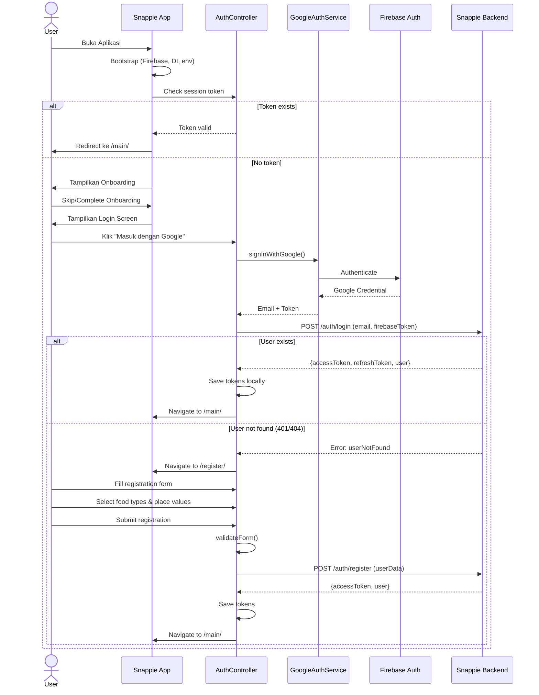
```mermaid
sequenceDiagram
    actor User
    participant App as Snappie App
    participant Auth as AuthController
    participant Google as GoogleAuthService
    participant Firebase as Firebase Auth
    participant Backend as Snappie Backend

    User->>App: Buka Aplikasi
    App->>App: Bootstrap (Firebase, DI, env)
    App->>Auth: Check session token

    alt Token exists
        Auth-->>App: Token valid
        App->>User: Redirect ke /main/
    else No token
        App->>User: Tampilkan Onboarding
        User->>App: Skip/Complete Onboarding
        App->>User: Tampilkan Login Screen

        User->>Auth: Klik "Masuk dengan Google"
        Auth->>Google: signInWithGoogle()
        Google->>Firebase: Authenticate
        Firebase-->>Google: Google Credential
        Google-->>Auth: Email + Token

        Auth->>Backend: POST /auth/login (email, firebaseToken)

        alt User exists
            Backend-->>Auth: {accessToken, refreshToken, user}
            Auth->>Auth: Save tokens locally
            Auth->>App: Navigate to /main/
        else User not found (401/404)
            Backend-->>Auth: Error: userNotFound
            Auth->>App: Navigate to /register/

            User->>Auth: Fill registration form
            User->>Auth: Select food types & place values
            User->>Auth: Submit registration

            Auth->>Auth: validateForm()
            Auth->>Backend: POST /auth/register (userData)
            Backend-->>Auth: {accessToken, user}
            Auth->>Auth: Save tokens
            Auth->>App: Navigate to /main/
        end
    end
```

### Referensi Kode

| Komponen              | File                                                          |
| --------------------- | ------------------------------------------------------------- |
| Onboarding Controller | `lib/app/modules/auth/controllers/onboarding_controller.dart` |
| Auth Controller       | `lib/app/modules/auth/controllers/auth_controller.dart`       |
| Auth Service          | `lib/app/core/services/auth_service.dart`                     |
| Google Auth Service   | `lib/app/core/services/google_auth_service.dart`              |
| Route Registry        | `lib/app/routes/app_pages.dart`                               |

---

## 2. Menelusuri Tempat Kuliner Hidden Gems (Pencarian dan Filter)

### Deskripsi

Use case ini memungkinkan pengguna untuk menemukan tempat-tempat kuliner hidden gems melalui fitur pencarian dan filter berdasarkan berbagai kriteria seperti kategori, food type, place value, rating, harga, dan lokasi terdekat.

### Aktor

- **Pengguna Terautentikasi**

### Precondition

- Pengguna sudah login ke aplikasi
- Koneksi internet tersedia

### Postcondition

- Pengguna dapat melihat daftar tempat sesuai kriteria pencarian/filter
- Pengguna dapat melihat detail tempat yang dipilih

### Flow Utama

1. Pengguna membuka tab "Jelajahi"
2. Sistem memuat daftar tempat dan kategori
3. Pengguna dapat melakukan pencarian dengan mengetik keyword
4. Sistem menerapkan local search dengan debounce
5. Pengguna dapat menerapkan filter:
   - Kategori makanan
   - Food types
   - Place values
   - Rating minimum
   - Range harga
   - Lokasi terdekat
6. Sistem menampilkan hasil yang terfilter
7. Pengguna memilih tempat untuk melihat detail
8. Sistem menampilkan detail tempat beserta reviews dan status gamifikasi

### Activity Diagram

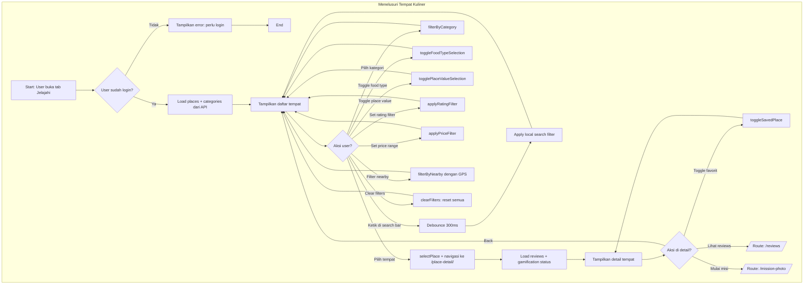
```mermaid
flowchart TD
    subgraph "Menelusuri Tempat Kuliner"
        A[Start: User buka tab Jelajahi] --> B{User sudah login?}
        B -- Tidak --> C[Tampilkan error: perlu login]
        C --> Z[End]
        B -- Ya --> D[Load places + categories dari API]
        D --> E[Tampilkan daftar tempat]

        E --> F{Aksi user?}

        F -- Ketik di search bar --> G[Debounce 300ms]
        G --> H[Apply local search filter]
        H --> E

        F -- Pilih kategori --> I[filterByCategory]
        I --> E

        F -- Toggle food type --> J[toggleFoodTypeSelection]
        J --> E

        F -- Toggle place value --> K[togglePlaceValueSelection]
        K --> E

        F -- Set rating filter --> L[applyRatingFilter]
        L --> E

        F -- Set price range --> M[applyPriceFilter]
        M --> E

        F -- Filter nearby --> N[filterByNearby dengan GPS]
        N --> E

        F -- Clear filters --> O[clearFilters: reset semua]
        O --> E

        F -- Pilih tempat --> P[selectPlace + navigasi ke /place-detail/]
        P --> Q[Load reviews + gamification status]
        Q --> R[Tampilkan detail tempat]

        R --> S{Aksi di detail?}
        S -- Back --> E
        S -- Toggle favorit --> T[toggleSavedPlace]
        T --> R
        S -- Lihat reviews --> U[/Route: /reviews/]
        S -- Mulai misi --> V[/Route: /mission-photo/]

        Z[End]
    end
```

### Sequence Diagram

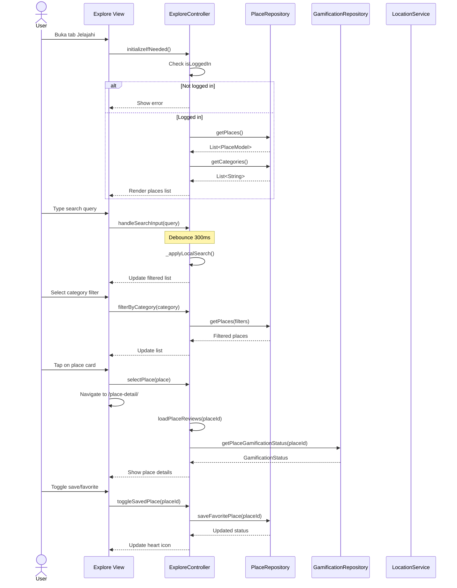
```mermaid
sequenceDiagram
    actor User
    participant App as Explore View
    participant Ctrl as ExploreController
    participant PlaceRepo as PlaceRepository
    participant GamifRepo as GamificationRepository
    participant Location as LocationService

    User->>App: Buka tab Jelajahi
    App->>Ctrl: initializeIfNeeded()

    Ctrl->>Ctrl: Check isLoggedIn
    alt Not logged in
        Ctrl-->>App: Show error
    else Logged in
        Ctrl->>PlaceRepo: getPlaces()
        PlaceRepo-->>Ctrl: List<PlaceModel>
        Ctrl->>PlaceRepo: getCategories()
        PlaceRepo-->>Ctrl: List<String>
        Ctrl-->>App: Render places list
    end

    User->>App: Type search query
    App->>Ctrl: handleSearchInput(query)
    Note over Ctrl: Debounce 300ms
    Ctrl->>Ctrl: _applyLocalSearch()
    Ctrl-->>App: Update filtered list

    User->>App: Select category filter
    App->>Ctrl: filterByCategory(category)
    Ctrl->>PlaceRepo: getPlaces(filters)
    PlaceRepo-->>Ctrl: Filtered places
    Ctrl-->>App: Update list

    User->>App: Tap on place card
    App->>Ctrl: selectPlace(place)
    App->>App: Navigate to /place-detail/
    Ctrl->>Ctrl: loadPlaceReviews(placeId)
    Ctrl->>GamifRepo: getPlaceGamificationStatus(placeId)
    GamifRepo-->>Ctrl: GamificationStatus
    Ctrl-->>App: Show place details

    User->>App: Toggle save/favorite
    App->>Ctrl: toggleSavedPlace(placeId)
    Ctrl->>PlaceRepo: saveFavoritePlace(placeId)
    PlaceRepo-->>Ctrl: Updated status
    Ctrl-->>App: Update heart icon
```

### Referensi Kode

| Komponen           | File                                                          |
| ------------------ | ------------------------------------------------------------- |
| Explore Controller | `lib/app/modules/explore/controllers/explore_controller.dart` |
| Explore View       | `lib/app/modules/explore/views/explore_view.dart`             |
| Place Detail View  | `lib/app/modules/explore/views/place_detail_view.dart`        |
| Reviews View       | `lib/app/modules/explore/views/reviews_view.dart`             |
| Place Repository   | `lib/app/data/repositories/place_repository_impl.dart`        |
| Location Service   | `lib/app/core/services/location_service.dart`                 |

---

## 3. Melakukan Check-in Tempat

### Deskripsi

Use case ini merupakan bagian dari sistem gamifikasi. Pengguna dapat melakukan check-in di tempat kuliner dengan mengambil foto sebagai bukti kunjungan. Check-in berhasil akan memberikan reward berupa XP dan koin.

### Aktor

- **Pengguna Terautentikasi**

### Precondition

- Pengguna sudah login
- Pengguna berada di halaman detail tempat
- Pengguna memberikan izin akses kamera dan lokasi
- Pengguna berada dalam radius lokasi tempat (geofencing)

### Postcondition

- Check-in tersimpan di sistem dengan foto dan koordinat lokasi
- Gambar terupload ke cloud storage (Cloudinary)
- Pengguna mendapatkan XP dan koin reward
- Progress challenge terkait ter-update

### Flow Utama

1. Pengguna berada di halaman detail tempat
2. Pengguna klik tombol CTA "Mulai Misi" / "Check-in"
3. Sistem membuka kamera
4. Pengguna mengambil foto
5. Sistem menampilkan preview foto
6. Pengguna konfirmasi foto
7. Sistem mengambil koordinat lokasi saat ini
8. Sistem upload foto ke Cloudinary
9. Sistem membuat check-in di backend dengan foto URL dan koordinat
10. Backend memvalidasi lokasi (geofencing)
11. Jika valid, backend menyimpan check-in dan mengembalikan reward
12. Sistem menampilkan modal sukses dengan reward yang didapat
13. Pengguna dapat melanjutkan ke misi review atau kembali

### Activity Diagram

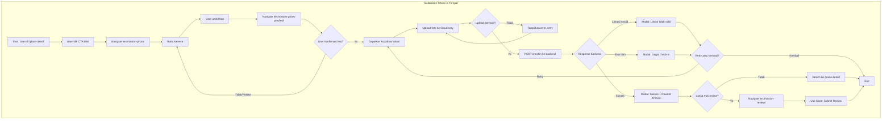
```mermaid
flowchart TD
    subgraph "Melakukan Check-in Tempat"
        A[Start: User di /place-detail/] --> B[User klik CTA Misi]
        B --> C[Navigate ke /mission-photo/]
        C --> D[Buka kamera]
        D --> E[User ambil foto]
        E --> F[Navigate ke /mission-photo-preview/]
        F --> G{User konfirmasi foto?}
        G -- Tidak/Retake --> D
        G -- Ya --> H[Dapatkan koordinat lokasi]
        H --> I[Upload foto ke Cloudinary]
        I --> J{Upload berhasil?}
        J -- Tidak --> K[Tampilkan error, retry]
        K --> I
        J -- Ya --> L[POST checkin ke backend]
        L --> M{Response backend}
        M -- Lokasi invalid --> N[Modal: Lokasi tidak valid]
        N --> O{Retry atau kembali?}
        O -- Retry --> H
        O -- Kembali --> Z
        M -- Error lain --> P[Modal: Gagal check-in]
        P --> O
        M -- Sukses --> Q[Modal: Sukses + Reward XP/Koin]
        Q --> R{Lanjut misi review?}
        R -- Tidak --> S[Return ke /place-detail/]
        R -- Ya --> T[Navigate ke /mission-review/]

        S --> Z[End]
        T --> U[Use Case: Submit Review]
        U --> Z
    end
```

### Sequence Diagram

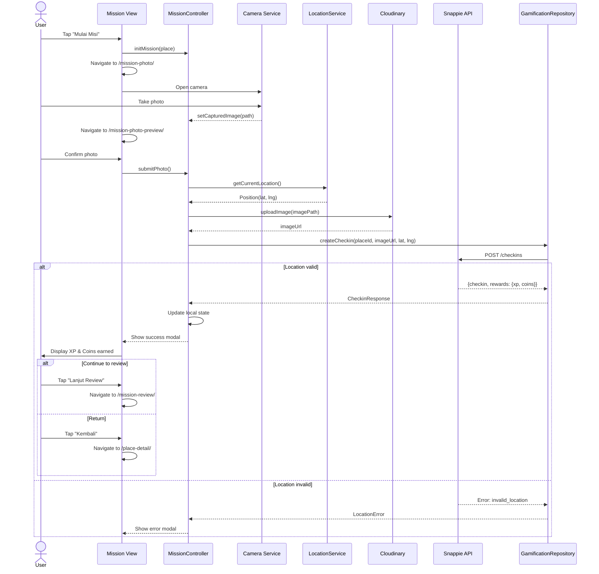
```mermaid
sequenceDiagram
    actor User
    participant App as Mission View
    participant Ctrl as MissionController
    participant Camera as Camera Service
    participant Location as LocationService
    participant Cloud as Cloudinary
    participant Backend as Snappie API
    participant GamifRepo as GamificationRepository

    User->>App: Tap "Mulai Misi"
    App->>Ctrl: initMission(place)
    App->>App: Navigate to /mission-photo/

    App->>Camera: Open camera
    User->>Camera: Take photo
    Camera-->>Ctrl: setCapturedImage(path)
    App->>App: Navigate to /mission-photo-preview/

    User->>App: Confirm photo
    App->>Ctrl: submitPhoto()

    Ctrl->>Location: getCurrentLocation()
    Location-->>Ctrl: Position(lat, lng)

    Ctrl->>Cloud: uploadImage(imagePath)
    Cloud-->>Ctrl: imageUrl

    Ctrl->>GamifRepo: createCheckin(placeId, imageUrl, lat, lng)
    GamifRepo->>Backend: POST /checkins

    alt Location valid
        Backend-->>GamifRepo: {checkin, rewards: {xp, coins}}
        GamifRepo-->>Ctrl: CheckinResponse
        Ctrl->>Ctrl: Update local state
        Ctrl-->>App: Show success modal
        App->>User: Display XP & Coins earned

        alt Continue to review
            User->>App: Tap "Lanjut Review"
            App->>App: Navigate to /mission-review/
        else Return
            User->>App: Tap "Kembali"
            App->>App: Navigate to /place-detail/
        end
    else Location invalid
        Backend-->>GamifRepo: Error: invalid_location
        GamifRepo-->>Ctrl: LocationError
        Ctrl-->>App: Show error modal
    end
```

### Referensi Kode

| Komponen                | File                                                            |
| ----------------------- | --------------------------------------------------------------- |
| Mission Controller      | `lib/app/modules/mission/controllers/mission_controller.dart`   |
| Mission Photo View      | `lib/app/modules/mission/views/mission_photo_view.dart`         |
| Mission Photo Preview   | `lib/app/modules/mission/views/mission_photo_preview_view.dart` |
| Location Service        | `lib/app/core/services/location_service.dart`                   |
| Cloudinary Service      | `lib/app/core/services/cloudinary_service.dart`                 |
| Gamification Repository | `lib/app/data/repositories/gamification_repository_impl.dart`   |

---

## 4. Berbagi Pengalaman Kunjungan (Review dan Postingan)

### Deskripsi

Use case ini memungkinkan pengguna untuk berbagi pengalaman kunjungan mereka ke tempat kuliner dalam dua bentuk: **Review** (ulasan tempat dengan rating) dan **Postingan** (social media post dengan foto dan caption).

### Aktor

- **Pengguna Terautentikasi**

### Precondition

- Pengguna sudah login
- Untuk review: Pengguna sudah melakukan check-in di tempat tersebut
- Koneksi internet tersedia

### Postcondition

- Review/Postingan tersimpan di sistem
- Konten muncul di feed dan halaman tempat (untuk review)
- Pengguna mendapatkan XP jika merupakan bagian dari misi

### Sub Use Case

#### A. Memberikan Review

1. Pengguna menyelesaikan check-in (misi foto)
2. Pengguna melanjutkan ke misi review
3. Pengguna memberikan rating (1-5 bintang)
4. Pengguna menulis konten review
5. Pengguna dapat menambah foto pendukung (opsional)
6. Pengguna memilih food types yang sesuai
7. Pengguna memilih place values yang sesuai
8. Pengguna submit review
9. Sistem menyimpan review dan menampilkan reward

#### B. Membuat Postingan

1. Pengguna klik tombol "+" di tab Beranda
2. Sistem menampilkan halaman create post
3. Pengguna memilih tempat terkait
4. Pengguna menulis caption/konten
5. Pengguna menambah foto (wajib minimal 1)
6. Pengguna submit postingan
7. Sistem upload foto dan menyimpan postingan
8. Postingan muncul di feed

### Activity Diagram

```mermaid
flowchart TD
    subgraph "Review Flow"
        A1[Start: Setelah check-in sukses] --> A2[Navigate ke /mission-review/]
        A2 --> A3[User berikan rating 1-5]
        A3 --> A4[User tulis konten review]
        A4 --> A5[User tambah foto opsional]
        A5 --> A6[Pilih food types]
        A6 --> A7[Pilih place values]
        A7 --> A8[Submit review]
        A8 --> A9{Validasi OK?}
        A9 -- Tidak --> A10[Tampilkan error validasi]
        A10 --> A3
        A9 -- Ya --> A11[Upload media jika ada]
        A11 --> A12[POST review ke backend]
        A12 --> A13{Response}
        A13 -- Error --> A14[Tampilkan error]
        A14 --> A3
        A13 -- Sukses --> A15[Modal sukses + opsi feedback]
        A15 --> A16{Isi feedback?}
        A16 -- Ya --> A17[Submit feedback survey]
        A17 --> A18[Return ke /place-detail/]
        A16 -- Skip --> A18
        A18 --> AZ[End Review]
    end

    subgraph "Create Post Flow"
        B1[Start: User klik + di Beranda] --> B2[Navigate ke /create-post/]
        B2 --> B3[Load places & user data]
        B3 --> B4[Tampilkan form post]
        B4 --> B5[User pilih tempat]
        B5 --> B6[User tulis caption]
        B6 --> B7[User tambah foto min. 1]
        B7 --> B8{Submit?}
        B8 -- Tidak --> B9{Cancel?}
        B9 -- Ya --> BZ[End: Kembali ke Beranda]
        B9 -- Tidak --> B4
        B8 -- Ya --> B10{Validasi OK?}
        B10 -- Tidak --> B11[Tampilkan error]
        B11 --> B4
        B10 -- Ya --> B12[Upload foto ke Cloudinary]
        B12 --> B13[POST ke backend]
        B13 --> B14{Response}
        B14 -- Error --> B15[Tampilkan error]
        B15 --> B4
        B14 -- Sukses --> B16[Navigate ke /main/ + refresh feed]
        B16 --> BZ[End Post]
    end
```

### Sequence Diagram - Review

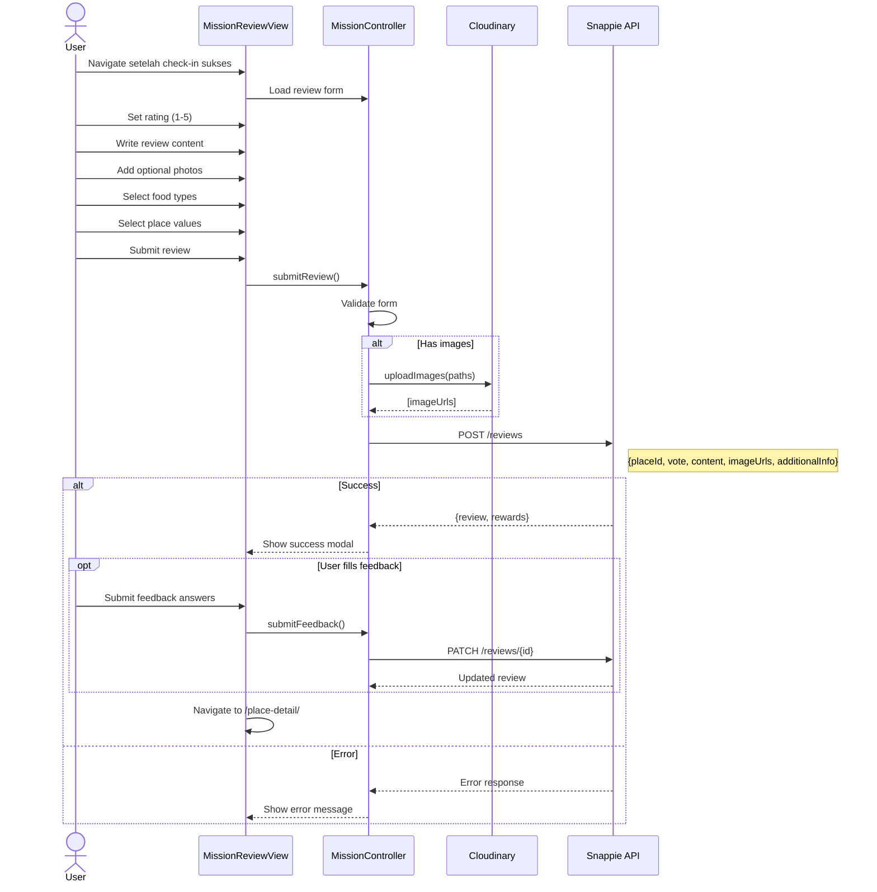
```mermaid
sequenceDiagram
    actor User
    participant App as MissionReviewView
    participant Ctrl as MissionController
    participant Cloud as Cloudinary
    participant Backend as Snappie API

    User->>App: Navigate setelah check-in sukses
    App->>Ctrl: Load review form

    User->>App: Set rating (1-5)
    User->>App: Write review content
    User->>App: Add optional photos
    User->>App: Select food types
    User->>App: Select place values

    User->>App: Submit review
    App->>Ctrl: submitReview()

    Ctrl->>Ctrl: Validate form

    alt Has images
        Ctrl->>Cloud: uploadImages(paths)
        Cloud-->>Ctrl: [imageUrls]
    end

    Ctrl->>Backend: POST /reviews
    Note right of Backend: {placeId, vote, content, imageUrls, additionalInfo}

    alt Success
        Backend-->>Ctrl: {review, rewards}
        Ctrl-->>App: Show success modal

        opt User fills feedback
            User->>App: Submit feedback answers
            App->>Ctrl: submitFeedback()
            Ctrl->>Backend: PATCH /reviews/{id}
            Backend-->>Ctrl: Updated review
        end

        App->>App: Navigate to /place-detail/
    else Error
        Backend-->>Ctrl: Error response
        Ctrl-->>App: Show error message
    end
```

### Sequence Diagram - Create Post

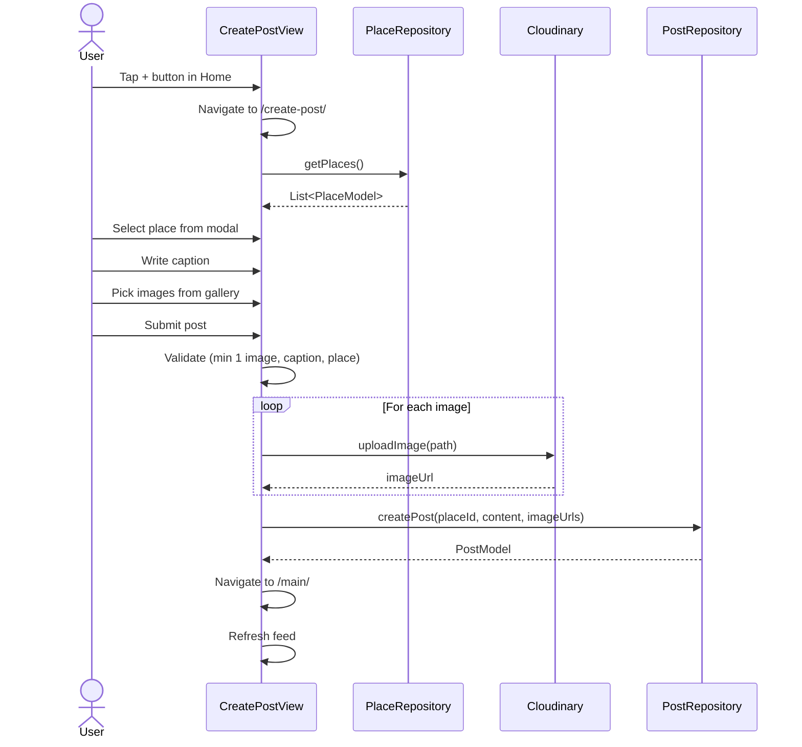
```mermaid
sequenceDiagram
    actor User
    participant App as CreatePostView
    participant PlaceRepo as PlaceRepository
    participant Cloud as Cloudinary
    participant PostRepo as PostRepository

    User->>App: Tap + button in Home
    App->>App: Navigate to /create-post/

    App->>PlaceRepo: getPlaces()
    PlaceRepo-->>App: List<PlaceModel>

    User->>App: Select place from modal
    User->>App: Write caption
    User->>App: Pick images from gallery

    User->>App: Submit post
    App->>App: Validate (min 1 image, caption, place)

    loop For each image
        App->>Cloud: uploadImage(path)
        Cloud-->>App: imageUrl
    end

    App->>PostRepo: createPost(placeId, content, imageUrls)
    PostRepo-->>App: PostModel

    App->>App: Navigate to /main/
    App->>App: Refresh feed
```

### Referensi Kode

| Komponen            | File                                                          |
| ------------------- | ------------------------------------------------------------- |
| Mission Controller  | `lib/app/modules/mission/controllers/mission_controller.dart` |
| Mission Review View | `lib/app/modules/mission/views/mission_review_view.dart`      |
| Create Post View    | `lib/app/modules/home/views/create_post_view.dart`            |
| Post Repository     | `lib/app/data/repositories/post_repository_impl.dart`         |
| Cloudinary Service  | `lib/app/core/services/cloudinary_service.dart`               |

---

## 5. Berinteraksi dengan Postingan (Like, Comment, Share, Save)

### Deskripsi

Use case ini mencakup semua bentuk interaksi sosial yang dapat dilakukan pengguna terhadap postingan di feed, meliputi like, comment, share, dan save.

### Aktor

- **Pengguna Terautentikasi**

### Precondition

- Pengguna sudah login
- Postingan tersedia di feed
- Koneksi internet tersedia

### Postcondition

- Interaksi tersimpan di backend
- UI terupdate secara optimistic
- Notifikasi dikirim ke pemilik postingan (untuk like/comment)

### Jenis Interaksi

| Interaksi | Status Implementasi | Deskripsi                            |
| --------- | ------------------- | ------------------------------------ |
| Like      | ✅ Implemented      | Toggle like dengan optimistic update |
| Save      | ✅ Implemented      | Simpan postingan ke koleksi pribadi  |
| Comment   | 🚧 Coming Soon      | Tambah komentar ke postingan         |
| Share     | 🚧 Coming Soon      | Bagikan postingan ke platform lain   |

### Activity Diagram

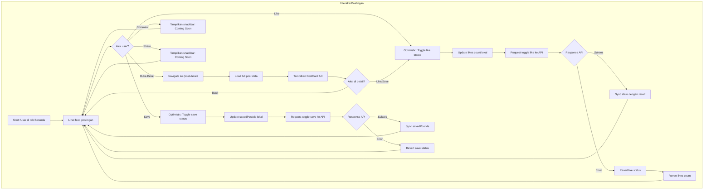
```mermaid
flowchart TD
    subgraph "Interaksi Postingan"
        A[Start: User di tab Beranda] --> B[Lihat feed postingan]
        B --> C{Aksi user?}

        C -- Like --> D[Optimistic: Toggle like status]
        D --> E[Update likes count lokal]
        E --> F[Request toggle like ke API]
        F --> G{Response API}
        G -- Sukses --> H[Sync state dengan result]
        G -- Error --> I[Revert like status]
        I --> J[Revert likes count]
        J --> B
        H --> B

        C -- Save --> K[Optimistic: Toggle save status]
        K --> L[Update savedPostIds lokal]
        L --> M[Request toggle save ke API]
        M --> N{Response API}
        N -- Sukses --> O[Sync savedPostIds]
        N -- Error --> P[Revert save status]
        P --> B
        O --> B

        C -- Comment --> Q[Tampilkan snackbar: Coming Soon]
        Q --> B

        C -- Share --> R[Tampilkan snackbar: Coming Soon]
        R --> B

        C -- Buka Detail --> S[Navigate ke /post-detail/]
        S --> T[Load full post data]
        T --> U[Tampilkan PostCard full]
        U --> V{Aksi di detail?}
        V -- Back --> B
        V -- Like/Save --> D
    end
```

### Sequence Diagram - Like Post

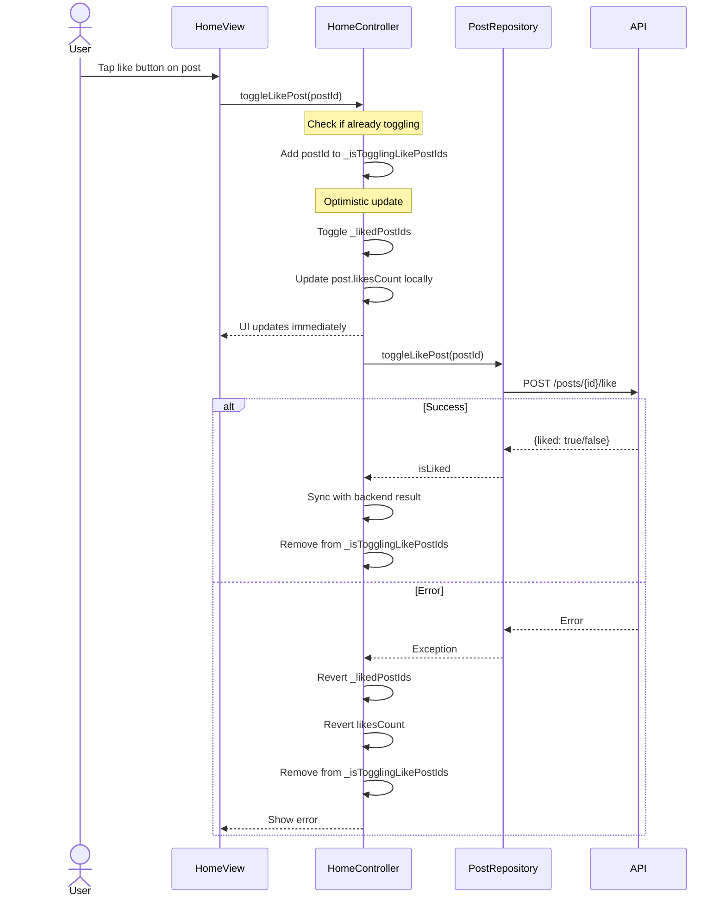
```mermaid
sequenceDiagram
    actor User
    participant App as HomeView
    participant Ctrl as HomeController
    participant Repo as PostRepository
    participant Backend as API

    User->>App: Tap like button on post
    App->>Ctrl: toggleLikePost(postId)

    Note over Ctrl: Check if already toggling
    Ctrl->>Ctrl: Add postId to _isTogglingLikePostIds

    Note over Ctrl: Optimistic update
    Ctrl->>Ctrl: Toggle _likedPostIds
    Ctrl->>Ctrl: Update post.likesCount locally
    Ctrl-->>App: UI updates immediately

    Ctrl->>Repo: toggleLikePost(postId)
    Repo->>Backend: POST /posts/{id}/like

    alt Success
        Backend-->>Repo: {liked: true/false}
        Repo-->>Ctrl: isLiked
        Ctrl->>Ctrl: Sync with backend result
        Ctrl->>Ctrl: Remove from _isTogglingLikePostIds
    else Error
        Backend-->>Repo: Error
        Repo-->>Ctrl: Exception
        Ctrl->>Ctrl: Revert _likedPostIds
        Ctrl->>Ctrl: Revert likesCount
        Ctrl->>Ctrl: Remove from _isTogglingLikePostIds
        Ctrl-->>App: Show error
    end
```

### Sequence Diagram - Save Post

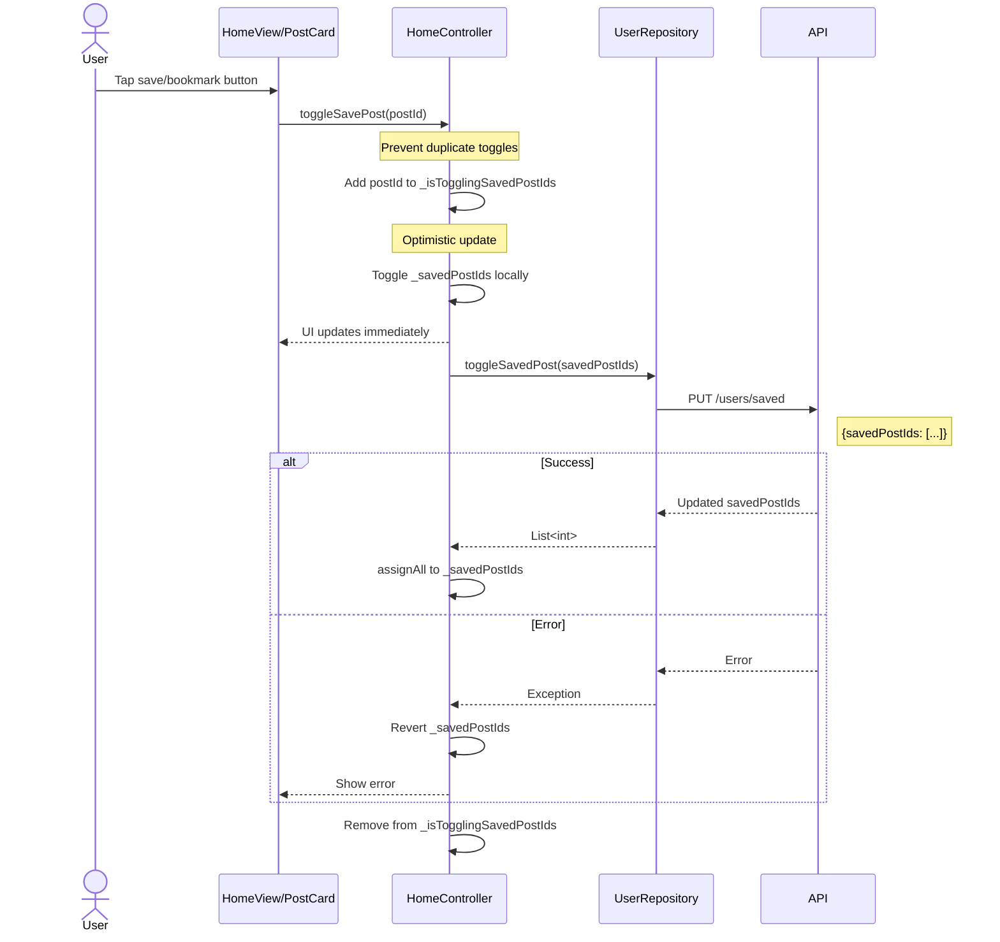
```mermaid
sequenceDiagram
    actor User
    participant App as HomeView/PostCard
    participant Ctrl as HomeController
    participant Repo as UserRepository
    participant Backend as API

    User->>App: Tap save/bookmark button
    App->>Ctrl: toggleSavePost(postId)

    Note over Ctrl: Prevent duplicate toggles
    Ctrl->>Ctrl: Add postId to _isTogglingSavedPostIds

    Note over Ctrl: Optimistic update
    Ctrl->>Ctrl: Toggle _savedPostIds locally
    Ctrl-->>App: UI updates immediately

    Ctrl->>Repo: toggleSavedPost(savedPostIds)
    Repo->>Backend: PUT /users/saved
    Note right of Backend: {savedPostIds: [...]}

    alt Success
        Backend-->>Repo: Updated savedPostIds
        Repo-->>Ctrl: List<int>
        Ctrl->>Ctrl: assignAll to _savedPostIds
    else Error
        Backend-->>Repo: Error
        Repo-->>Ctrl: Exception
        Ctrl->>Ctrl: Revert _savedPostIds
        Ctrl-->>App: Show error
    end

    Ctrl->>Ctrl: Remove from _isTogglingSavedPostIds
```

### Referensi Kode

| Komponen         | File                                                          |
| ---------------- | ------------------------------------------------------------- |
| Home Controller  | `lib/app/modules/home/controllers/home_controller.dart`       |
| Home View        | `lib/app/modules/home/views/home_view.dart`                   |
| Post Card Widget | `lib/app/modules/shared/widgets/_card_widgets/post_card.dart` |
| Post Detail View | `lib/app/modules/home/views/post_detail_view.dart`            |
| Post Repository  | `lib/app/data/repositories/post_repository_impl.dart`         |
| User Repository  | `lib/app/data/repositories/user_repository_impl.dart`         |

---

## 6. Melihat Artikel Kuliner Hidden Gems

### Deskripsi

Use case ini memungkinkan pengguna untuk membaca artikel-artikel tentang kuliner hidden gems, tips, atau informasi menarik seputar dunia kuliner. Pengguna dapat mencari dan memfilter artikel berdasarkan kategori.

### Aktor

- **Pengguna Terautentikasi**

### Precondition

- Pengguna sudah login
- Koneksi internet tersedia

### Postcondition

- Pengguna dapat membaca artikel yang dipilih
- Bookmark artikel tersimpan (jika diaktifkan)

### Flow Utama

1. Pengguna membuka tab "Artikel"
2. Sistem memuat daftar artikel dari API
3. Pengguna dapat mencari artikel dengan keyword
4. Sistem menerapkan filter pencarian dengan debounce
5. Pengguna dapat filter berdasarkan kategori
6. Pengguna memilih artikel untuk dibaca
7. Sistem menampilkan detail artikel
8. Pengguna dapat bookmark atau share artikel

### Activity Diagram

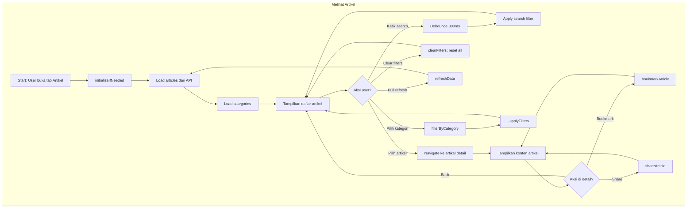
```mermaid
flowchart TD
    subgraph "Melihat Artikel"
        A[Start: User buka tab Artikel] --> B[initializeIfNeeded]
        B --> C[Load articles dari API]
        C --> D[Load categories]
        D --> E[Tampilkan daftar artikel]

        E --> F{Aksi user?}

        F -- Ketik search --> G[Debounce 300ms]
        G --> H[Apply search filter]
        H --> E

        F -- Pilih kategori --> I[filterByCategory]
        I --> J[_applyFilters]
        J --> E

        F -- Clear filters --> K[clearFilters: reset all]
        K --> E

        F -- Pull refresh --> L[refreshData]
        L --> C

        F -- Pilih artikel --> M[Navigate ke artikel detail]
        M --> N[Tampilkan konten artikel]
        N --> O{Aksi di detail?}
        O -- Back --> E
        O -- Bookmark --> P[bookmarkArticle]
        P --> N
        O -- Share --> Q[shareArticle]
        Q --> N
    end
```

### Sequence Diagram

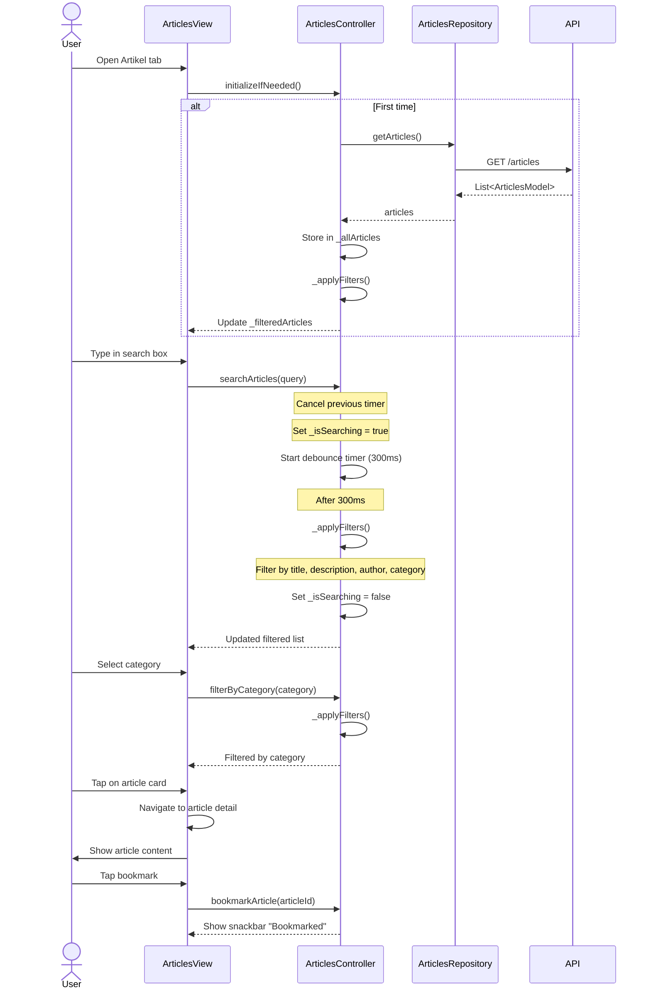
```mermaid
sequenceDiagram
    actor User
    participant App as ArticlesView
    participant Ctrl as ArticlesController
    participant Repo as ArticlesRepository
    participant Backend as API

    User->>App: Open Artikel tab
    App->>Ctrl: initializeIfNeeded()

    alt First time
        Ctrl->>Repo: getArticles()
        Repo->>Backend: GET /articles
        Backend-->>Repo: List<ArticlesModel>
        Repo-->>Ctrl: articles
        Ctrl->>Ctrl: Store in _allArticles
        Ctrl->>Ctrl: _applyFilters()
        Ctrl-->>App: Update _filteredArticles
    end

    User->>App: Type in search box
    App->>Ctrl: searchArticles(query)

    Note over Ctrl: Cancel previous timer
    Note over Ctrl: Set _isSearching = true

    Ctrl->>Ctrl: Start debounce timer (300ms)

    Note over Ctrl: After 300ms
    Ctrl->>Ctrl: _applyFilters()
    Note over Ctrl: Filter by title, description, author, category
    Ctrl->>Ctrl: Set _isSearching = false
    Ctrl-->>App: Updated filtered list

    User->>App: Select category
    App->>Ctrl: filterByCategory(category)
    Ctrl->>Ctrl: _applyFilters()
    Ctrl-->>App: Filtered by category

    User->>App: Tap on article card
    App->>App: Navigate to article detail
    App->>User: Show article content

    User->>App: Tap bookmark
    App->>Ctrl: bookmarkArticle(articleId)
    Ctrl-->>App: Show snackbar "Bookmarked"
```

### Referensi Kode

| Komponen            | File                                                            |
| ------------------- | --------------------------------------------------------------- |
| Articles Controller | `lib/app/modules/articles/controllers/articles_controller.dart` |
| Articles View       | `lib/app/modules/articles/views/articles_view.dart`             |
| Articles Repository | `lib/app/data/repositories/articles_repository_impl.dart`       |
| Articles Model      | `lib/app/data/models/articles_model.dart`                       |

---

## 7. Mengelola Progres Gamifikasi

### Deskripsi

Use case ini mencakup pengelolaan dan pemantauan progres gamifikasi pengguna, termasuk melihat achievements, challenges aktif, riwayat XP, dan riwayat koin.

### Aktor

- **Pengguna Terautentikasi**

### Precondition

- Pengguna sudah login
- Pengguna memiliki aktivitas gamifikasi (check-in, review, dll)

### Postcondition

- Pengguna dapat melihat status progres gamifikasi
- Pengguna dapat mengklaim reward dari challenge yang selesai

### Komponen Gamifikasi

| Komponen     | Deskripsi                                 |
| ------------ | ----------------------------------------- |
| Level        | Level pengguna berdasarkan total XP       |
| XP           | Experience points dari berbagai aktivitas |
| Koin         | Mata uang virtual untuk ditukar reward    |
| Achievements | Badge/penghargaan berdasarkan milestone   |
| Challenges   | Tantangan dengan target tertentu          |

### Flow Utama

1. Pengguna membuka tab "Akun"
2. Sistem menampilkan ringkasan profil dengan statistik gamifikasi
3. Pengguna dapat melihat:
   - Total XP dan Level
   - Total Koin
   - Jumlah check-in
   - Jumlah review
4. Pengguna dapat mengakses halaman detail:
   - Achievements
   - Challenges
   - Riwayat Koin (Kupon & Riwayat)

### Activity Diagram

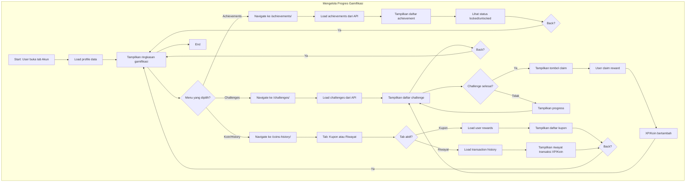
```mermaid
flowchart TD
    subgraph "Mengelola Progres Gamifikasi"
        A[Start: User buka tab Akun] --> B[Load profile data]
        B --> C[Tampilkan ringkasan gamifikasi]
        C --> D{Menu yang dipilih?}

        D -- Achievements --> E[Navigate ke /achievements/]
        E --> F[Load achievements dari API]
        F --> G[Tampilkan daftar achievement]
        G --> H[Lihat status locked/unlocked]
        H --> I{Back?}
        I -- Ya --> C

        D -- Challenges --> J[Navigate ke /challenges/]
        J --> K[Load challenges dari API]
        K --> L[Tampilkan daftar challenge]
        L --> M{Challenge selesai?}
        M -- Ya --> N[Tampilkan tombol claim]
        N --> O[User claim reward]
        O --> P[XP/Koin bertambah]
        P --> L
        M -- Tidak --> Q[Tampilkan progress]
        Q --> L
        L --> R{Back?}
        R -- Ya --> C

        D -- Koin/History --> S[Navigate ke /coins-history/]
        S --> T[Tab: Kupon atau Riwayat]
        T --> U{Tab aktif?}
        U -- Kupon --> V[Load user rewards]
        V --> W[Tampilkan daftar kupon]
        U -- Riwayat --> X[Load transaction history]
        X --> Y[Tampilkan riwayat transaksi XP/Koin]
        W --> Z{Back?}
        Y --> Z
        Z -- Ya --> C

        C --> AA[End]
    end
```

### Sequence Diagram - View Achievements

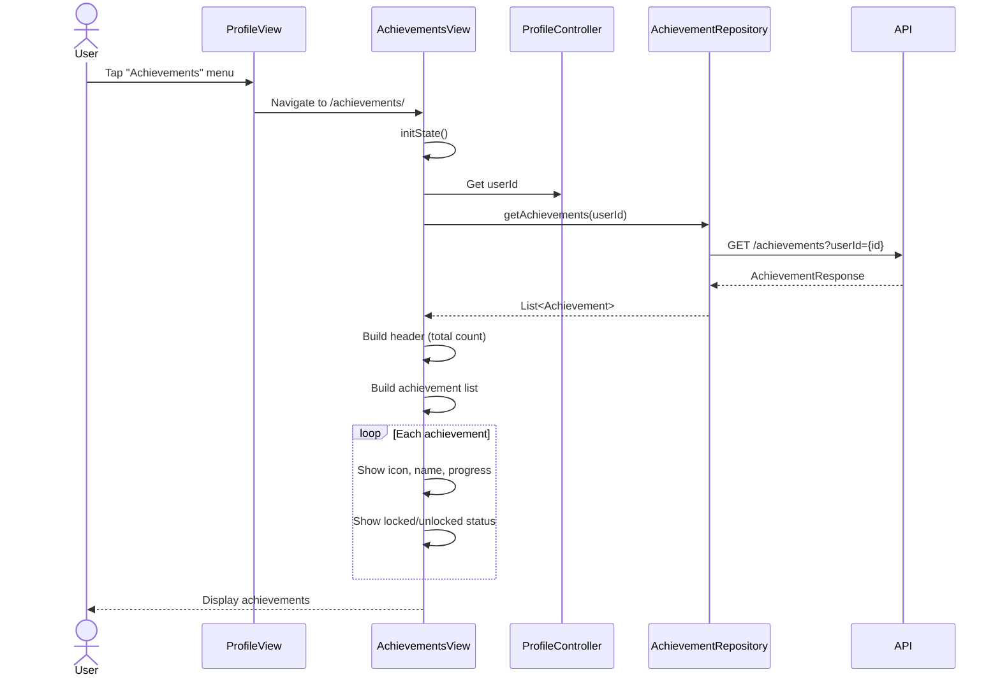
```mermaid
sequenceDiagram
    actor User
    participant App as ProfileView
    participant AchView as AchievementsView
    participant Ctrl as ProfileController
    participant Repo as AchievementRepository
    participant Backend as API

    User->>App: Tap "Achievements" menu
    App->>AchView: Navigate to /achievements/

    AchView->>AchView: initState()
    AchView->>Ctrl: Get userId
    AchView->>Repo: getAchievements(userId)
    Repo->>Backend: GET /achievements?userId={id}
    Backend-->>Repo: AchievementResponse
    Repo-->>AchView: List<Achievement>

    AchView->>AchView: Build header (total count)
    AchView->>AchView: Build achievement list

    loop Each achievement
        AchView->>AchView: Show icon, name, progress
        AchView->>AchView: Show locked/unlocked status
    end

    AchView-->>User: Display achievements
```

### Sequence Diagram - View Coins History

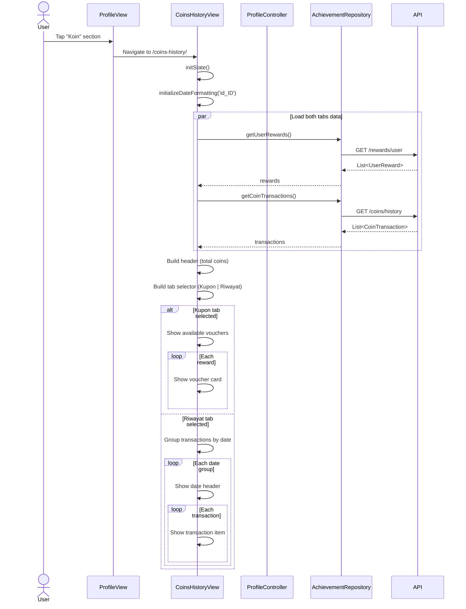
```mermaid
sequenceDiagram
    actor User
    participant App as ProfileView
    participant CoinsView as CoinsHistoryView
    participant Ctrl as ProfileController
    participant Repo as AchievementRepository
    participant Backend as API

    User->>App: Tap "Koin" section
    App->>CoinsView: Navigate to /coins-history/

    CoinsView->>CoinsView: initState()
    CoinsView->>CoinsView: initializeDateFormatting('id_ID')

    par Load both tabs data
        CoinsView->>Repo: getUserRewards()
        Repo->>Backend: GET /rewards/user
        Backend-->>Repo: List<UserReward>
        Repo-->>CoinsView: rewards

        CoinsView->>Repo: getCoinTransactions()
        Repo->>Backend: GET /coins/history
        Backend-->>Repo: List<CoinTransaction>
        Repo-->>CoinsView: transactions
    end

    CoinsView->>CoinsView: Build header (total coins)
    CoinsView->>CoinsView: Build tab selector (Kupon | Riwayat)

    alt Kupon tab selected
        CoinsView->>CoinsView: Show available vouchers
        loop Each reward
            CoinsView->>CoinsView: Show voucher card
        end
    else Riwayat tab selected
        CoinsView->>CoinsView: Group transactions by date
        loop Each date group
            CoinsView->>CoinsView: Show date header
            loop Each transaction
                CoinsView->>CoinsView: Show transaction item
            end
        end
    end
```

### Referensi Kode

| Komponen               | File                                                          |
| ---------------------- | ------------------------------------------------------------- |
| Profile Controller     | `lib/app/modules/profile/controllers/profile_controller.dart` |
| Profile View           | `lib/app/modules/profile/views/profile_view.dart`             |
| Achievements View      | `lib/app/modules/profile/views/achievements_view.dart`        |
| Challenges View        | `lib/app/modules/profile/views/challenges_view.dart`          |
| Coins History View     | `lib/app/modules/profile/views/coins_history_view.dart`       |
| Achievement Repository | `lib/app/data/repositories/achievement_repository_impl.dart`  |

---

## 8. Melihat Leaderboard

### Deskripsi

Use case ini memungkinkan pengguna untuk melihat peringkat pengguna berdasarkan XP yang dikumpulkan. Leaderboard tersedia dalam dua periode: mingguan dan bulanan.

### Aktor

- **Pengguna Terautentikasi**

### Precondition

- Pengguna sudah login
- Data leaderboard tersedia dari backend

### Postcondition

- Pengguna dapat melihat posisi peringkatnya
- Pengguna dapat melihat peringkat top users

### Flow Utama

1. Pengguna membuka tab "Akun"
2. Pengguna melihat preview leaderboard di profil
3. Pengguna klik "Lihat Selengkapnya" untuk full view
4. Sistem menampilkan halaman leaderboard dengan tab periode
5. Pengguna dapat switch antara Mingguan dan Bulanan
6. Sistem memuat dan menampilkan data sesuai periode
7. Top 3 users ditampilkan dengan podium visual
8. Sisa peringkat ditampilkan dalam list

### Activity Diagram

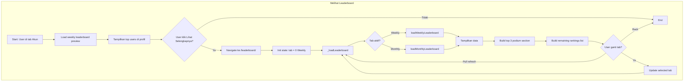
```mermaid
flowchart TD
    subgraph "Melihat Leaderboard"
        A[Start: User di tab Akun] --> B[Load weekly leaderboard preview]
        B --> C[Tampilkan top users di profil]
        C --> D{User klik Lihat Selengkapnya?}
        D -- Tidak --> Z[End]
        D -- Ya --> E[Navigate ke /leaderboard/]
        E --> F[Init state: tab = 0 Weekly]
        F --> G[_loadLeaderboard]
        G --> H{Tab aktif?}
        H -- Weekly --> I[loadWeeklyLeaderboard]
        H -- Monthly --> J[loadMonthlyLeaderboard]
        I --> K[Tampilkan data]
        J --> K
        K --> L[Build top 3 podium section]
        L --> M[Build remaining rankings list]
        M --> N{User ganti tab?}
        N -- Ya --> O[Update selected tab]
        O --> G
        N -- Pull refresh --> G
        N -- Back --> Z
    end
```

### Sequence Diagram

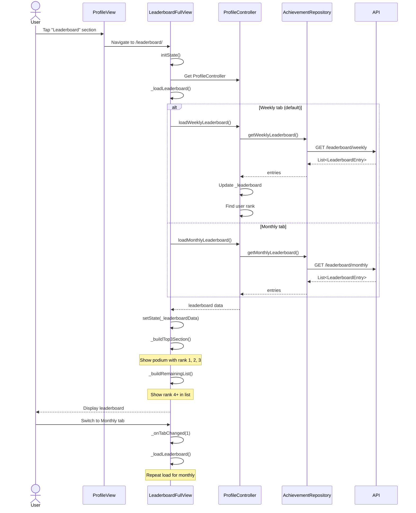
```mermaid
sequenceDiagram
    actor User
    participant Profile as ProfileView
    participant LB as LeaderboardFullView
    participant Ctrl as ProfileController
    participant Repo as AchievementRepository
    participant Backend as API

    User->>Profile: Tap "Leaderboard" section
    Profile->>LB: Navigate to /leaderboard/

    LB->>LB: initState()
    LB->>Ctrl: Get ProfileController

    LB->>LB: _loadLeaderboard()

    alt Weekly tab (default)
        LB->>Ctrl: loadWeeklyLeaderboard()
        Ctrl->>Repo: getWeeklyLeaderboard()
        Repo->>Backend: GET /leaderboard/weekly
        Backend-->>Repo: List<LeaderboardEntry>
        Repo-->>Ctrl: entries
        Ctrl->>Ctrl: Update _leaderboard
        Ctrl->>Ctrl: Find user rank
    else Monthly tab
        LB->>Ctrl: loadMonthlyLeaderboard()
        Ctrl->>Repo: getMonthlyLeaderboard()
        Repo->>Backend: GET /leaderboard/monthly
        Backend-->>Repo: List<LeaderboardEntry>
        Repo-->>Ctrl: entries
    end

    Ctrl-->>LB: leaderboard data

    LB->>LB: setState(_leaderboardData)
    LB->>LB: _buildTop3Section()
    Note over LB: Show podium with rank 1, 2, 3
    LB->>LB: _buildRemainingList()
    Note over LB: Show rank 4+ in list

    LB-->>User: Display leaderboard

    User->>LB: Switch to Monthly tab
    LB->>LB: _onTabChanged(1)
    LB->>LB: _loadLeaderboard()
    Note over LB: Repeat load for monthly
```

### Referensi Kode

| Komponen               | File                                                          |
| ---------------------- | ------------------------------------------------------------- |
| Profile Controller     | `lib/app/modules/profile/controllers/profile_controller.dart` |
| Leaderboard Full View  | `lib/app/modules/profile/views/leaderboard_full_view.dart`    |
| Achievement Repository | `lib/app/data/repositories/achievement_repository_impl.dart`  |
| Leaderboard Model      | `lib/app/data/models/leaderboard_model.dart`                  |

---

## 9. Menukarkan Reward/Kupon

### Deskripsi

Use case ini memungkinkan pengguna untuk menukarkan koin yang telah dikumpulkan dengan reward berupa kupon/voucher dari merchant partner.

### Aktor

- **Pengguna Terautentikasi**

### Precondition

- Pengguna sudah login
- Pengguna memiliki koin yang cukup
- Reward tersedia untuk ditukarkan

### Postcondition

- Koin pengguna berkurang sesuai harga reward
- Kupon ditambahkan ke koleksi pengguna
- Kupon dapat digunakan di merchant terkait

### Flow Utama

1. Pengguna membuka halaman Rewards dari profil
2. Sistem memuat daftar rewards yang dimiliki
3. Sistem menampilkan header dengan total koin
4. Pengguna melihat kupon yang tersedia
5. Pengguna dapat memilih kupon untuk melihat detail
6. Detail kupon menampilkan:
   - Nama reward
   - Merchant
   - Tanggal kadaluarsa
   - Status (unused/used)
7. Pengguna dapat menggunakan kupon saat transaksi

### Activity Diagram

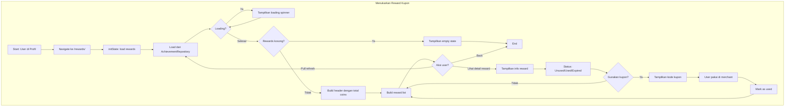
```mermaid
flowchart TD
    subgraph "Menukarkan Reward Kupon"
        A[Start: User di Profil] --> B[Navigate ke /rewards/]
        B --> C[initState: load rewards]
        C --> D[Load dari AchievementRepository]
        D --> E{Loading?}
        E -- Ya --> F[Tampilkan loading spinner]
        F --> E
        E -- Selesai --> G{Rewards kosong?}
        G -- Ya --> H[Tampilkan empty state]
        H --> Z[End]
        G -- Tidak --> I[Build header dengan total coins]
        I --> J[Build reward list]
        J --> K{Aksi user?}
        K -- Lihat detail reward --> L[Tampilkan info reward]
        L --> M[Status: Unused/Used/Expired]
        M --> N{Gunakan kupon?}
        N -- Ya --> O[Tampilkan kode kupon]
        O --> P[User pakai di merchant]
        P --> Q[Mark as used]
        Q --> J
        N -- Tidak --> J
        K -- Pull refresh --> D
        K -- Back --> Z
    end
```

### Sequence Diagram

```mermaid
sequenceDiagram
    actor User
    participant Profile as ProfileView
    participant Rewards as RewardsView
    participant Ctrl as ProfileController
    participant Repo as AchievementRepository
    participant Backend as API

    User->>Profile: Tap "Rewards" menu
    Profile->>Rewards: Navigate to /rewards/

    Rewards->>Rewards: initState()
    Rewards->>Rewards: _loadRewards()
    Rewards->>Rewards: setState(isLoading = true)

    Rewards->>Repo: getUserRewards()
    Repo->>Backend: GET /rewards/user
    Backend-->>Repo: List<UserReward>
    Repo-->>Rewards: rewards

    Rewards->>Rewards: setState(rewards, isLoading = false)

    alt Rewards exist
        Rewards->>Rewards: _buildHeaderSection()
        Note over Rewards: Show total coins from ProfileController

        loop Each reward
            Rewards->>Rewards: _buildRewardItem(reward)
            Note over Rewards: Show name, merchant, expiry
        end
    else No rewards
        Rewards->>Rewards: _buildEmptyState()
    end

    Rewards-->>User: Display rewards page

    User->>Rewards: Tap on reward card
    Rewards->>Rewards: Show reward detail modal
    Note over Rewards: Display coupon code, validity, status

    User->>Rewards: Tap "Use Coupon"
    Rewards->>Repo: markRewardAsUsed(rewardId)
    Repo->>Backend: PATCH /rewards/{id}/use
    Backend-->>Repo: Updated reward
    Repo-->>Rewards: success
    Rewards->>Rewards: Update reward status locally
```

### Referensi Kode

| Komponen               | File                                                          |
| ---------------------- | ------------------------------------------------------------- |
| Rewards View           | `lib/app/modules/profile/views/rewards_view.dart`             |
| Profile Controller     | `lib/app/modules/profile/controllers/profile_controller.dart` |
| Achievement Repository | `lib/app/data/repositories/achievement_repository_impl.dart`  |
| Reward Model           | `lib/app/data/models/reward_model.dart`                       |

---

## Ringkasan Diagram Interaksi Antar Use Case

```mermaid
flowchart TB
    subgraph "Entry Points"
        UC1[1. Autentikasi]
    end

    subgraph "Core Features"
        UC2[2. Jelajahi Tempat]
        UC3[3. Check-in]
        UC4[4. Review & Post]
        UC5[5. Interaksi Sosial]
        UC6[6. Artikel]
    end

    subgraph "Gamification"
        UC7[7. Progres Gamifikasi]
        UC8[8. Leaderboard]
        UC9[9. Rewards]
    end

    UC1 --> UC2
    UC1 --> UC5
    UC1 --> UC6
    UC1 --> UC7

    UC2 --> UC3
    UC3 --> UC4
    UC4 --> UC5

    UC3 --> UC7
    UC4 --> UC7
    UC7 --> UC8
    UC7 --> UC9

    style UC1 fill:#e1f5fe
    style UC3 fill:#fff3e0
    style UC4 fill:#fff3e0
    style UC7 fill:#f3e5f5
    style UC8 fill:#f3e5f5
    style UC9 fill:#f3e5f5
```

---

### Teknologi Stack

- **Framework**: Flutter with GetX state management
- **Backend**: REST API
- **Auth**: Firebase Auth + Google Sign-In
- **Storage**: Cloudinary for media
- **Location**: Geolocator package

---

_Dokumen ini di-generate berdasarkan analisis kode sumber aplikasi Snappie._
_Terakhir diperbarui: 2026-02-03_
