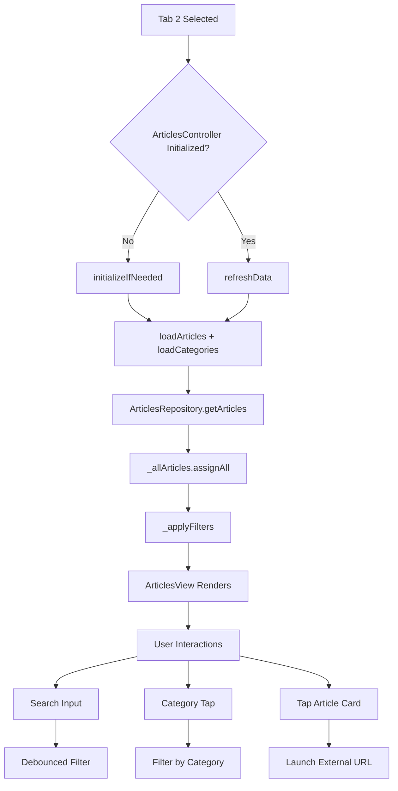
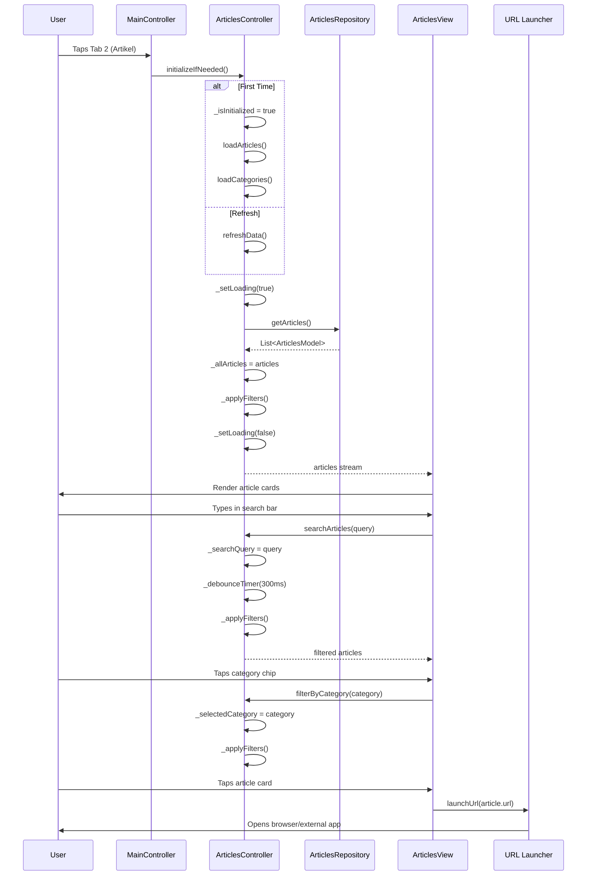

# User Flow: Articles - Listing, Search & Filter

## Overview
Article browsing tab with local search and category filtering. Opens external URLs.

## Entry Points
- Tab 2 (Artikel) in MainLayout
- Route: `/articles` (within MainLayout, ArticlesController)

## Components
- **Controller**: `ArticlesController` (`lib/app/modules/articles/controllers/articles_controller.dart`)
- **View**: `ArticlesView` (`lib/app/modules/articles/views/articles_view.dart`)
- **Repository**: `ArticlesRepository` (`lib/app/data/repositories/articles_repository_impl.dart`)

## Activity Diagram



## Sequence Diagram



## State Management (ArticlesController)

| Variable | Type | Description |
|----------|------|-------------|
| `_allArticles` | `RxList<ArticlesModel>` | All loaded articles |
| `_filteredArticles` | `RxList<ArticlesModel>` | After search/category filter |
| `_categories` | `RxList<String>` | Category options |
| `_selectedCategory` | `RxString` | Active category filter |
| `_searchQuery` | `RxString` | Search text |
| `_isLoading` | `RxBool` | Loading indicator |
| `_isSearching` | `RxBool` | Debounce indicator |
| `_isInitialized` | `RxBool` | Init guard |
| `searchTextController` | `TextEditingController` | Search input |

## Filter Logic

```dart
// ArticlesController._applyFilters() lines 115-143
void _applyFilters() {
  List<ArticlesModel> result = List.from(_allArticles);

  // Search filter (title, description, author, category)
  if (_searchQuery.value.isNotEmpty) {
    final query = _searchQuery.value.toLowerCase();
    result = result.where((article) {
      final title = article.title?.toLowerCase() ?? '';
      final description = article.description?.toLowerCase() ?? '';
      final author = article.author?.toLowerCase() ?? '';
      final category = article.category?.toLowerCase() ?? '';
      return title.contains(query) ||
             description.contains(query) ||
             author.contains(query) ||
             category.contains(query);
    }).toList();
  }

  // Category filter
  if (_selectedCategory.value.isNotEmpty) {
    result = result.where((article) =>
      article.category?.toLowerCase() == _selectedCategory.value.toLowerCase()
    ).toList();
  }

  _filteredArticles.value = result;
}
```

## Search Debounce

```dart
// ArticlesController.searchArticles() lines 96-112
void searchArticles(String query) {
  _searchQuery.value = query;
  _debounceTimer?.cancel();
  
  if (query.isNotEmpty) _isSearching.value = true;
  
  _debounceTimer = Timer(const Duration(milliseconds: 300), () {
    _applyFilters();
    _isSearching.value = false;
  });
}
```

## Categories (Current State)

```dart
// ArticlesController.loadCategories() lines 78-89
Future<void> loadCategories() async {
  try {
    // TODO: Load real categories from API
    _categories.clear();
    // Currently empty - waiting for API endpoints
  } catch (e) {
    Logger.error('Error loading categories');
  }
}
```

## Article Model

```dart
// Expected ArticlesModel structure
class ArticlesModel {
  final int id;
  final String title;
  final String? description;
  final String? author;
  final String? category;
  final String? imageUrl;
  final String url; // External URL to open
  final DateTime? publishedAt;
}
```

## Navigation Flow

```
┌──────────────────┐
│ MainLayout       │
│ Tab 2: Artikel   │
└────────┬─────────┘
         │
         ▼
┌──────────────────┐
│ ArticlesController│
│ initializeIfNeeded│
└────────┬─────────┘
         │
         ▼
┌──────────────────┐
│ /articles        │
│ ArticlesView     │
│ - Search Bar     │
│ - Category Chips │
│ - Article Cards  │
└────────┬─────────┘
         │
    ┌────┴────┐
    ▼         ▼
 Search    Category
 Filter    Filter
    │         │
    └────┬────┘
         ▼
┌──────────────────┐
│ Filtered List    │
│ Article Cards    │
└────────┬─────────┘
         │
         ▼
┌──────────────────┐
│ Tap Card         │
│ launchUrl(url)   │
└────────┬─────────┘
         │
         ▼
┌──────────────────┐
│ External Browser │
│ / In-App Browser │
└──────────────────┘
```

## Edge Cases

| Scenario | Handling |
|----------|----------|
| No articles | Empty state widget |
| Search clears | `clearFilters()` resets all |
| Category not in API | Hardcoded fallback (TODO) |
| Invalid URL | `url_launcher` handles gracefully |
| Network error | Silent fail, shows cached/empty |
| Large list | No pagination (all loaded at once) |
| Pull-to-refresh | `refreshData()` reloads all |

## Testing Checklist

- [ ] Tab select loads articles
- [ ] Search debounced (300ms) works
- [ ] Category filter works
- [ ] Clear filters resets both
- [ ] Article tap opens external URL
- [ ] Loading states shown
- [ ] Empty state when no results
- [ ] Pull-to-refresh reloads
- [ ] Categories load (when API ready)
- [ ] No memory leaks on navigation

## Related Files

- `lib/app/modules/articles/controllers/articles_controller.dart`
- `lib/app/modules/articles/views/articles_view.dart`
- `lib/app/data/repositories/articles_repository_impl.dart`
- `lib/app/data/models/articles_model.dart`
- `lib/app/routes/app_pages.dart` (ARTICLES route)