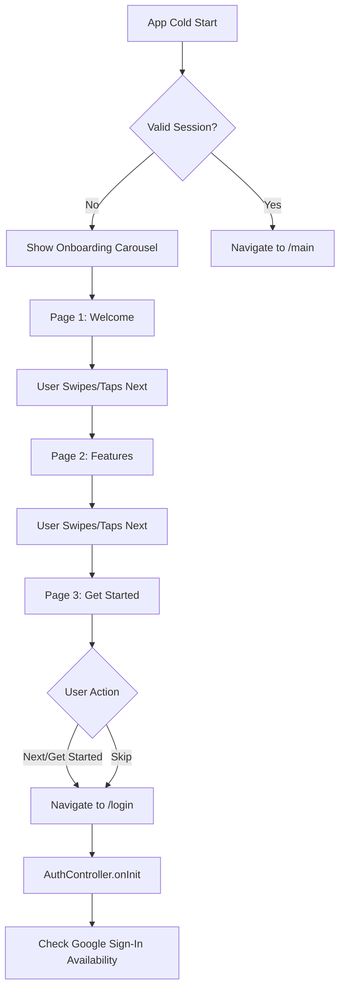
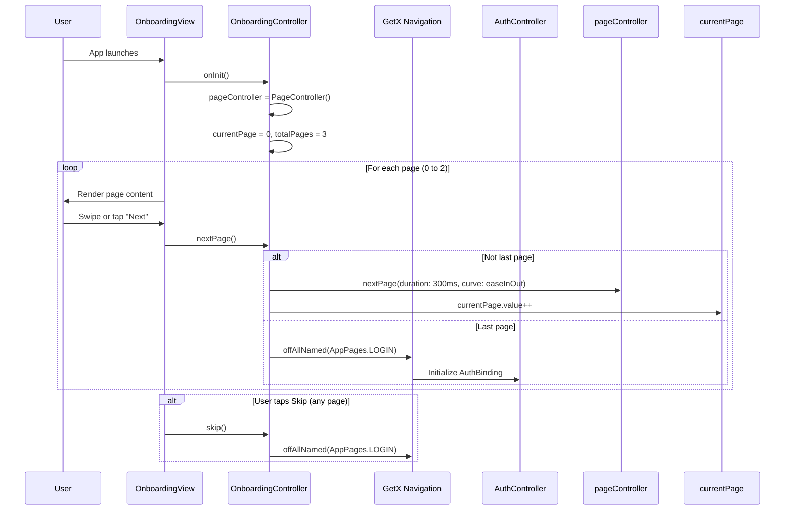

# User Flow: Onboarding Carousel

## Overview
First-time user experience showing app value proposition across 3 pages before authentication.

## Entry Points
- App cold start (no valid session in SharedPreferences)
- Route: `/onboarding` (AppPages.INITIAL)

## Components
- **Controller**: `OnboardingController` (`lib/app/modules/auth/controllers/onboarding_controller.dart`)
- **View**: `OnboardingView` (`lib/app/modules/auth/views/onboarding_view.dart`)
- **Binding**: `OnboardingBinding` (`lib/app/modules/auth/bindings/onboarding_binding.dart`)
- **Route**: `AppPages.ONBOARDING = '/onboarding'`

## Activity Diagram



## Sequence Diagram



## State Management

| Variable | Type | Description |
|----------|------|-------------|
| `currentPage` | `RxInt` | Current page index (0-2) |
| `totalPages` | `int` | Constant 3 |
| `pageController` | `PageController` | Controls page animation |

## Key Methods

### `onPageChanged(int index)`
Updates `currentPage` reactively when user swipes.

### `nextPage()`
```dart
if (currentPage < totalPages - 1) {
  pageController.nextPage(duration: 300ms, curve: Curves.easeInOut);
} else {
  Get.offAllNamed(AppPages.LOGIN); // Navigate to login
}
```

### `skip()`
Immediate navigation to login: `Get.offAllNamed(AppPages.LOGIN)`

## Navigation Flow

```
┌─────────────────┐
│  App Launch     │
└────────┬────────┘
         │
         ▼
┌─────────────────┐
│ Check Session   │◄──── SharedPreferences (AuthService)
└────────┬────────┘
         │ No Session
         ▼
┌─────────────────┐
│ /onboarding     │
│ OnboardingView  │
│ 3 Pages         │
└────────┬────────┘
         │ Next/Skip
         ▼
┌─────────────────┐
│ /login          │
│ LoginView       │
│ AuthController  │
└─────────────────┘
```

## Edge Cases

| Scenario | Handling |
|----------|----------|
| App kill during onboarding | Restarts from page 0 (no persistence) |
| Back button on page 0 | Exits app (handled by Flutter) |
| Rapid taps | PageController handles animation queue |
| Device rotation | PageController maintains position |

## Testing Checklist

- [ ] Cold start shows onboarding
- [ ] Swipe navigation works all 3 pages
- [ ] Next button advances pages
- [ ] Skip button jumps to login
- [ ] Last page "Get Started" goes to login
- [ ] Page indicators update correctly
- [ ] No memory leaks on navigation

## Related Files

- `lib/app/modules/auth/controllers/onboarding_controller.dart`
- `lib/app/modules/auth/views/onboarding_view.dart`
- `lib/app/modules/auth/bindings/onboarding_binding.dart`
- `lib/app/routes/app_pages.dart` (ONBOARDING route)