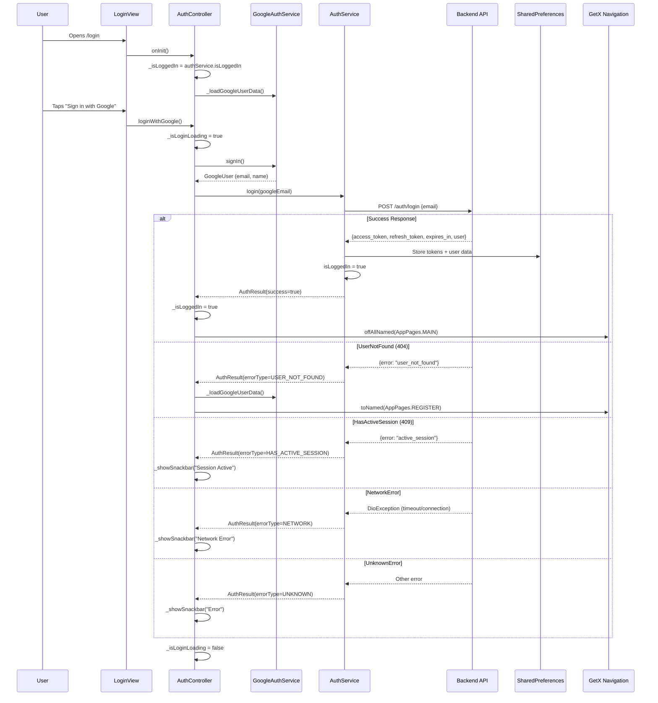

# User Flow: Google Sign-In Login

## Overview
Primary authentication flow using Google Sign-In (Firebase) followed by backend token exchange.

## Entry Points
- Route: `/login` (from onboarding or logout)
- Direct: `/main` if valid session exists (auto-login)

## Components
- **Controller**: `AuthController` (`lib/app/modules/auth/controllers/auth_controller.dart`)
- **View**: `LoginView` (`lib/app/modules/auth/views/login_view.dart`)
- **Services**: `AuthService`, `GoogleAuthService`
- **Route**: `AppPages.LOGIN = '/login'`
- **Binding**: `AuthBinding`

## Activity Diagram

```mermaid
flowchart TD
    A[/login Route] --> B[LoginView Rendered]
    B --> C[User Taps 'Sign in with Google']
    C --> D[GoogleAuthService.signIn]
    D --> E{Google Sign-In Success?}
    E -->|No| F[Show Error Snackbar]
    F --> C
    E -->|Yes| G[Get Google User Email/Name]
    G --> H[AuthService.login email]
    H --> I{Backend Response}
    I -->|Success| J[Store Tokens in SharedPreferences]
    J --> K[AuthService.isLoggedIn = true]
    K --> L[Get.offAllNamed /main]
    I -->|UserNotFound| M[Load Google User Data]
    M --> N[Get.toNamed /register]
    I -->|HasActiveSession| O[Show Session Active Snackbar]
    O --> C
    I -->|NetworkError| P[Show Network Error Snackbar]
    P --> C
    I -->|Unknown| Q[Show Generic Error Snackbar]
    Q --> C
```

## Sequence Diagram



## State Management (AuthController)

| Variable | Type | Description |
|----------|------|-------------|
| `_isLoginLoading` | `RxBool` | Loading state for login button |
| `_isLoggedIn` | `RxBool` | Current auth status |
| `_googleUserName` | `RxString` | Google account name |
| `_googleUserEmail` | `RxString` | Google account email |

## Key Methods

### `loginWithGoogle()`
```dart
Future<void> loginWithGoogle() async {
  _isLoginLoading.value = true;
  try {
    final result = await authService.login(); // Internally calls GoogleAuthService
    
    if (result.success) {
      _isLoggedIn.value = true;
      Get.offAllNamed(AppPages.MAIN);
      return;
    }
    
    // Handle error types
    switch (result.errorType) {
      case AuthErrorType.userNotFound:
        _loadGoogleUserData();
        Get.toNamed(AppPages.REGISTER);
        break;
      case AuthErrorType.hasActiveSession:
        _showSnackbar('Session Active', ...);
        break;
      case AuthErrorType.network:
        _showSnackbar('Network Error', ...);
        break;
      default:
        _showSnackbar('Error', ...);
    }
  } catch (e) {
    _showSnackbar('Error', 'Network error...');
  }
  _isLoginLoading.value = false;
}
```

### `AuthService.login()` (Core Logic)
```dart
// In AuthService - handles Google sign-in + backend token exchange
Future<AuthResult> login() async {
  // 1. Google Sign-In
  final googleUser = await googleAuthService.signIn();
  if (googleUser == null) return AuthResult.cancelled();
  
  // 2. Backend token exchange
  final response = await dio.post('/auth/login', data: {'email': googleUser.email});
  
  // 3. Store tokens
  await _saveTokens(response.data);
  
  return AuthResult.success();
}
```

## Token Storage (SharedPreferences)

| Key | Value | Description |
|-----|-------|-------------|
| `access_token` | String | JWT for API authentication |
| `refresh_token` | String | Long-lived token for renewal |
| `token_expiry` | int | Unix timestamp (milliseconds) |
| `user_data` | JSON | Serialized UserModel |

## Error Types (`AuthErrorType`)

| Type | HTTP Status | User Message | Action |
|------|-------------|--------------|--------|
| `userNotFound` | 404 | Redirect to register | Navigate to `/register` |
| `hasActiveSession` | 409 | "Masih ada sesi aktif" | Stay on login |
| `network` | - | "Periksa koneksi" | Retry |
| `unknown` | 500+ | "Terjadi kesalahan" | Retry |

## Navigation Flow

```
┌─────────────┐
│  /login     │
│ LoginView   │
└──────┬──────┘
       │ Tap "Google Sign-In"
       ▼
┌──────────────────┐
│ GoogleAuthService│
│ .signIn()        │
└──────┬───────────┘
       │ GoogleUser
       ▼
┌──────────────────┐
│ AuthService.login│
│ POST /auth/login │
└──────┬───────────┘
       │ Response
       ▼
┌─────────┬─────────┬─────────────┐
│ Success │Not Found│ Other Error │
▼         ▼         ▼
/main   /register  Stay + Snackbar
```

## Edge Cases

| Scenario | Handling |
|----------|----------|
| User cancels Google picker | `_isLoginLoading = false`, no navigation |
| Google Play Services unavailable | Snackbar: "Google Play Services required" |
| Backend returns 401 on login | Treated as `unknown` error |
| Token storage fails | Logged but continues (non-blocking) |
| Multiple rapid taps | `_isLoginLoading` prevents double submission |

## Testing Checklist

- [ ] Google Sign-In button triggers flow
- [ ] Successful login → `/main` with tokens stored
- [ ] New user → `/register` with email pre-filled
- [ ] Active session error → snackbar shown
- [ ] Network error → snackbar shown
- [ ] Cancel Google picker → no navigation, loading stops
- [ ] Loading state disables button
- [ ] Tokens persist across app restart

## Related Files

- `lib/app/modules/auth/controllers/auth_controller.dart` (lines 221-281)
- `lib/app/modules/auth/views/login_view.dart`
- `lib/app/core/services/auth_service.dart`
- `lib/app/core/services/google_auth_service.dart`
- `lib/app/core/errors/auth_result.dart`
- `lib/app/routes/app_pages.dart`