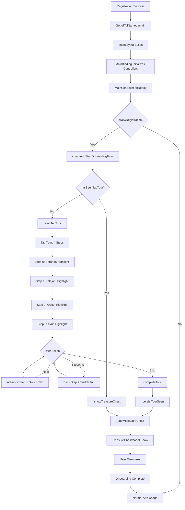
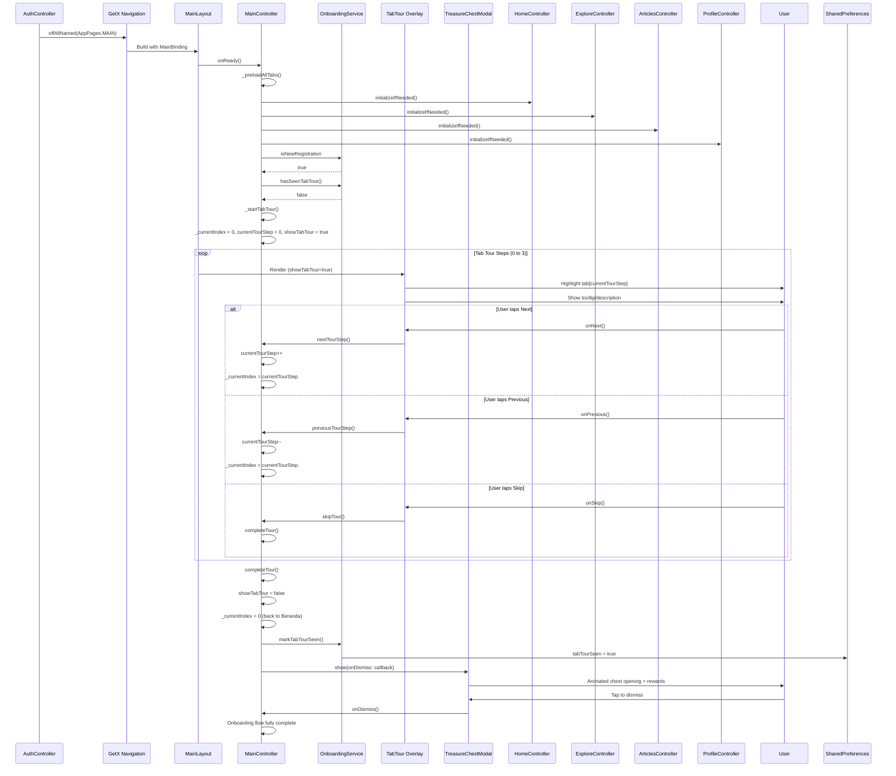

# User Flow: Post-Registration Onboarding (Tab Tour + Treasure Chest)

## Overview
First-time user guidance after registration: 4-step tab tour highlighting each main tab, followed by a treasure chest reward modal.

## Entry Points
- Automatic: After successful registration → `/main` (MainLayout loads)
- Trigger: `OnboardingService.isNewRegistration == true`
- Manual: `MainController.debugShowOnboarding()` (debug only)

## Components
- **Controller**: `MainController` (`lib/app/modules/shared/layout/controllers/main_controller.dart`)
- **Service**: `OnboardingService` (`lib/app/core/services/onboarding_service.dart`)
- **Views**: Tab tour overlay (built into `MainLayout`), `TreasureChestModal`
- **Routes**: Runs within `/main` (MainLayout)

## Activity Diagram



## Sequence Diagram



## State Management (MainController)

| Variable | Type | Description |
|----------|------|-------------|
| `showTabTour` | `RxBool` | Controls tour overlay visibility |
| `currentTourStep` | `RxInt` | Current step (0-3) |
| `_totalTourSteps` | `const int` | 4 (constant) |
| `_currentIndex` | `RxInt` | Current tab index (synced with tour) |

## Tab Tour Steps

| Step | Tab Index | Tab Name | Description |
|------|-----------|----------|-------------|
| 0 | 0 | Beranda | Social feed: posts, likes, saves, follows |
| 1 | 1 | Jelajahi | Discover places, check-ins, reviews |
| 2 | 2 | Artikel | Browse articles, search, external links |
| 3 | 3 | Akun | Profile, stats, leaderboard, settings |

## Key Methods

### `checkAndStartOnboardingFlow()` (lines 71-89)
```dart
Future<void> checkAndStartOnboardingFlow() async {
  final onboarding = Get.find<OnboardingService>();
  if (onboarding.isNewRegistration) {
    final alreadySeen = await onboarding.hasSeenTabTour();
    if (!alreadySeen) {
      _startTabTour(); // Begin 4-step tour
    }
    onboarding.clearNewRegistration(); // Clear flag after check
  }
}
```

### `_startTabTour()` (lines 97-102)
```dart
void _startTabTour() {
  _currentIndex.value = 0;        // Start at Beranda
  currentTourStep.value = 0;      // Step 0
  showTabTour.value = true;       // Show overlay
}
```

### `nextTourStep()` / `previousTourStep()` (lines 105-130)
```dart
void nextTourStep() {
  if (currentTourStep < _totalTourSteps - 1) {
    currentTourStep.value++;
    _currentIndex.value = currentTourStep.value; // Switch tab
  } else {
    completeTour(); // Last step → finish
  }
}

void previousTourStep() {
  if (currentTourStep > 0) {
    currentTourStep.value--;
    _currentIndex.value = currentTourStep.value; // Switch tab back
  }
}
```

### `completeTour()` (lines 135-147)
```dart
void completeTour() {
  showTabTour.value = false;
  _currentIndex.value = 0; // Return to Beranda
  _persistTourSeen();      // Save to SharedPreferences
  
  // Step 2: Show Treasure Chest
  _showTreasureChest(() {
    Logger.debug('Onboarding flow fully complete');
  });
}
```

### `_showTreasureChest(VoidCallback onComplete)` (lines 91-95)
```dart
void _showTreasureChest(VoidCallback onComplete) {
  TreasureChestModal.show(onDismiss: onComplete);
}
```

## OnboardingService Persistence

| Key | Type | Description |
|-----|------|-------------|
| `isNewRegistration` | `bool` | Set after registration, cleared after check |
| `tabTourSeen` | `bool` | Set after tour completion |

```dart
// OnboardingService methods
Future<void> markAsNewRegistration() async {
  await prefs.setBool('is_new_registration', true);
}

bool get isNewRegistration => prefs.getBool('is_new_registration') ?? false;

Future<void> clearNewRegistration() async {
  await prefs.remove('is_new_registration');
}

Future<bool> hasSeenTabTour() async {
  return prefs.getBool('tab_tour_seen') ?? false;
}

Future<void> markTabTourSeen() async {
  await prefs.setBool('tab_tour_seen', true);
}
```

## Navigation Flow

```
┌──────────────────┐
│ Registration     │
│ Success          │
└────────┬─────────┘
         │
         ▼
┌──────────────────┐
│ /main            │
│ MainLayout       │
│ MainController   │
└────────┬─────────┘
         │ onReady()
         ▼
┌────────────────────────┐
│ isNewRegistration?     │──No──► Normal Usage
└────────┬───────────────┘
         │ Yes
         ▼
┌────────────────────────┐
│ hasSeenTabTour?        │──Yes──► Treasure Chest
└────────┬───────────────┘
         │ No
         ▼
┌────────────────────────┐
│ TAB TOUR (4 Steps)     │
│ Step 0: Beranda        │
│ Step 1: Jelajahi       │
│ Step 2: Artikel        │
│ Step 3: Akun           │
│ Controls: Next/Prev/   │
│ Skip                   │
└────────┬───────────────┘
         │ Complete/Skip
         ▼
┌────────────────────────┐
│ markTabTourSeen()      │
│ clearNewRegistration() │
└────────┬───────────────┘
         │
         ▼
┌────────────────────────┐
│ TREASURE CHEST MODAL   │
│ Animated reward reveal │
│ Tap to dismiss         │
└────────┬───────────────┘
         │
         ▼
┌────────────────────────┐
│ Normal App Usage       │
│ (Tab 0: Beranda)       │
└────────────────────────┘
```

## TreasureChestModal

**Component**: `lib/app/modules/shared/widgets/_dialog_widgets/treasure_chest_modal.dart`
- Animated chest opening
- Shows XP/Coin rewards
- Single dismiss action
- Non-blocking (overlay)

## Edge Cases

| Scenario | Handling |
|----------|----------|
| App killed during tour | `isNewRegistration` persists, tour restarts on next launch |
| User skips tour | `completeTour()` called directly → treasure chest |
| User goes back during tour | `previousTourStep()` switches tab back |
| MainController not ready | `checkAndStartOnboardingFlow()` called proactively from AuthController |
| Tour already seen (reinstall) | `hasSeenTabTour()` returns true → straight to treasure chest |

## Testing Checklist

- [ ] Registration → `/main` triggers tour automatically
- [ ] Tour shows 4 steps in order
- [ ] Next advances step + switches tab
- [ ] Previous goes back + switches tab
- [ ] Skip jumps to treasure chest
- [ ] Complete (step 4) → treasure chest
- [ ] Treasure chest displays + dismisses
- [ ] Second launch: no tour, no chest (flags persisted)
- [ ] Debug method triggers tour manually
- [ ] Tab content loads during tour (preloaded)

## Related Files

- `lib/app/modules/shared/layout/controllers/main_controller.dart` (lines 67-160)
- `lib/app/core/services/onboarding_service.dart`
- `lib/app/modules/shared/widgets/_dialog_widgets/treasure_chest_modal.dart`
- `lib/app/modules/shared/layout/views/main_layout.dart` (renders tour overlay)
- `lib/app/modules/auth/controllers/auth_controller.dart` (lines 374-383: triggers onboarding)