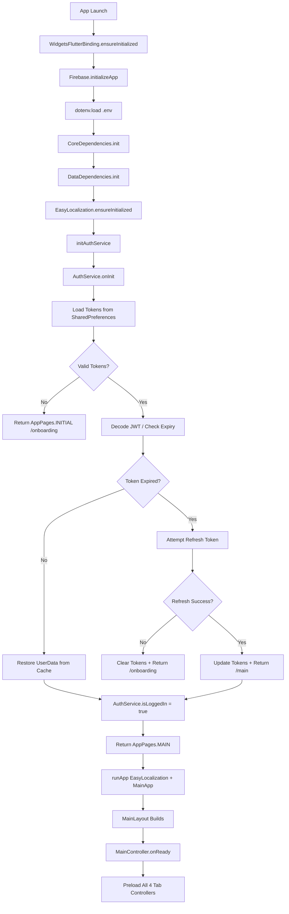
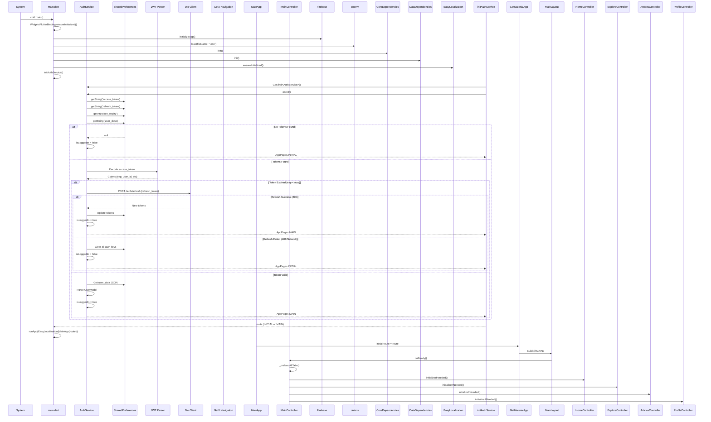

# User Flow: Auto-Login / Session Restore

## Overview
Seamless app startup for returning users with valid stored tokens. Bypasses onboarding/login entirely.

## Entry Points
- App cold start (any launch with valid session)
- Route: `/main` directly (not `/onboarding` or `/login`)

## Components
- **Entry**: `main.dart` (`lib/main.dart`)
- **Service**: `AuthService` (`lib/app/core/services/auth_service.dart`)
- **Storage**: SharedPreferences (tokens, user data)
- **Route Decision**: `initAuthService()` in `main.dart`

## Activity Diagram



## Sequence Diagram



## Token Structure (SharedPreferences)

| Key | Type | Example | Description |
|-----|------|---------|-------------|
| `access_token` | String | `eyJhbGciOiJIUzI1NiIs...` | JWT for API auth |
| `refresh_token` | String | `dGhpcyBpcyBhIHJlZnJl...` | Long-lived refresh token |
| `token_expiry` | int | `1734567890000` | Expiry timestamp (ms) |
| `user_data` | String (JSON) | `{"id":1,"name":"John",...}` | Serialized UserModel |

## AuthService.onInit() Logic

```dart
// lib/app/core/services/auth_service.dart
Future<void> onInit() async {
  final prefs = await SharedPreferences.getInstance();
  
  _accessToken = prefs.getString('access_token');
  _refreshToken = prefs.getString('refresh_token');
  _tokenExpiry = prefs.getInt('token_expiry');
  
  if (_accessToken != null && _refreshToken != null && _tokenExpiry != null) {
    // Check expiry
    if (DateTime.now().millisecondsSinceEpoch < _tokenExpiry!) {
      // Token valid - restore user
      final userDataJson = prefs.getString('user_data');
      if (userDataJson != null) {
        _userData = UserModel.fromJson(jsonDecode(userDataJson));
      }
      _isLoggedIn.value = true;
    } else {
      // Token expired - try refresh
      await _tryRefreshToken();
    }
  }
}

Future<void> _tryRefreshToken() async {
  try {
    final response = await _dio.post('/auth/refresh', data: {
      'refresh_token': _refreshToken,
    });
    
    // Save new tokens
    await _saveTokens(response.data);
    _isLoggedIn.value = true;
  } catch (e) {
    // Refresh failed - clear everything
    await logout();
  }
}
```

## initAuthService() in main.dart

```dart
// lib/main.dart lines 17-30
Future<String> initAuthService() async {
  try {
    final authService = Get.find<AuthService>();
    await authService.onInit();
    
    if (authService.isLoggedIn) {
      return AppPages.MAIN;      // Direct to main tabs
    }
    return AppPages.INITIAL;     // Onboarding
  } catch (e) {
    Logger.error('Error initializing auth service', e, null, 'Auth');
    return AppPages.INITIAL;
  }
}
```

## Navigation Decision Tree

```
                    ┌─────────────────┐
                    │  App Launch     │
                    └────────┬────────┘
                             │
                             ▼
                    ┌─────────────────┐
                    │  Load .env &    │
                    │  Dependencies   │
                    └────────┬────────┘
                             │
                             ▼
                    ┌─────────────────┐
                    │  AuthService    │
                    │  .onInit()      │
                    └────────┬────────┘
                             │
              ┌──────────────┼──────────────┐
              ▼              ▼              ▼
       ┌───────────┐  ┌───────────┐  ┌───────────┐
       │ No Tokens │  │ Tokens +  │  │ Tokens +  │
       │           │  │ Valid     │  │ Expired   │
       └─────┬─────┘  └─────┬─────┘  └─────┬─────┘
             │              │              │
             ▼              ▼              ▼
       ┌───────────┐  ┌───────────┐  ┌───────────┐
       │ /onboarding│  │  /main    │  │ Try Refresh│
       └───────────┘  └───────────┘  └─────┬─────┘
                                          │
                               ┌──────────┴──────────┐
                               ▼                     ▼
                        ┌───────────┐           ┌───────────┐
                        │ Success   │           │ Failed    │
                        │ /main     │           │ /onboarding│
                        └───────────┘           └───────────┘
```

## MainLayout Preloading (MainController.onReady)

```dart
// lib/app/modules/shared/layout/controllers/main_controller.dart lines 163-189
@override
void onReady() {
  super.onReady();
  
  // App update check
  try {
    final updater = Get.find<AppUpdateService>();
    updater.checkAndPrompt();
  } catch (_) {}
  
  // Preload ALL tab data at startup
  _preloadAllTabs();
  
  // Check onboarding
  checkAndStartOnboardingFlow();
}

void _preloadAllTabs() {
  try {
    Get.find<HomeController>().initializeIfNeeded();
    Get.find<ExploreController>().initializeIfNeeded();
    Get.find<ArticlesController>().initializeIfNeeded();
    Get.find<ProfileController>().initializeIfNeeded();
    Logger.debug('MainController: All tabs preloaded', 'Navigation');
  } catch (e) {
    Logger.warning('MainController: Failed to preload tabs: $e', 'Navigation');
  }
}
```

## Tab Controller Lazy Initialization Pattern

Each tab controller uses `initializeIfNeeded()`:

```dart
// HomeController example (lines 98-104)
final _isInitialized = false.obs;

void initializeIfNeeded() {
  if (!_isInitialized.value) {
    _isInitialized.value = true;
    loadHomeData();  // Actual data loading
  }
}
```

## Edge Cases

| Scenario | Handling |
|----------|----------|
| Corrupted token in storage | JWT decode fails → treated as no token |
| Refresh token expired | Refresh fails → logout → onboarding |
| Network unavailable at startup | Refresh fails → logout → onboarding |
| User data JSON corrupted | Parse fails → `_userData = null`, but `isLoggedIn = true` |
| Multiple app instances | SharedPreferences is process-safe |
| Token expires during preload | API calls get 401 → Dio interceptor handles refresh |

## Testing Checklist

- [ ] Fresh install → onboarding
- [ ] Valid tokens → direct to `/main`
- [ ] Expired access + valid refresh → silent refresh → `/main`
- [ ] Expired refresh → logout → onboarding
- [ ] No network at startup → logout → onboarding
- [ ] Corrupted storage → onboarding
- [ ] All 4 tabs preload on `/main` entry
- [ ] User data restored in AuthService
- [ ] `isLoggedIn` reactive updates UI correctly

## Related Files

- `lib/main.dart` (lines 17-66)
- `lib/app/core/services/auth_service.dart` (onInit, _tryRefreshToken, _saveTokens)
- `lib/app/core/network/dio_client.dart` (interceptor for 401 handling)
- `lib/app/modules/shared/layout/controllers/main_controller.dart` (onReady, _preloadAllTabs)
- `lib/app/core/services/app_update_service.dart`