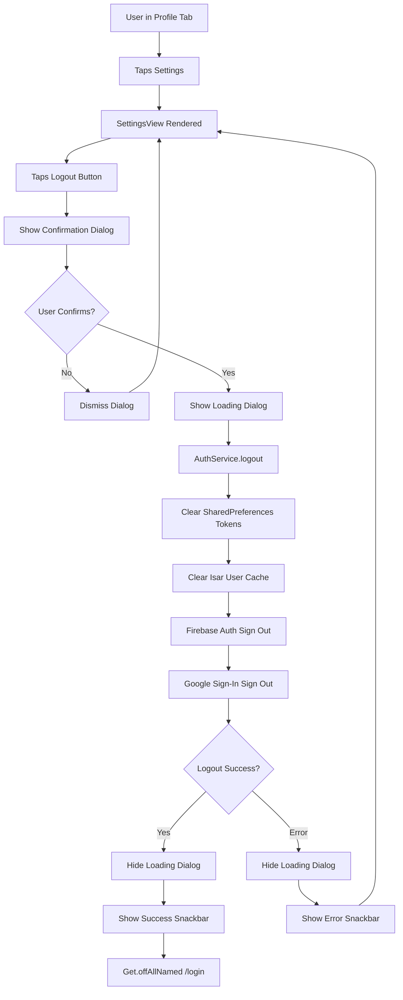

# User Flow: Logout

## Overview
User-initiated sign out that clears local session and redirects to login.

## Entry Points
- Profile → Settings → Logout button
- Route: Handled within `/profile` tab (ProfileController)

## Components
- **Controller**: `ProfileController` (`lib/app/modules/profile/controllers/profile_controller.dart`)
- **Service**: `AuthService` (`lib/app/core/services/auth_service.dart`)
- **Views**: `SettingsView` (logout button), Confirmation Dialog
- **Route**: Navigates to `AppPages.LOGIN = '/login'`

## Activity Diagram



## Sequence Diagram

```mermaid
sequenceDiagram
    participant User
    participant SettingsView
    participant ProfileController
    participant AuthService
    participant SharedPreferences
    participant Isar Database
    participant Firebase Auth
    participant GoogleAuthService
    participant GetX Navigation
    participant AppSnackbar

    User->>SettingsView: Taps "Logout" button
    SettingsView->>ProfileController: logout()
    
    ProfileController->>ProfileController: Show confirmation AlertDialog
    alt User taps "Batal"
        ProfileController->>ProfileController: Get.back(result: false)
        return
    else User taps "Logout"
        ProfileController->>ProfileController: Get.back(result: true)
        ProfileController->>ProfileController: Show loading dialog (barrierDismissible: false)
        
        ProfileController->>AuthService: logout()
        
        AuthService->>SharedPreferences: remove('access_token')
        AuthService->>SharedPreferences: remove('refresh_token')
        AuthService->>SharedPreferences: remove('token_expiry')
        AuthService->>SharedPreferences: remove('user_data')
        
        AuthService->>Isar Database: Clear user data (UserLocalDataSource)
        
        AuthService->>Firebase Auth: signOut()
        AuthService->>GoogleAuthService: signOut()
        
        AuthService->>AuthService: _isLoggedIn.value = false
        AuthService->>AuthService: _userData.value = null
        AuthService->>AuthService: _accessToken = null
        AuthService->>AuthService: _refreshToken = null
        
        AuthService-->>ProfileController: Success
        
        ProfileController->>ProfileController: Get.back() (close loading)
        ProfileController->>AppSnackbar: success('Anda telah keluar', title: 'Logout Berhasil')
        ProfileController->>GetX Navigation: offAllNamed(AppPages.LOGIN)
        
        GetX Navigation->>AuthController: (re-initialized via AuthBinding)
        AuthController->>AuthController: _isLoggedIn.value = false
        AuthController->>AuthController: emailController.clear()
    end
```

## AuthService.logout() Implementation

```dart
// lib/app/core/services/auth_service.dart
Future<void> logout() async {
  final prefs = await SharedPreferences.getInstance();
  
  // Clear all auth-related keys
  await prefs.remove('access_token');
  await prefs.remove('refresh_token');
  await prefs.remove('token_expiry');
  await prefs.remove('user_data');
  
  // Clear Isar cache
  try {
    final isar = Get.find<IsarService>().isar;
    await isar.writeTxn(() async {
      await isar.userModels.clear();
    });
  } catch (_) {}
  
  // Clear reactive state
  _isLoggedIn.value = false;
  _userData.value = null;
  _accessToken = null;
  _refreshToken = null;
  _tokenExpiry = null;
  
  // Firebase & Google sign out (non-blocking)
  try {
    await FirebaseAuth.instance.signOut();
  } catch (_) {}
  
  try {
    await GoogleSignIn().signOut();
  } catch (_) {}
}
```

## State Changes

| Component | Before Logout | After Logout |
|-----------|---------------|--------------|
| `AuthService.isLoggedIn` | `true` | `false` |
| `AuthService.userData` | `UserModel` | `null` |
| `AuthService.token` | `String` | `null` |
| `SharedPreferences` | Has 4 keys | Keys removed |
| `Isar UserModel` | Cached | Cleared |
| `AuthController._isLoggedIn` | `true` | `false` |

## Navigation Flow

```
┌──────────────────┐
│ Profile Tab      │
│ (Tab 3)          │
└────────┬─────────┘
         │
         ▼
┌──────────────────┐
│ Settings         │
│ (SettingsView)   │
└────────┬─────────┘
         │
         ▼
┌──────────────────┐
│ Logout Button    │
│ → Confirm Dialog │
└────────┬─────────┘
         │
    ┌────┴────┐
    ▼         ▼
 Batal    Confirm
    │         │
    ▼         ▼
  Stay    Loading
          │
          ▼
┌──────────────────┐
│ AuthService      │
│ .logout()        │
│ - Clear Prefs    │
│ - Clear Isar     │
│ - Firebase SignOut│
│ - Google SignOut │
└────────┬─────────┘
         │
         ▼
┌──────────────────┐
│ Success Snackbar │
└────────┬─────────┘
         │
         ▼
┌──────────────────┐
│ /login           │
│ LoginView        │
│ AuthController   │
└──────────────────┘
```

## Error Handling

| Failure Point | Handling |
|---------------|----------|
| SharedPreferences clear | Logged, continues (non-blocking) |
| Isar clear | Logged, continues (non-blocking) |
| Firebase signOut | Caught, continues (non-blocking) |
| Google signOut | Caught, continues (non-blocking) |
| Any exception | Loading dialog closed, error snackbar shown |

```dart
// ProfileController.logout() lines 300-354
Future<void> logout() async {
  try {
    final confirmed = await Get.dialog<bool>(AlertDialog(...));
    
    if (confirmed == true) {
      Get.dialog(Center(child: CircularProgressIndicator()), barrierDismissible: false);
      
      await authService.logout();
      
      Get.back(); // Close loading
      
      AppSnackbar.success('Anda telah keluar dari aplikasi', title: 'Logout Berhasil');
      
      Get.offAllNamed(AppPages.LOGIN);
    }
  } catch (e) {
    if (Get.isDialogOpen == true) Get.back();
    AppSnackbar.error(ErrorHandler.getReadableMessage(e, tag: 'ProfileController'));
  }
}
```

## Edge Cases

| Scenario | Handling |
|----------|----------|
| User force-closes during logout | Next launch: tokens already cleared → onboarding |
| Network error during Firebase signOut | Ignored (local session already cleared) |
| Multiple rapid logout taps | Confirmation dialog prevents double execution |
| Back button during loading dialog | `barrierDismissible: false` prevents dismiss |
| Deep link opens app after logout | AuthService re-initializes → onboarding |

## Testing Checklist

- [ ] Settings → Logout shows confirmation dialog
- [ ] "Batal" dismisses dialog, stays in settings
- [ ] "Logout" shows loading dialog
- [ ] Loading dialog cannot be dismissed by back button
- [ ] Success: Snackbar shown, navigates to `/login`
- [ ] Error: Snackbar shown, stays in settings
- [ ] After logout: `/login` shows fresh state
- [ ] App restart after logout → onboarding
- [ ] Tokens cleared from SharedPreferences
- [ ] Isar user cache cleared
- [ ] AuthController reset (email cleared, isLoggedIn=false)

## Related Files

- `lib/app/modules/profile/controllers/profile_controller.dart` (lines 300-354)
- `lib/app/core/services/auth_service.dart` (logout method)
- `lib/app/modules/profile/views/settings_view.dart` (logout button)
- `lib/app/modules/auth/controllers/auth_controller.dart` (line 534-547: logout method)
- `lib/app/core/services/google_auth_service.dart` (signOut)