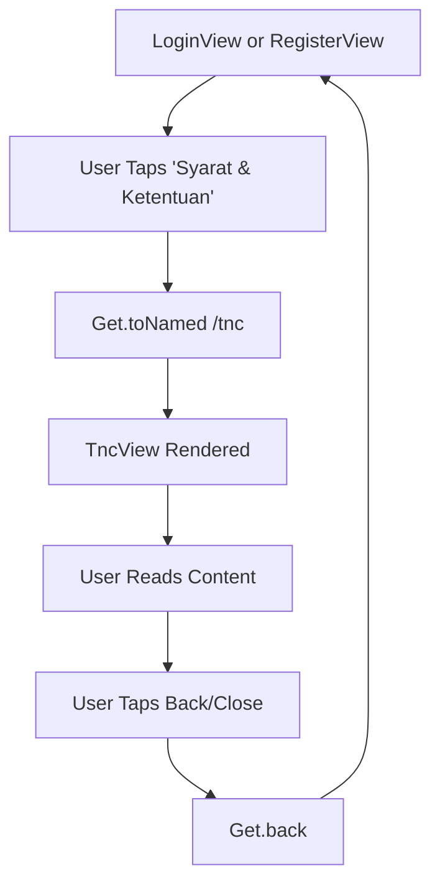
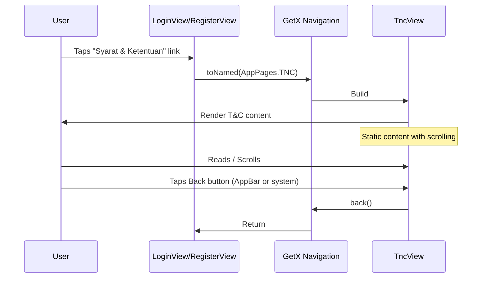

# User Flow: Terms & Conditions (TNC)

## Overview
Static content view for Terms & Conditions, accessible from login and registration screens.

## Entry Points
- Login screen: "Syarat & Ketentuan" link
- Register screen: "Syarat & Ketentuan" link
- Route: `/tnc` (AppPages.TNC)

## Components
- **View**: `TncView` (`lib/app/modules/auth/views/tnc_view.dart`)
- **Route**: `AppPages.TNC = '/tnc'`
- **No Controller**: Stateless widget
- **No Binding**: Direct navigation

## Activity Diagram



## Sequence Diagram



## TncView Structure

```dart
// lib/app/modules/auth/views/tnc_view.dart
class TncView extends StatelessWidget {
  @override
  Widget build(BuildContext context) {
    return Scaffold(
      appBar: AppBar(
        title: Text('Syarat & Ketentuan'),
        leading: BackButton(),
      ),
      body: SingleChildScrollView(
        padding: EdgeInsets.all(16),
        child: Column(
          crossAxisAlignment: CrossAxisAlignment.start,
          children: [
            // Section 1: Penggunaan Aplikasi
            _buildSection('1. Penggunaan Aplikasi', content1),
            // Section 2: Akun Pengguna
            _buildSection('2. Akun Pengguna', content2),
            // Section 3: Konten
            _buildSection('3. Konten', content3),
            // Section 4: Privasi
            _buildSection('4. Privasi', content4),
            // Section 5: Pembatasan Tanggung Jawab
            _buildSection('5. Pembatasan Tanggung Jawab', content5),
            // Section 6: Perubahan Ketentuan
            _buildSection('6. Perubahan Ketentuan', content6),
            // Section 7: Hukum Berlaku
            _buildSection('7. Hukum Berlaku', content7),
          ],
        ),
      ),
    );
  }
}
```

## Navigation Flow

```
┌──────────────────┐
│ LoginView        │
│ RegisterView     │
└────────┬─────────┘
         │ Tap "Syarat & Ketentuan"
         ▼
┌──────────────────┐
│ Get.toNamed      │
│ (AppPages.TNC)   │
└────────┬─────────┘
         │
         ▼
┌──────────────────┐
│ TncView          │
│ - AppBar         │
│ - Scrollable     │
│ - Static Content │
└────────┬─────────┘
         │ Back/Close
         ▼
┌──────────────────┐
│ Previous Screen  │
│ (Login/Register) │
└──────────────────┘
```

## Route Definition

```dart
// lib/app/routes/app_pages.dart
static const TNC = '/tnc';

GetPage(
  name: TNC,
  page: () => const TncView(),
  // No binding needed - stateless
),
```

## Content Sections (Indonesian)

| Section | Title | Key Points |
|---------|-------|------------|
| 1 | Penggunaan Aplikasi | Personal use only, no commercial use |
| 2 | Akun Pengguna | Registration accuracy, security responsibility |
| 3 | Konten | User-generated content rights, moderation |
| 4 | Privasi | Data collection, usage, sharing policy |
| 5 | Pembatasan Tanggung Jawab | No warranty, limitation of liability |
| 6 | Perubahan Ketentuan | Right to update, notification method |
| 7 | Hukum Berlaku | Indonesian law, jurisdiction |

## Edge Cases

| Scenario | Handling |
|----------|----------|
| Deep link to /tnc | Works directly (no auth required) |
| Back gesture on iOS | Standard Navigator.pop |
| Hardware back on Android | Standard Navigator.pop |
| Content too long | SingleChildScrollView handles overflow |
| Orientation change | Scaffold rebuilds, content preserved |

## Testing Checklist

- [ ] Accessible from Login screen link
- [ ] Accessible from Register screen link
- [ ] Direct navigation to `/tnc` works
- [ ] Content renders completely
- [ ] Scrolling works for long content
- [ ] Back button returns to previous screen
- [ ] AppBar back button works
- [ ] No controller/binding overhead
- [ ] Works offline (static content)

## Related Files

- `lib/app/modules/auth/views/tnc_view.dart`
- `lib/app/routes/app_pages.dart` (TNC route)
- `lib/app/modules/auth/views/login_view.dart` (link to TNC)
- `lib/app/modules/auth/views/register_view.dart` (link to TNC)