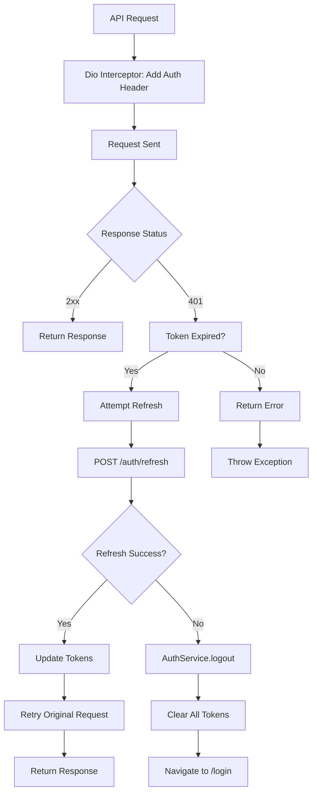
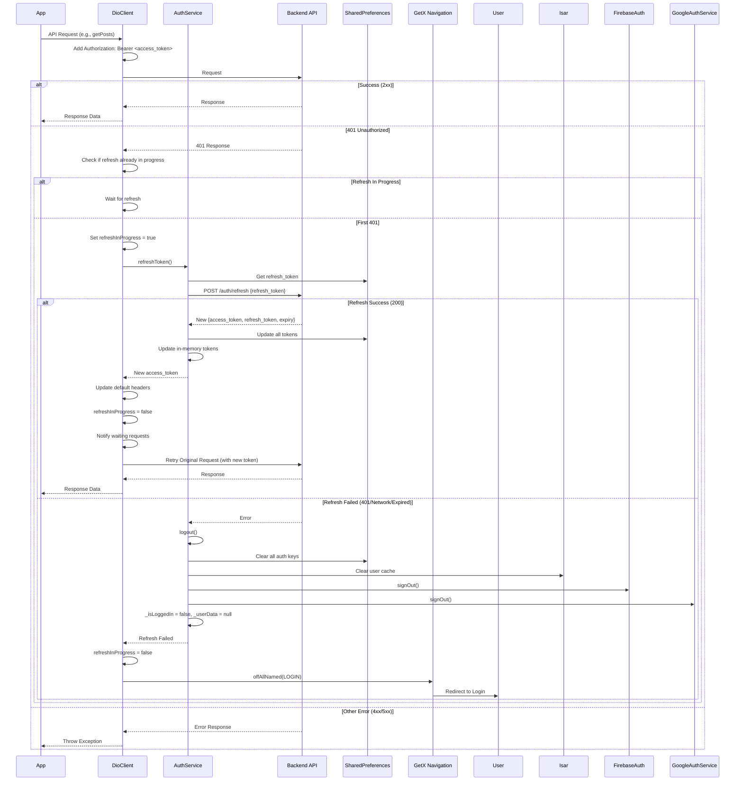

# User Flow: Cross-Cutting - Token Auto-Refresh

## Overview
Transparent token refresh on 401 responses. Handles expired access tokens using refresh tokens.

## Trigger Points
- Any API call returning 401 Unauthorized
- Dio interceptor in `DioClient`

## Components
- **Network**: `DioClient` (`lib/app/core/network/dio_client.dart`)
- **Service**: `AuthService` (`lib/app/core/services/auth_service.dart`)
- **Storage**: SharedPreferences (tokens)

## Activity Diagram



## Sequence Diagram



## DioClient Interceptor Implementation

```dart
// lib/app/core/network/dio_client.dart (simplified)

class DioClient {
  static bool _isRefreshing = false;
  static final List<Function> _waitingRequests = [];

  static void setupInterceptors(Dio dio) {
    dio.interceptors.add(InterceptorsWrapper(
      onRequest: (options, handler) {
        // Add auth header
        final token = AuthService.getToken();
        if (token != null) {
          options.headers['Authorization'] = 'Bearer $token';
        }
        return handler.next(options);
      },
      onError: (error, handler) async {
        if (error.response?.statusCode == 401 && !_isRefreshing) {
          _isRefreshing = true;
          
          try {
            final authService = Get.find<AuthService>();
            await authService.refreshToken(); // Updates tokens
            
            // Retry failed request
            final newToken = authService.token;
            error.requestOptions.headers['Authorization'] = 'Bearer $newToken';
            
            final response = await dio.fetch(error.requestOptions);
            return handler.resolve(response);
          } catch (e) {
            // Refresh failed - logout
            await Get.find<AuthService>().logout();
            Get.offAllNamed(AppPages.LOGIN);
            return handler.reject(error);
          } finally {
            _isRefreshing = false;
            // Process waiting requests
            for (final callback in _waitingRequests) {
              callback();
            }
            _waitingRequests.clear();
          }
        }
        
        // For waiting requests
        if (error.response?.statusCode == 401 && _isRefreshing) {
          return _retryAfterRefresh(error, handler);
        }
        
        return handler.next(error);
      },
    ));
  }
}
```

## AuthService.refreshToken()

```dart
// lib/app/core/services/auth_service.dart
Future<void> refreshToken() async {
  final prefs = await SharedPreferences.getInstance();
  final refreshToken = prefs.getString('refresh_token');
  
  if (refreshToken == null) throw Exception('No refresh token');
  
  final response = await _dio.post('/auth/refresh', data: {
    'refresh_token': refreshToken,
  });
  
  // Save new tokens
  await _saveTokens(response.data);
}

Future<void> _saveTokens(Map<String, dynamic> data) async {
  final prefs = await SharedPreferences.getInstance();
  await prefs.setString('access_token', data['access_token']);
  await prefs.setString('refresh_token', data['refresh_token']);
  await prefs.setInt('token_expiry', DateTime.now()
    .add(Duration(seconds: data['expires_in'])).millisecondsSinceEpoch);
  
  _accessToken = data['access_token'];
  _refreshToken = data['refresh_token'];
  _tokenExpiry = prefs.getInt('token_expiry');
}
```

## Error Handling Flow

| Refresh Result | Action |
|----------------|--------|
| Success (200) | Update tokens, retry original request |
| 401 (Invalid refresh) | Logout → `/login` |
| 403 (Revoked) | Logout → `/login` |
| Network Error | Logout → `/login` |
| Timeout | Logout → `/login` |

## User Experience

```
Normal API Call
       │
       ▼
┌──────────────────┐
│ 401 Received     │
└────────┬─────────┘
         │
         ▼
┌──────────────────┐
│ Silent Refresh   │
│ (Background)     │
└────────┬─────────┘
         │
    ┌────┴────┐
    ▼         ▼
 Success   Failed
    │         │
    ▼         ▼
 Retry    Logout +
 Request  Redirect
    │         │
    ▼         ▼
 Success   Login
  (User    Screen
  unaware)
```

## Edge Cases

| Scenario | Handling |
|----------|----------|
| Multiple simultaneous 401s | Queue waits for single refresh |
| Refresh during app startup | `AuthService.onInit()` handles |
| Refresh token expired | Logout |
| Network offline | Logout (after retry) |
| User force-closes during refresh | Next launch: tokens invalid → onboarding |
| Background/foreground | No auto-refresh (only on API call) |

## Testing Checklist

- [ ] Valid token: Request succeeds
- [ ] Expired access + valid refresh: Silent refresh + retry
- [ ] Expired refresh: Logout → login
- [ ] Multiple parallel 401s: Single refresh, all retry
- [ ] Refresh network error: Logout
- [ ] Refresh 403: Logout
- [ ] No refresh token: Logout
- [ ] Token update persists across requests
- [ ] User unaware of silent refresh

## Related Files

- `lib/app/core/network/dio_client.dart`
- `lib/app/core/services/auth_service.dart` (refreshToken, logout, _saveTokens)
- `lib/app/core/helpers/api_response_helpers.dart` (error extraction)