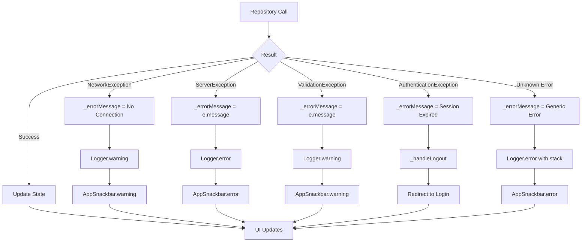
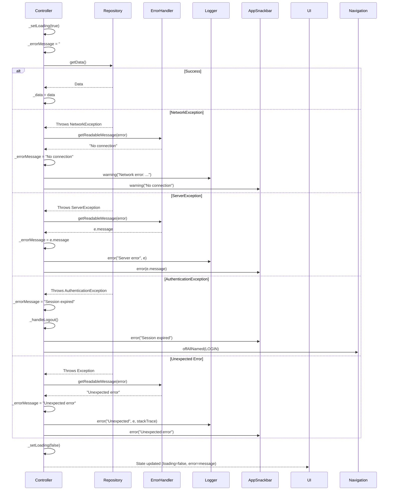

# User Flow: Cross-Cutting - Standardized Error Handling

## Overview
Consistent error handling pattern across all controllers with user-friendly messages and proper logging.

## Components
- **Helper**: `ErrorHandler` (`lib/app/core/helpers/error_handler.dart`)
- **UI**: `AppSnackbar` (`lib/app/core/helpers/app_snackbar.dart`)
- **Logger**: `Logger` (`lib/app/core/services/logger_service.dart`)
- **Exceptions**: Custom exceptions in `lib/app/core/errors/exceptions.dart`

## Exception Hierarchy

```dart
// lib/app/core/errors/exceptions.dart
abstract class AppException implements Exception {
  final String message;
  final int? statusCode;
  const AppException(this.message, {this.statusCode});
}

class NetworkException extends AppException {
  const NetworkException(super.message, {super.statusCode});
}

class ServerException extends AppException {
  const ServerException(super.message, {super.statusCode});
}

class ValidationException extends AppException {
  const ValidationException(super.message, {super.statusCode});
}

class AuthenticationException extends AppException {
  const AuthenticationException(super.message, {super.statusCode});
}

class CacheException extends AppException {
  const CacheException(super.message, {super.statusCode});
}
```

## Standard Controller Error Pattern

```dart
// Standard pattern used in all controllers
Future<void> loadData() async {
  _setLoading(true);
  _errorMessage.value = '';
  
  try {
    final data = await repository.getData();
    _data.value = data;
  } on NetworkException catch (e) {
    _errorMessage.value = 'Tidak ada koneksi internet. Coba lagi nanti.';
    Logger.warning('Network error: ${e.message}', 'Controller');
  } on ServerException catch (e) {
    _errorMessage.value = e.message;
    Logger.error('Server error', e, null, 'Controller');
  } on ValidationException catch (e) {
    _errorMessage.value = e.message;
    Logger.warning('Validation error: ${e.message}', 'Controller');
  } on AuthenticationException {
    _errorMessage.value = 'Sesi Anda telah berakhir. Silakan login kembali.';
    await _handleLogout();
  } catch (e, stackTrace) {
    _errorMessage.value = 'Terjadi kesalahan. Silakan coba lagi.';
    Logger.error('Unexpected error', e, stackTrace, 'Controller');
  } finally {
    _setLoading(false);
  }
}
```

## ErrorHandler.getReadableMessage()

```dart
// lib/app/core/helpers/error_handler.dart
class ErrorHandler {
  static String getReadableMessage(dynamic error, {String? tag}) {
    if (error is NetworkException) {
      return 'Tidak ada koneksi internet. Periksa koneksi Anda.';
    }
    
    if (error is ServerException) {
      return error.message;
    }
    
    if (error is ValidationException) {
      return error.message;
    }
    
    if (error is AuthenticationException) {
      return 'Sesi telah berakhir. Silakan login kembali.';
    }
    
    if (error is DioException) {
      return _handleDioError(error);
    }
    
    if (error is FormatException) {
      return 'Format data tidak valid.';
    }
    
    if (error is SocketException) {
      return 'Tidak ada koneksi internet.';
    }
    
    // Fallback
    Logger.error('Unhandled error type: ${error.runtimeType}', error, null, tag);
    return 'Terjadi kesalahan tidak terduga. Silakan coba lagi.';
  }
  
  static String _handleDioError(DioException e) {
    switch (e.type) {
      case DioExceptionType.connectionTimeout:
      case DioExceptionType.sendTimeout:
      case DioExceptionType.receiveTimeout:
        return 'Koneksi timeout. Silakan coba lagi.';
      case DioExceptionType.badResponse:
        final status = e.response?.statusCode;
        final msg = e.response?.data?['message'] ?? 'Server error';
        if (status == 401) return 'Sesi berakhir. Login kembali.';
        if (status == 403) return 'Akses ditolak.';
        if (status == 404) return 'Data tidak ditemukan.';
        if (status == 422) return msg; // Validation errors
        if (status == 429) return 'Terlalu banyak permintaan. Tunggu sebentar.';
        if (status! >= 500) return 'Server bermasalah. Coba lagi nanti.';
        return msg;
      case DioExceptionType.cancel:
        return 'Permintaan dibatalkan.';
      case DioExceptionType.connectionError:
        return 'Tidak bisa terhubung ke server.';
      default:
        return 'Kesalahan jaringan: ${e.message}';
    }
  }
}
```

## AppSnackbar Usage

```dart
// lib/app/core/helpers/app_snackbar.dart

class AppSnackbar {
  static final GlobalKey<ScaffoldMessengerState> messengerKey = 
      GlobalKey<ScaffoldMessengerState>();
  
  static void show({
    required String title,
    required String message,
    Color? backgroundColor,
    Duration duration = const Duration(seconds: 3),
  }) {
    messengerKey.currentState?.showSnackBar(
      SnackBar(
        content: Column(
          mainAxisSize: MainAxisSize.min,
          crossAxisAlignment: CrossAxisAlignment.start,
          children: [
            Text(title, style: TextStyle(fontWeight: FontWeight.bold)),
            Text(message),
          ],
        ),
        backgroundColor: backgroundColor ?? Colors.grey[900],
        duration: duration,
        behavior: SnackBarBehavior.floating,
      ),
    );
  }
  
  static void success(String message, {String title = 'Berhasil', Duration? duration}) {
    show(title: title, message: message, backgroundColor: Colors.green, duration: duration);
  }
  
  static void error(String message, {String title = 'Error', Duration? duration}) {
    show(title: title, message: message, backgroundColor: Colors.red, duration: duration);
  }
  
  static void warning(String message, {String title = 'Peringatan', Duration? duration}) {
    show(title: title, message: message, backgroundColor: Colors.orange, duration: duration);
  }
  
  static void info(String message, {String title = 'Info', Duration? duration}) {
    show(title: title, message: message, backgroundColor: Colors.blue, duration: duration);
  }
}
```

## Activity Diagram: Error Flow



## Sequence Diagram: Error Handling



## Error Display in Views

```dart
// Standard pattern in views
Obx(() => controller.isLoading
  ? Center(child: CircularProgressIndicator())
  : controller.errorMessage.isNotEmpty
    ? ErrorStateWidget(
        message: controller.errorMessage,
        onRetry: () => controller.loadData(),
      )
    : controller.data.isEmpty
      ? EmptyStateWidget(message: 'Tidak ada data')
      : ListView.builder(...),
)
```

## State Widgets

```dart
// lib/app/modules/shared/widgets/_state_widgets/

// ErrorStateWidget
class ErrorStateWidget extends StatelessWidget {
  final String message;
  final VoidCallback? onRetry;
  
  @override
  Widget build(BuildContext context) {
    return Center(
      child: Column(
        mainAxisSize: MainAxisSize.min,
        children: [
          Icon(Icons.error_outline, size: 64, color: Colors.red),
          Text(message, textAlign: TextAlign.center),
          if (onRetry != null)
            ElevatedButton(
              onPressed: onRetry,
              child: Text('Coba Lagi'),
            ),
        ],
      ),
    );
  }
}

// EmptyStateWidget
class EmptyStateWidget extends StatelessWidget {
  final String message;
  final IconData icon;
  
  @override
  Widget build(BuildContext context) {
    return Center(
      child: Column(
        mainAxisSize: MainAxisSize.min,
        children: [
          Icon(icon, size: 64, color: Colors.grey),
          Text(message, style: TextStyle(color: Colors.grey)),
        ],
      ),
    );
  }
}
```

## Logging Levels (Logger Service)

```dart
// lib/app/core/services/logger_service.dart
enum LogLevel { debug, info, warning, error }

class Logger {
  static void debug(String message, [String? tag]) {
    if (!EnvironmentConfig.isProduction) _log('🐛', message, tag);
  }
  
  static void info(String message, [String? tag]) {
    _log('ℹ️', message, tag);
  }
  
  static void warning(String message, [String? tag]) {
    _log('⚠️', message, tag);
  }
  
  static void error(String message, [Object? error, StackTrace? stack, String? tag]) {
    _log('❌', message, tag);
    if (error != null) _log('❌', 'Error: $error', tag);
    if (stack != null && EnvironmentConfig.isProduction) {
      // Send to crash reporting
    }
  }
}
```

## Edge Cases

| Scenario | Handling |
|----------|----------|
| Error during loading | Shows error state with retry button |
| Error during refresh | Keeps old data, shows snackbar |
| Multiple rapid errors | Last error wins (reactive) |
| Auth error in background | Logout on next user action |
| Network intermittent | Each request handled independently |
| Production vs Debug | Debug logs only in debug mode |

## Testing Checklist

- [ ] Network error shows "No connection" + retry
- [ ] Server error shows backend message
- [ ] Validation error shows field message
- [ ] Auth error logs out + redirects
- [ ] Unknown error shows generic message
- [ ] Loading state during request
- [ ] Error state clears on retry
- [ ] Snackbar colors: green/red/orange/blue
- [ ] Logger outputs correct levels
- [ ] No print() statements in production

## Related Files

- `lib/app/core/helpers/error_handler.dart`
- `lib/app/core/helpers/app_snackbar.dart`
- `lib/app/core/services/logger_service.dart`
- `lib/app/core/errors/exceptions.dart`
- All controllers (HomeController, ExploreController, etc.)
- `lib/app/modules/shared/widgets/_state_widgets/`