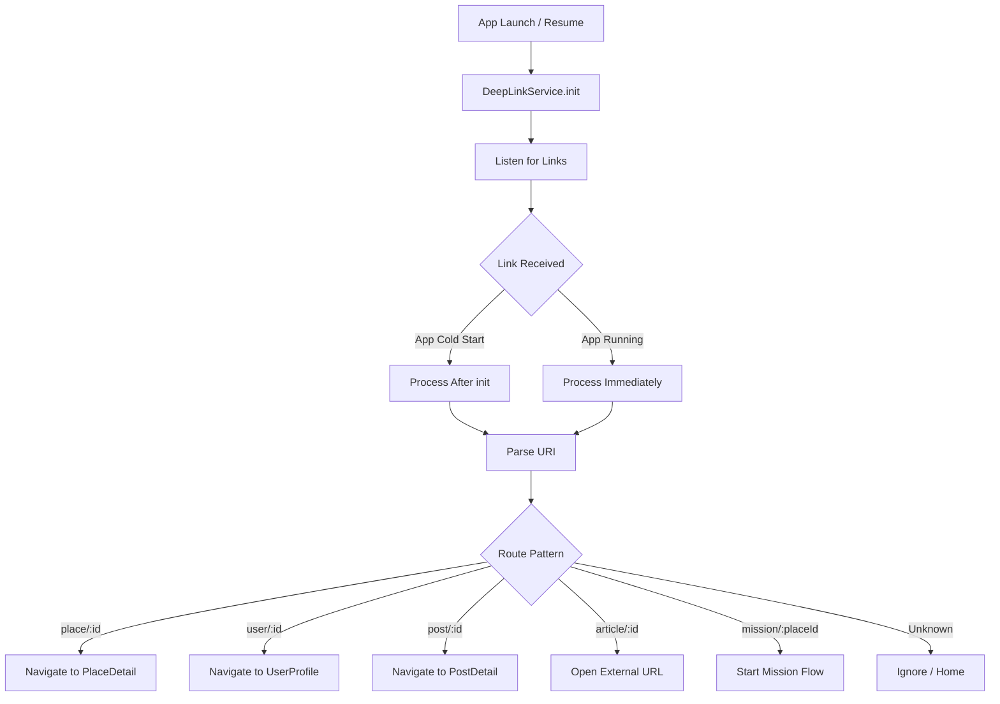
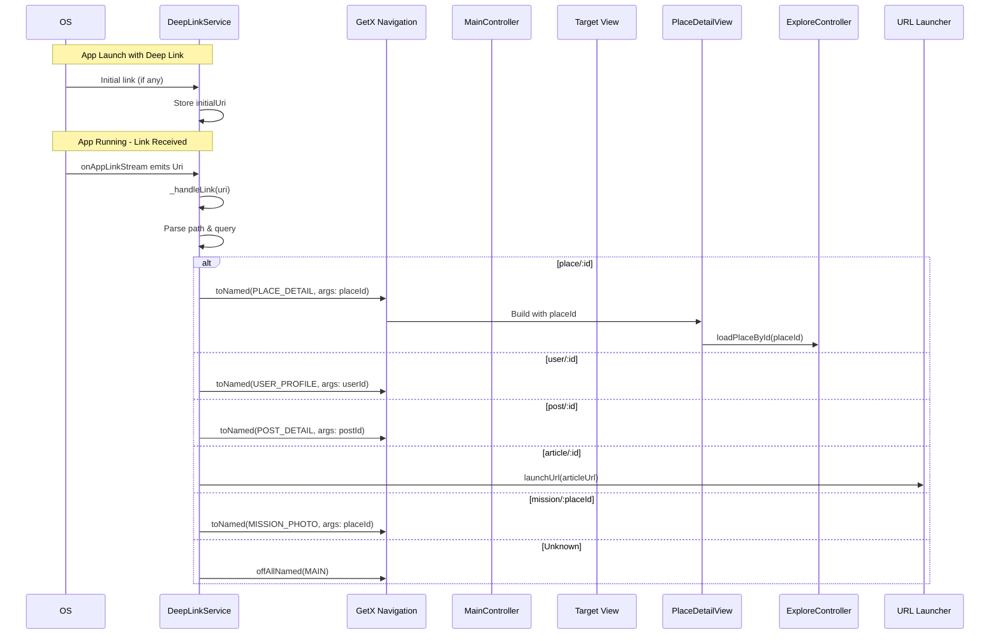
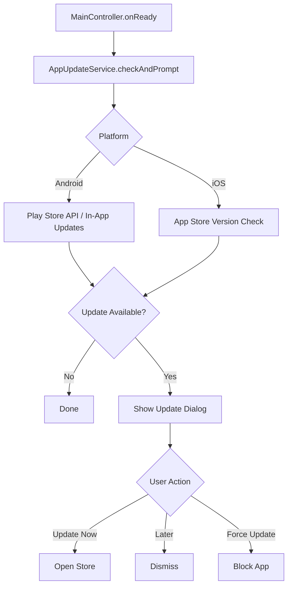
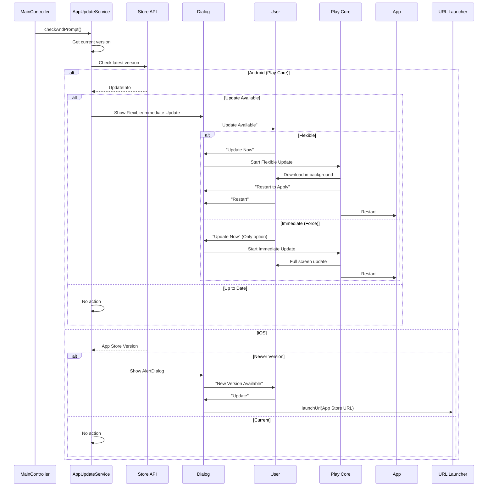

# User Flow: Cross-Cutting - Deep Links & App Updates

## Overview
Deep link handling for external URLs and automatic app update checking.

## Components
- **Service**: `DeepLinkService` (`lib/app/core/services/deep_link_service.dart`)
- **Service**: `AppUpdateService` (`lib/app/core/services/app_update_service.dart`)
- **Entry**: `main.dart` initialization

---

## 1. Deep Links

### Activity Diagram



### Sequence Diagram



### DeepLinkService Implementation

```dart
// lib/app/core/services/deep_link_service.dart

class DeepLinkService {
  static Uri? _initialUri;
  static StreamSubscription? _sub;
  
  static Future<void> init() async {
    // 1. Handle initial link (cold start)
    final initialUri = await AppLinks.getInitialLink();
    if (initialUri != null) {
      _initialUri = initialUri;
      // Process after app initialization
      WidgetsBinding.instance.addPostFrameCallback((_) {
        _handleLink(initialUri);
      });
    }
    
    // 2. Listen for links while app running
    _sub = AppLinks.uriLinkStream.listen((uri) {
      _handleLink(uri);
    });
  }
  
  static void _handleLink(Uri uri) {
    final path = uri.path;
    final queryParams = uri.queryParameters;
    
    // Remove leading slash
    final cleanPath = path.startsWith('/') ? path.substring(1) : path;
    final segments = cleanPath.split('/');
    
    if (segments.isEmpty) return;
    
    switch (segments[0]) {
      case 'place':
        if (segments.length > 1) {
          final placeId = int.tryParse(segments[1]);
          if (placeId != null) {
            Get.toNamed(AppPages.PLACE_DETAIL, arguments: placeId);
          }
        }
        break;
        
      case 'user':
        if (segments.length > 1) {
          final userId = int.tryParse(segments[1]);
          if (userId != null) {
            Get.toNamed(AppPages.USER_PROFILE, arguments: userId);
          }
        }
        break;
        
      case 'post':
        if (segments.length > 1) {
          final postId = int.tryParse(segments[1]);
          if (postId != null) {
            Get.toNamed(AppPages.POST_DETAIL, arguments: postId);
          }
        }
        break;
        
      case 'article':
        if (segments.length > 1) {
          final articleUrl = queryParams['url'] ?? 'https://snappie.app/article/${segments[1]}';
          launchUrl(Uri.parse(articleUrl));
        }
        break;
        
      case 'mission':
        if (segments.length > 1) {
          final placeId = int.tryParse(segments[1]);
          if (placeId != null) {
            Get.toNamed(AppPages.MISSION_PHOTO, arguments: placeId);
          }
        }
        break;
        
      default:
        Get.offAllNamed(AppPages.MAIN);
    }
  }
}
```

### Main.dart Integration

```dart
// lib/main.dart
void main() async {
  // ... initialization ...
  
  runApp(
    EasyLocalization(
      // ... config ...
      child: MainApp(route: await initAuthService()),
    ),
  );
  
  // Initialize deep link handling AFTER app is running
  DeepLinkService.init();
}
```

### URL Patterns

| Pattern | Example | Action |
|---------|---------|--------|
| `snappie://place/123` | Place detail | Navigate to PlaceDetail |
| `snappie://user/456` | User profile | Navigate to UserProfile |
| `snappie://post/789` | Post detail | Navigate to PostDetail |
| `snappie://article/101` | Article | Open external URL |
| `snappie://mission/123` | Start mission | Navigate to MissionPhoto |

### Android/iOS Configuration

```xml
<!-- android/app/src/main/AndroidManifest.xml -->
<intent-filter android:autoVerify="true">
  <action android:name="android.intent.action.VIEW" />
  <category android:name="android.intent.category.DEFAULT" />
  <category android:name="android.intent.category.BROWSABLE" />
  <data android:scheme="snappie" android:host="*" />
</intent-filter>
```

```xml
<!-- ios/Runner/Info.plist -->
<key>CFBundleURLTypes</key>
<array>
  <dict>
    <key>CFBundleURLSchemes</key>
    <array>
      <string>snappie</string>
    </array>
  </dict>
</array>
```

---

## 2. App Update Check

### Activity Diagram



### Sequence Diagram



### AppUpdateService Implementation

```dart
// lib/app/core/services/app_update_service.dart

class AppUpdateService {
  final String _currentVersion;
  
  AppUpdateService(this._currentVersion);
  
  Future<void> checkAndPrompt() async {
    if (Platform.isAndroid) {
      await _checkAndroidUpdate();
    } else if (Platform.isIOS) {
      await _checkIOSUpdate();
    }
  }
  
  Future<void> _checkAndroidUpdate() async {
    try {
      final appUpdateInfo = await AppUpdateInfo.fromPlayStore();
      
      if (appUpdateInfo.updateAvailability == UpdateAvailability.updateAvailable) {
        if (appUpdateInfo.isUpdateTypeAllowed(AppUpdateType.immediate)) {
          // Force update
          await AppUpdateManager.startImmediateUpdate();
        } else if (appUpdateInfo.isUpdateTypeAllowed(AppUpdateType.flexible)) {
          // Flexible update
          await AppUpdateManager.startFlexibleUpdate();
        }
      }
    } catch (e) {
      Logger.error('App update check failed', e, null, 'AppUpdate');
    }
  }
  
  Future<void> _checkIOSUpdate() async {
    try {
      final response = await http.get(
        Uri.parse('https://itunes.apple.com/lookup?bundleId=com.snappie.app'),
      );
      
      final data = jsonDecode(response.body);
      final storeVersion = data['results'][0]['version'];
      
      if (_isNewerVersion(storeVersion, _currentVersion)) {
        _showIOSUpdateDialog(storeVersion);
      }
    } catch (e) {
      Logger.error('iOS update check failed', e, null, 'AppUpdate');
    }
  }
  
  void _showIOSUpdateDialog(String storeVersion) {
    Get.dialog(
      AlertDialog(
        title: Text('Update Tersedia'),
        content: Text('Versi $storeVersion sudah tersedia. Update sekarang?'),
        actions: [
          TextButton(
            onPressed: () => Get.back(),
            child: Text('Nanti'),
          ),
          ElevatedButton(
            onPressed: () {
              Get.back();
              launchUrl(Uri.parse('https://apps.apple.com/app/idYOUR_APP_ID'));
            },
            child: Text('Update'),
          ),
        ],
      ),
      barrierDismissible: false,
    );
  }
  
  bool _isNewerVersion(String store, String current) {
    final storeParts = store.split('.').map(int.parse).toList();
    final currentParts = current.split('.').map(int.parse).toList();
    
    for (int i = 0; i < max(storeParts.length, currentParts.length); i++) {
      final s = i < storeParts.length ? storeParts[i] : 0;
      final c = i < currentParts.length ? currentParts[i] : 0;
      if (s > c) return true;
      if (s < c) return false;
    }
    return false;
  }
}
```

### MainController Integration

```dart
// lib/app/modules/shared/layout/controllers/main_controller.dart (lines 163-168)
@override
void onReady() {
  super.onReady();
  try {
    final updater = Get.find<AppUpdateService>();
    updater.checkAndPrompt();
  } catch (_) {}
  
  _preloadAllTabs();
  checkAndStartOnboardingFlow();
}
```

### Dependency Registration

```dart
// lib/app/core/dependencies/core_dependencies.dart
Get.put(AppUpdateService(EnvironmentConfig.appVersion), permanent: true);
```

---

## Edge Cases

| Scenario | Deep Links | App Updates |
|----------|------------|-------------|
| App killed | Initial link processed on launch | Check on next launch |
| Multiple links | Queue processed sequentially | Single check per session |
| Invalid URI | Ignored, go to main | N/A |
| Auth required | Redirect to login after auth | N/A |
| Update during use | N/A | Prompt on next onReady |
| Force update | N/A | Block app until updated |
| Store unavailable | N/A | Silent fail, retry later |

## Testing Checklist

### Deep Links
- [ ] Cold start with link → correct navigation
- [ ] Running app with link → immediate navigation
- [ ] Place link → PlaceDetail with data
- [ ] User link → UserProfile
- [ ] Post link → PostDetail
- [ ] Article link → External browser
- [ ] Mission link → Mission flow
- [ ] Invalid link → Main screen

### App Updates
- [ ] Android: Flexible update works
- [ ] Android: Immediate (force) update works
- [ ] iOS: Dialog shows with store link
- [ ] Current version: No prompt
- [ ] Network error: Silent fail
- [ ] Force update blocks app

## Related Files

- `lib/app/core/services/deep_link_service.dart`
- `lib/app/core/services/app_update_service.dart`
- `lib/main.dart` (initialization order)
- `lib/app/modules/shared/layout/controllers/main_controller.dart`
- `lib/app/core/dependencies/core_dependencies.dart`
- `android/app/src/main/AndroidManifest.xml`
- `ios/Runner/Info.plist`