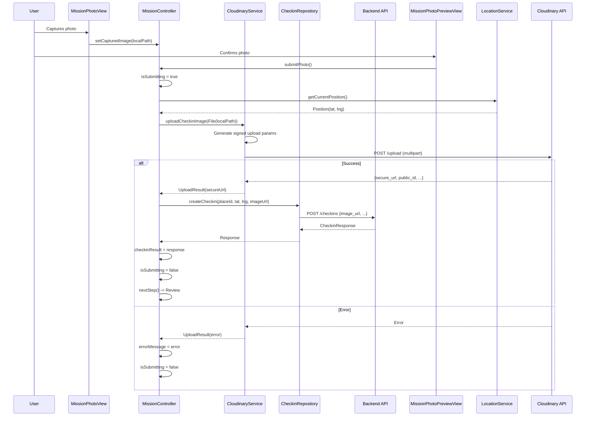
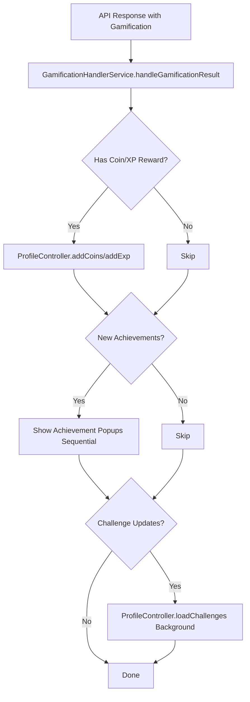
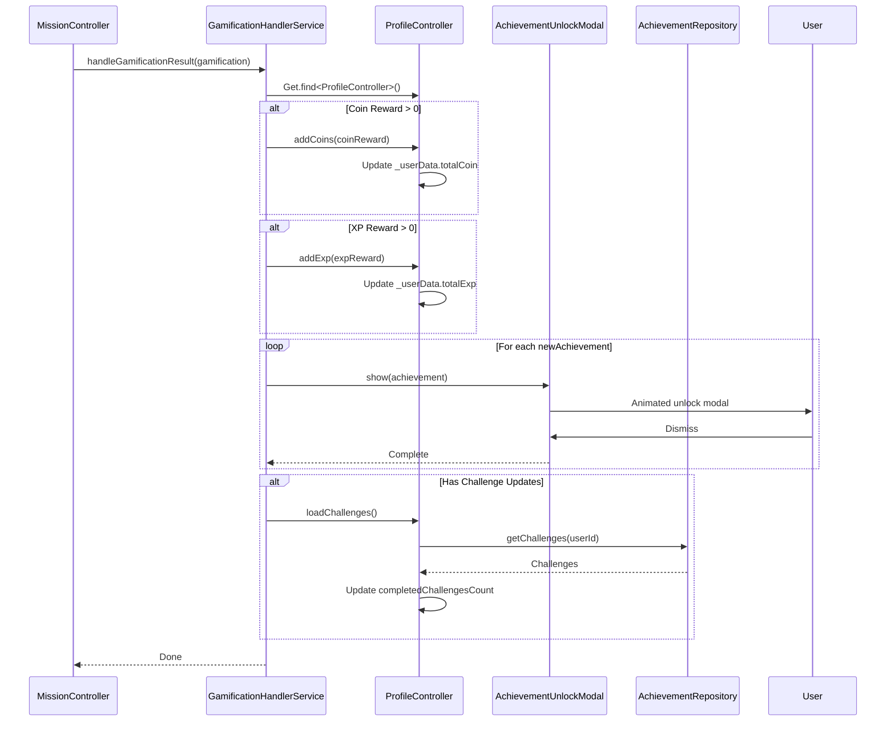

# User Flow: Cross-Cutting - Cloudinary Image Upload & Gamification Handler

## Overview
Image upload to Cloudinary for check-ins/posts and centralized gamification processing for rewards/achievements.

---

## 1. Cloudinary Image Upload

### Activity Diagram

```mermaid
flowchart TD
    A[User Captures/Selects Image] --> B[Mission: setCapturedImage / Post: pickImage]
    B --> C[Preview Screen (Optional)]
    C --> D[User Confirms]
    D --> E[CloudinaryService.uploadCheckinImage]
    E --> F[Upload to Cloudinary]
    F --> G{Upload Success?}
    G -->|Yes| H[Return Secure URL]
    H --> I[API Call with Image URL]
    G -->|No| J[Show Error Snackbar]
    J --> K[Stay on Screen]
```

### Sequence Diagram: Mission Check-in Upload



### CloudinaryService Implementation

```dart
// lib/app/core/services/cloudinary_service.dart

class CloudinaryService {
  final String _cloudName;
  final String _apiKey;
  final String _apiSecret;
  final String _uploadPreset;
  
  CloudinaryService(this._cloudName, this._apiKey, this._apiSecret, this._uploadPreset);
  
  Future<UploadResult> uploadCheckinImage(File imageFile) async {
    try {
      // Generate signature for secure upload
      final timestamp = DateTime.now().millisecondsSinceEpoch ~/ 1000;
      final params = {
        'timestamp': timestamp.toString(),
        'upload_preset': _uploadPreset,
        'folder': 'checkins',
      };
      
      final signature = _generateSignature(params);
      params['signature'] = signature;
      params['api_key'] = _apiKey;
      
      // Multipart upload
      final request = http.MultipartRequest(
        'POST',
        Uri.parse('https://api.cloudinary.com/v1_1/$_cloudName/image/upload'),
      );
      
      request.fields.addAll(params);
      request.files.add(await http.MultipartFile.fromPath('file', imageFile.path));
      
      final response = await request.send();
      final responseData = jsonDecode(await response.stream.bytesToString());
      
      if (response.statusCode == 200) {
        return UploadResult(
          success: true,
          secureUrl: responseData['secure_url'],
          publicId: responseData['public_id'],
        );
      } else {
        return UploadResult(
          success: false,
          error: responseData['error']?['message'] ?? 'Upload failed',
        );
      }
    } catch (e) {
      return UploadResult(success: false, error: e.toString());
    }
  }
  
  String _generateSignature(Map<String, String> params) {
    final sortedKeys = params.keys.toList()..sort();
    final stringToSign = sortedKeys.map((k) => '$k=${params[k]}').join('&');
    final key = utf8.encode(_apiSecret);
    final bytes = utf8.encode(stringToSign);
    final hmac = Hmac(sha256, key).convert(bytes);
    return hmac.toString();
  }
}

class UploadResult {
  final bool success;
  final String? secureUrl;
  final String? publicId;
  final String? error;
  
  UploadResult({
    required this.success,
    this.secureUrl,
    this.publicId,
    this.error,
  });
}
```

### Environment Config

```dart
// lib/app/core/constants/environment_config.dart
class EnvironmentConfig {
  static String get cloudinaryCloudName => dotenv.env['CLOUDINARY_CLOUD_NAME'] ?? '';
  static String get cloudinaryApiKey => dotenv.env['CLOUDINARY_API_KEY'] ?? '';
  static String get cloudinaryApiSecret => dotenv.env['CLOUDINARY_API_SECRET'] ?? '';
  static String get cloudinaryUploadPreset => 'snappie_checkins'; // Unsigned preset
}
```

### Dependency Injection

```dart
// lib/app/core/dependencies/core_dependencies.dart
Get.put(CloudinaryService(
  EnvironmentConfig.cloudinaryCloudName,
  EnvironmentConfig.cloudinaryApiKey,
  EnvironmentConfig.cloudinaryApiSecret,
  EnvironmentConfig.cloudinaryUploadPreset,
), permanent: true);
```

---

## 2. Gamification Handler

### Activity Diagram



### Sequence Diagram



### GamificationHandlerService Implementation

```dart
// lib/app/core/services/gamification_handler_service.dart

class GamificationHandlerService {
  static Future<void> handleGamificationResult(GamificationResponse gamification) async {
    try {
      final profileController = Get.find<ProfileController>();
      
      // 1. Update Profile Coins/XP (Immediate UI Update)
      if (gamification.coinReward != null && gamification.coinReward! > 0) {
        await profileController.addCoins(gamification.coinReward!);
      }
      
      if (gamification.expReward != null && gamification.expReward! > 0) {
        await profileController.addExp(gamification.expReward!);
      }
      
      // 2. Show Achievement Unlock Popups (Sequential)
      if (gamification.newAchievements != null && gamification.newAchievements!.isNotEmpty) {
        for (final achievement in gamification.newAchievements!) {
          await _showAchievementPopup(achievement);
        }
      }
      
      // 3. Refresh Challenges (Background, Non-blocking)
      if (gamification.challengeUpdates != null && gamification.challengeUpdates!.isNotEmpty) {
        unawaited(profileController.loadChallenges());
      }
      
      // 4. Update Profile Badge Count
      if (gamification.newAchievements != null) {
        profileController.incrementCompletedChallenges(gamification.newAchievements!.length);
      }
      
    } catch (e) {
      Logger.error('Gamification handling failed', e, null, 'GamificationHandler');
    }
  }
  
  static Future<void> _showAchievementPopup(AchievementModel achievement) async {
    // Use a completer to wait for user dismissal
    final completer = Completer<void>();
    
    // Show modal (non-blocking, sequential)
    await Get.dialog(
      AchievementUnlockModal(
        achievement: achievement,
        onDismiss: () => completer.complete(),
      ),
      barrierDismissible: false,
    );
    
    await completer.future;
  }
}
```

### Gamification Response Model

```dart
// lib/app/data/models/gamification_response_model.dart

class GamificationResponse {
  final int? coinReward;
  final int? expReward;
  final List<AchievementModel>? newAchievements;
  final List<ChallengeModel>? challengeUpdates;
  final bool hasGamification;
  
  GamificationResponse({
    this.coinReward,
    this.expReward,
    this.newAchievements,
    this.challengeUpdates,
  });
  
  bool get hasGamification => 
    (coinReward ?? 0) > 0 || 
    (expReward ?? 0) > 0 || 
    (newAchievements?.isNotEmpty ?? false) || 
    (challengeUpdates?.isNotEmpty ?? false);
}
```

### Achievement Unlock Modal

```dart
// lib/app/modules/shared/widgets/_dialog_widgets/achievement_unlock_modal.dart

class AchievementUnlockModal extends StatelessWidget {
  final AchievementModel achievement;
  final VoidCallback onDismiss;
  
  @override
  Widget build(BuildContext context) {
    return Dialog(
      child: Container(
        padding: EdgeInsets.all(24),
        child: Column(
          mainAxisSize: MainAxisSize.min,
          children: [
            // Animated achievement icon
            AnimatedBuilder(
              animation: _animationController,
              builder: (context, child) => Transform.scale(
                scale: _scaleAnimation.value,
                child: Image.network(achievement.iconUrl, size: 100),
              ),
            ),
            Text('Pencapaian Baru!', style: Theme.of(context).textTheme.headlineSmall),
            Text(achievement.name, style: Theme.of(context).textTheme.titleLarge),
            Text(achievement.description),
            Text('+${achievement.expReward} XP  +${achievement.coinReward} Koin'),
            ElevatedButton(
              onPressed: onDismiss,
              child: Text('Keren!'),
            ),
          ],
        ),
      ),
    );
  }
}
```

---

## Navigation Flow

```
┌──────────────────┐
│ Mission/Action   │
│ Complete         │
└────────┬─────────┘
         │
         ▼
┌──────────────────┐
│ API Response     │
│ + Gamification   │
└────────┬─────────┘
         │
         ▼
┌──────────────────┐
│ Gamification     │
│ Handler          │
└────────┬─────────┘
         │
    ┌────┼────┐
    ▼    ▼    ▼
 Coins  XP   Achievements  Challenges
  +X     +X     Popups        Refresh
    │    │      │             │
    └────┴──────┴─────────────┘
               │
               ▼
┌──────────────────────────┐
│ ProfileController State  │
│ Updated Immediately      │
└──────────────────────────┘
```

## Edge Cases

| Scenario | Cloudinary | Gamification |
|----------|------------|--------------|
| Upload timeout | Retry logic (TODO) | N/A |
| Large image | Compress before upload (TODO) | N/A |
| Multiple achievements | Sequential popups | Queue handled |
| Challenge + achievement | Both processed | Order: coins/XP → achievements → challenges |
| Handler error | Logged, non-blocking | Try-catch wraps all |
| Offline | Queue for later (TODO) | N/A |

## Testing Checklist

### Cloudinary
- [ ] Image upload returns secure URL
- [ ] Upload error shows snackbar
- [ ] Image used in check-in API
- [ ] Signed upload works

### Gamification
- [ ] Coins/XP update profile immediately
- [ ] Achievement popups show sequentially
- [ ] Popups don't stack (wait for dismiss)
- [ ] Challenges refresh in background
- [ ] Badge count increments
- [ ] Errors don't block main flow

## Related Files

- `lib/app/core/services/cloudinary_service.dart`
- `lib/app/core/services/gamification_handler_service.dart`
- `lib/app/modules/mission/controllers/mission_controller.dart`
- `lib/app/modules/profile/controllers/profile_controller.dart`
- `lib/app/modules/shared/widgets/_dialog_widgets/achievement_unlock_modal.dart`
- `lib/app/data/models/gamification_response_model.dart`