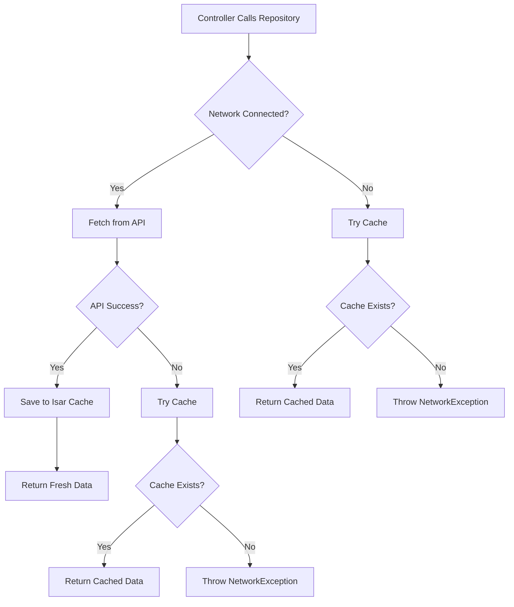
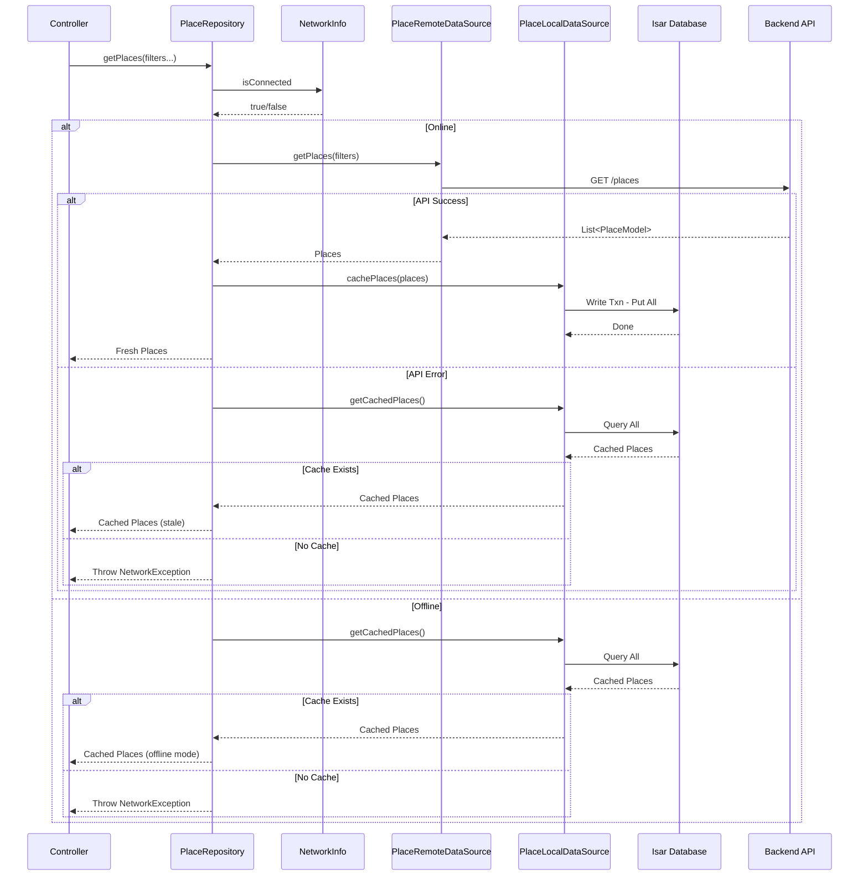

# User Flow: Cross-Cutting - Offline Support & Network Handling

## Overview
Offline-first architecture with Isar caching, connectivity detection, and graceful degradation.

## Components
- **Network**: `ConnectivityPlus` (`connectivity_plus` package)
- **Cache**: Isar Database (`isar` package)
- **Local**: `UserLocalDataSource` (`lib/app/data/datasources/local/user_local_datasource.dart`)
- **Repositories**: All repositories implement offline-first pattern

## Activity Diagram: Repository Offline Pattern



## Sequence Diagram: PlaceRepository.getPlaces()



## NetworkInfo Implementation

```dart
// lib/app/core/network/network_info.dart

abstract class NetworkInfo {
  Future<bool> get isConnected;
}

class NetworkInfoImpl implements NetworkInfo {
  final Connectivity _connectivity;
  
  NetworkInfoImpl(this._connectivity);
  
  @override
  Future<bool> get isConnected async {
    final result = await _connectivity.checkConnectivity();
    return result != ConnectivityResult.none;
  }
  
  // Stream for real-time connectivity changes
  Stream<ConnectivityResult> get onConnectivityChanged => 
      _connectivity.onConnectivityChanged;
}
```

## Repository Pattern (Example: PlaceRepositoryImpl)

```dart
// lib/app/data/repositories/place_repository_impl.dart

class PlaceRepositoryImpl implements PlaceRepository {
  final PlaceRemoteDataSource _remoteDataSource;
  final PlaceLocalDataSource _localDataSource;
  final NetworkInfo _networkInfo;
  
  PlaceRepositoryImpl({
    required PlaceRemoteDataSource remoteDataSource,
    required PlaceLocalDataSource localDataSource,
    required NetworkInfo networkInfo,
  }) : _remoteDataSource = remoteDataSource,
       _localDataSource = localDataSource,
       _networkInfo = networkInfo;
  
  @override
  Future<List<PlaceModel>> getPlaces({
    int page = 1,
    int perPage = 20,
    double? minRating,
    bool? partner,
    bool? popular,
    double? longitude,
    double? latitude,
    List<String>? placeValues,
    List<String>? foodTypes,
  }) async {
    final isConnected = await _networkInfo.isConnected;
    
    if (isConnected) {
      try {
        final places = await _remoteDataSource.getPlaces(
          page: page,
          perPage: perPage,
          minRating: minRating,
          partner: partner,
          popular: popular,
          longitude: longitude,
          latitude: latitude,
          placeValues: placeValues,
          foodTypes: foodTypes,
        );
        
        // Cache for offline (fire-and-forget)
        _localDataSource.cachePlaces(places);
        
        return places;
      } catch (e) {
        // Fallback to cache
        return _getCachedPlaces();
      }
    } else {
      // Offline - use cache
      return _getCachedPlaces();
    }
  }
  
  Future<List<PlaceModel>> _getCachedPlaces() async {
    final cached = await _localDataSource.getCachedPlaces();
    if (cached.isEmpty) {
      throw NetworkException('Tidak ada koneksi internet dan data cache kosong');
    }
    return cached;
  }
}
```

## Local DataSource (Isar)

```dart
// lib/app/data/datasources/local/user_local_datasource.dart

class UserLocalDataSource {
  final Isar _isar;
  
  UserLocalDataSource(this._isar);
  
  Future<void> cacheUser(UserModel user) async {
    await _isar.writeTxn(() async {
      await _isar.userModels.put(user);
    });
  }
  
  Future<UserModel?> getCachedUser() async {
    return await _isar.userModels.where().findFirst();
  }
  
  Future<void> clearUser() async {
    await _isar.writeTxn(() async {
      await _isar.userModels.clear();
    });
  }
}

// For Places
class PlaceLocalDataSource {
  final Isar _isar;
  
  PlaceLocalDataSource(this._isar);
  
  Future<void> cachePlaces(List<PlaceModel> places) async {
    await _isar.writeTxn(() async {
      await _isar.placeModels.putAll(places);
    });
  }
  
  Future<List<PlaceModel>> getCachedPlaces() async {
    return await _isar.placeModels.where().findAll();
  }
  
  Future<PlaceModel?> getCachedPlaceById(int id) async {
    return await _isar.placeModels.get(id);
  }
}
```

## Isar Models (Auto-generated)

```dart
// lib/app/data/models/place_model.dart
@collection
class PlaceModel {
  Id id;
  
  @Index()
  late String name;
  
  late String? address;
  late double? latitude;
  late double? longitude;
  late int? expReward;
  late int? coinReward;
  // ... other fields
  
  @override
  bool operator ==(Object other) => identical(this, other) || other is PlaceModel && id == other.id;
}
```

## Connectivity UI Indicator

```dart
// Common pattern in views
class ConnectivityBanner extends StatelessWidget {
  @override
  Widget build(BuildContext context) {
    return StreamBuilder<ConnectivityResult>(
      stream: Connectivity().onConnectivityChanged,
      builder: (context, snapshot) {
        final isOnline = snapshot.data != ConnectivityResult.none;
        
        if (isOnline) return SizedBox.shrink();
        
        return Container(
          color: Colors.orange,
          padding: EdgeInsets.symmetric(vertical: 8, horizontal: 16),
          child: Row(
            children: [
              Icon(Icons.wifi_off, color: Colors.white),
              SizedBox(width: 8),
              Expanded(child: Text('Mode Offline - Menampilkan data tersimpan', style: TextStyle(color: Colors.white))),
            ],
          ),
        );
      },
    );
  }
}
```

## Cache Invalidation Strategy

| Data Type | Cache TTL | Invalidation Trigger |
|-----------|-----------|---------------------|
| User Profile | 24 hours | On profile update |
| Places | 1 hour | On pull-to-refresh |
| Posts | 30 min | On new post/create |
| Reviews | 1 hour | On new review |
| Articles | 2 hours | On pull-to-refresh |
| Achievements | 6 hours | On new achievement |

## Edge Cases

| Scenario | Handling |
|----------|----------|
| App starts offline | Shows cached data immediately |
| Goes offline mid-use | Banner shows, cached data used |
| Comes back online | Silent sync on next pull-to-refresh |
| Cache corrupted | Clear on error, fetch fresh |
| Storage full | Isar handles automatically |
| Partial cache | Shows what's available |
| Filtered queries offline | Only supports cached filters |

## Testing Checklist

- [ ] App loads cached data offline
- [ ] Online: Fetches fresh, caches
- [ ] Online error: Falls back to cache
- [ ] Offline error: Shows cached or error
- [ ] Connectivity banner shows/hides
- [ ] Pull-to-refresh updates cache
- [ ] Cache cleared on logout
- [ ] Multiple data types cached
- [ ] Isar transactions atomic
- [ ] No crashes on cache miss

## Related Files

- `lib/app/core/network/network_info.dart`
- `lib/app/data/repositories/place_repository_impl.dart`
- `lib/app/data/datasources/local/user_local_datasource.dart`
- `lib/app/data/datasources/local/place_local_datasource.dart`
- `lib/app/data/datasources/remote/place_remote_datasource.dart`
- `lib/app/core/services/isar_service.dart`
- `lib/app/core/dependencies/data_dependencies.dart` (Isar registration)