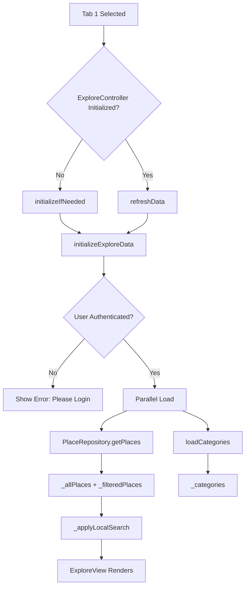
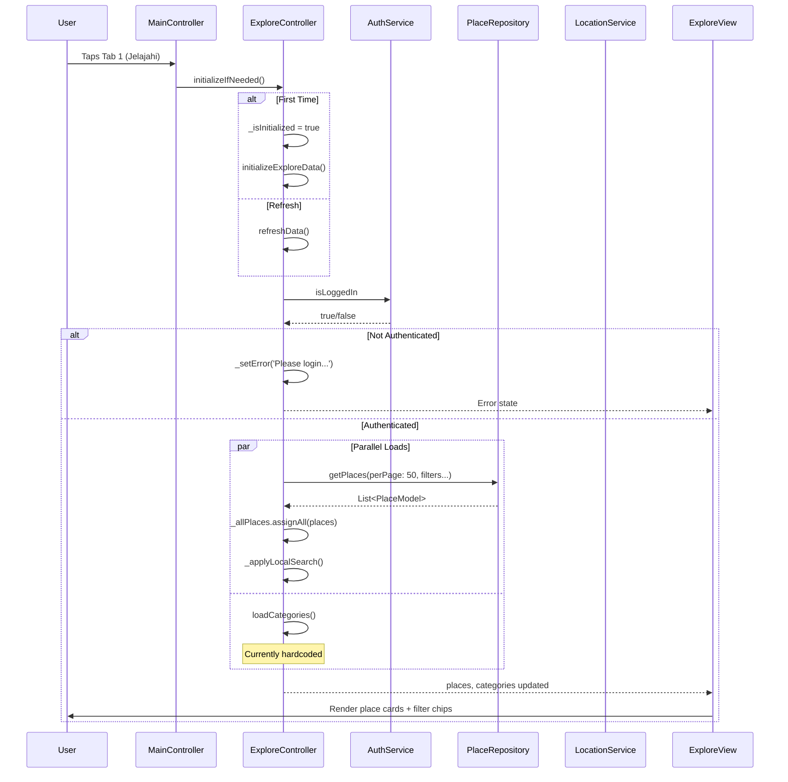
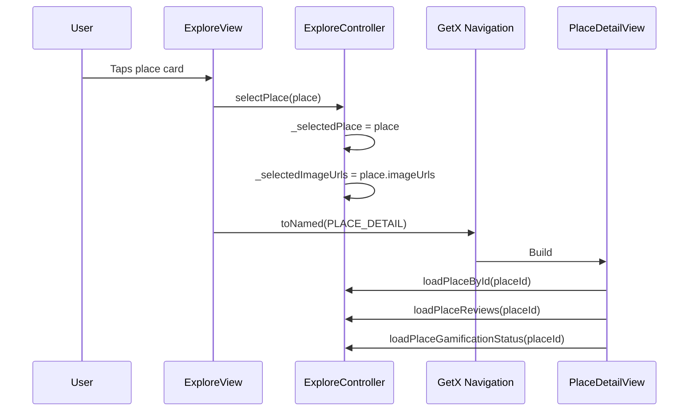

# User Flow: Explore - Place Discovery & Filtering

## Overview
Main explore tab for discovering places with comprehensive filtering, search, and categorization.

## Entry Points
- Tab 1 (Jelajahi) in MainLayout
- Route: `/explore` (within MainLayout, ExploreController)

## Components
- **Controller**: `ExploreController` (`lib/app/modules/explore/controllers/explore_controller.dart`)
- **View**: `ExploreView` (`lib/app/modules/explore/views/explore_view.dart`)
- **Repositories**: `PlaceRepository`, `UserRepository`
- **Services**: `AuthService`, `LocationService`

## Activity Diagram



## Sequence Diagram



## State Management (ExploreController)

| Variable | Type | Description |
|----------|------|-------------|
| `_allPlaces` | `RxList<PlaceModel>` | All loaded places (unfiltered) |
| `_filteredPlaces` | `RxList<PlaceModel>` | Places after search filter |
| `_categories` | `RxList<String>` | Category filter options |
| `_selectedPlace` | `Rxn<PlaceModel>` | Selected for detail |
| `_searchQuery` | `RxString` | Current search text |
| `_isSearching` | `RxBool` | Debounce indicator |
| `_selectedCategory` | `RxString` | Active category filter |
| `_selectedRating` | `Rxn<int>` | Min rating filter (1-5) |
| `_selectedPriceRange` | `Rxn<String>` | Price range filter |
| `_selectedFilter` | `RxString` | Special filter: popular/partner/nearby/foodTypes/placeValues |
| `_selectedLocation` | `Rxn<List<double>>` | Lat/lng for nearby |
| `_selectedFoodTypes` | `RxList<String>` | Multi-select food types |
| `_selectedPlaceValues` | `RxList<String>` | Multi-select place values |
| `_hasMoreData` | `RxBool` | Pagination flag |
| `_currentPage` | `RxInt` | Current page for pagination |
| `_isLoading` | `RxBool` | Loading indicator |
| `_errorMessage` | `RxString` | Error display |

## Place Loading with Filters

```dart
// ExploreController.loadPlaces() lines 268-351
Future<void> loadPlaces({bool refresh = false, bool fromApi = true}) async {
  if (!authService.isLoggedIn) return;
  
  if (refresh) {
    _currentPage.value = 1;
    _hasMoreData.value = true;
    _allPlaces.clear();
    _filteredPlaces.clear();
  }
  if (!_hasMoreData.value && !refresh) return;
  
  _setLoading(true);
  _clearError();
  
  try {
    final placesList = await placeRepository.getPlaces(
      perPage: 50,
      minRating: _selectedRating.value?.toDouble(),
      partner: _selectedFilter.value == 'partner' ? true : null,
      popular: _selectedFilter.value == 'popular' ? true : null,
      longitude: _selectedFilter.value == 'nearby' 
          ? _selectedLocation.value![1] : null,
      latitude: _selectedFilter.value == 'nearby' 
          ? _selectedLocation.value![0] : null,
      placeValues: _selectedFilter.value == 'placeValues' 
          ? _selectedPlaceValues.toList() : null,
      foodTypes: _selectedFilter.value == 'foodTypes' 
          ? _selectedFoodTypes.toList() : null,
    );
    
    if (refresh || _currentPage.value == 1) {
      _allPlaces.assignAll(placesList);
    } else {
      _allPlaces.addAll(placesList);
    }
    
    if (placesList.isEmpty) _hasMoreData.value = false;
    else _currentPage.value++;
    
    _applyLocalSearch(); // Apply search filter
  } catch (e) {
    _setError(ErrorHandler.getReadableMessage(e));
  }
  _setLoading(false);
}
```

## Local Search (Debounced)

```dart
// ExploreController.handleSearchInput() lines 403-418
void handleSearchInput(String query, {Duration delay = 300ms}) {
  _searchQuery.value = query;
  _searchDebounce?.cancel();
  
  if (query.isNotEmpty) _isSearching.value = true;
  
  _searchDebounce = Timer(delay, () {
    _applyLocalSearch();
    _isSearching.value = false;
  });
}

// _applyLocalSearch() lines 378-400
void _applyLocalSearch() {
  List<PlaceModel> result = List.from(_allPlaces);
  
  if (_searchQuery.value.isNotEmpty) {
    final q = _searchQuery.value.toLowerCase();
    result = result.where((p) => 
      (p.name?.toLowerCase() ?? '').contains(q)
    ).toList();
  }
  
  _filteredPlaces.value = result;
}
```

## Filter Types

| Filter | Parameter | API Call | UI |
|--------|-----------|----------|-----|
| Category | `category` | `getPlaces` | Chip row |
| Rating | `minRating` | `getPlaces` | Stars (1-5) |
| Price | `priceRange` | Not in API | Dropdown |
| Popular | `popular=true` | `getPlaces` | Toggle chip |
| Partner | `partner=true` | `getPlaces` | Toggle chip |
| Nearby | `lat`, `lng` | `getPlaces` | GPS button |
| Food Types | `foodTypes[]` | `getPlaces` | Multi-select modal |
| Place Values | `placeValues[]` | `getPlaces` | Multi-select modal |

## Special Filter Logic (`_selectedFilter`)

```dart
// Only ONE special filter active at a time
_selectedFilter.value = ''; // 'popular' | 'partner' | 'nearby' | 'foodTypes' | 'placeValues'

// Nearby requires location
Future<void> filterByNearby() async {
  if (_selectedFilter.value == 'nearby') {
    _selectedFilter.value = '';
    _selectedLocation.value = null;
    await loadPlaces(refresh: true);
    return;
  }
  
  final position = await LocationService.getCurrentPosition();
  _selectedFilter.value = 'nearby';
  _selectedLocation.value = [position.latitude, position.longitude];
  await loadPlaces(refresh: true);
}
```

## Navigation Flow

```
┌──────────────────┐
│ MainLayout       │
│ Tab 1: Jelajahi  │
└────────┬─────────┘
         │
         ▼
┌──────────────────┐
│ ExploreController│
│ initializeIfNeeded│
└────────┬─────────┘
         │
         ▼
┌──────────────────┐
│ Auth Check       │──Fail──► Error: Login Required
└────────┬─────────┘
         │ Pass
         ▼
┌──────────────────┐
│ Parallel Load:   │
│ - Places (50)    │
│ - Categories     │
└────────┬─────────┘
         │
         ▼
┌──────────────────┐
│ ExploreView      │
│ - Search Bar     │
│ - Filter Chips   │
│ - Place Cards    │
└──────────────────┘
```

## Place Card Interaction



## Edge Cases

| Scenario | Handling |
|----------|----------|
| No auth | Error state, no places loaded |
| Empty results | Empty state widget |
| Search clears | `clearSearch()` resets query + reapplies |
| Filter combination | `_selectedFilter` exclusive, others combinable |
| Pagination | `loadMorePlaces()` appends to `_allPlaces` |
| Location denied | Nearby filter shows error, doesn't load |
| Network error | Error message, retry button |

## Testing Checklist

- [ ] Tab select loads places + categories
- [ ] Search debounced (300ms) filters locally
- [ ] Category filter triggers API reload
- [ ] Rating filter applies on "Apply"
- [ ] Popular/Partner toggles work
- [ ] Nearby requests location permission
- [ ] Food types multi-select modal
- [ ] Place values multi-select modal
- [ ] Clear filters resets all
- [ ] Pull-to-refresh reloads
- [ ] Pagination loads more
- [ ] Place tap navigates to detail
- [ ] Auth error shows login prompt

## Related Files

- `lib/app/modules/explore/controllers/explore_controller.dart` (lines 1-591)
- `lib/app/modules/explore/views/explore_view.dart`
- `lib/app/data/repositories/place_repository_impl.dart`
- `lib/app/core/services/location_service.dart`
- `lib/app/core/constants/food_type.dart`
- `lib/app/core/constants/place_value.dart`