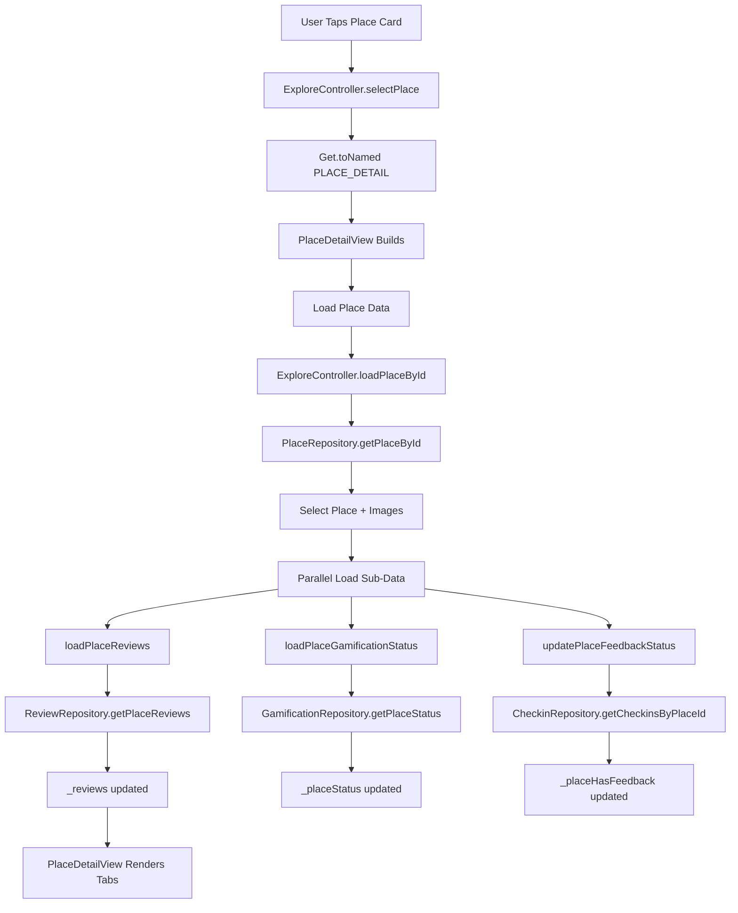
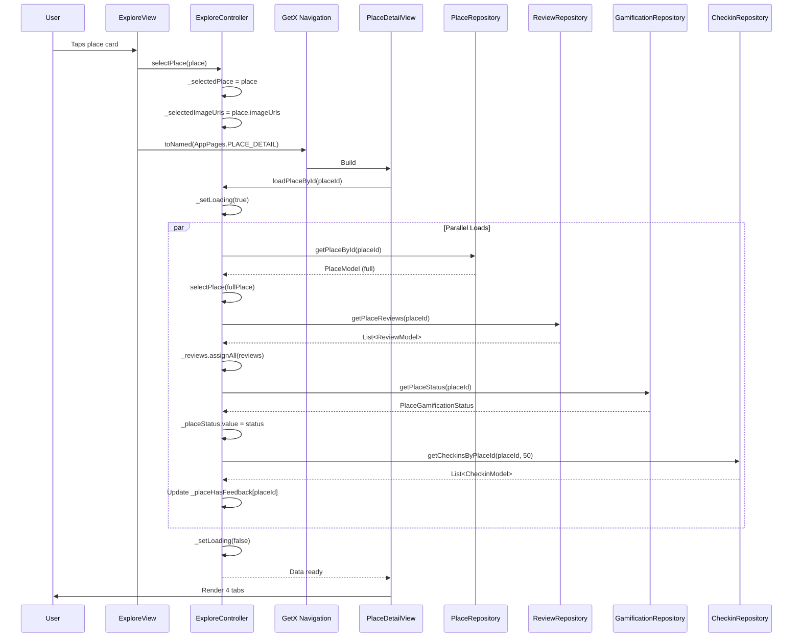

# User Flow: Explore - Place Detail & Sub-Tabs

## Overview
Detailed place view with 4 sub-tabs: Info, Reviews, Facilities, Gallery. Loads comprehensive place data including gamification status.

## Entry Points
- ExploreView: Tap place card
- Route: `/place-detail` (AppPages.PLACE_DETAIL)
- Shared `ExploreController` instance

## Components
- **Controller**: `ExploreController` (shared)
- **Views**: `PlaceDetailView`, `ReviewsView`, `FacilitiesView`, `GalleryView`
- **Routes**: `PLACE_DETAIL`, `REVIEWS`, `FACILITIES`, `GALLERY`
- **Repositories**: `PlaceRepository`, `ReviewRepository`, `GamificationRepository`, `CheckinRepository`, `PostRepository`

## Activity Diagram



## Sequence Diagram



## PlaceDetailView Tab Structure

```
PlaceDetailView
├── TabBar (4 tabs)
│   ├── Info (Default)
│   ├── Ulasan (Reviews)
│   ├── Fasilitas (Facilities)
│   └── Galeri (Gallery)
├── TabBarView
│   ├── Info Tab → Place info, attributes, map, actions
│   ├── Reviews Tab → ReviewsView (route: /reviews)
│   ├── Facilities Tab → FacilitiesView (route: /facilities)
│   └── Gallery Tab → GalleryView (route: /gallery)
└── Bottom Action Bar
    ├── Check-in Button (if eligible)
    ├── Review Button (if eligible)
    └── Mission Button (if eligible)
```

## Gamification Status (`PlaceGamificationStatus`)

| Property | Type | Description |
|----------|------|-------------|
| `hasCheckinThisMonth` | `bool` | User already checked in |
| `hasReviewThisMonth` | `bool` | User already reviewed |
| `appReviewSubmittedThisMonth` | `bool` | User submitted app feedback |
| `canCheckin` | `bool` | Eligible for check-in |
| `canReview` | `bool` | Eligible for review |
| `canSubmitAppReview` | `bool` | Eligible for app feedback |

```dart
// ExploreController getters (lines 157-165)
bool get hasCheckinThisMonth => _placeStatus.value?.hasCheckinThisMonth ?? false;
bool get hasReviewThisMonth => _placeStatus.value?.hasReviewThisMonth ?? false;
bool get appReviewSubmittedThisMonth => _placeStatus.value?.appReviewSubmittedThisMonth ?? false;
bool get canCheckin => _placeStatus.value?.canCheckin ?? true;
bool get canReview => _placeStatus.value?.canReview ?? true;
bool get canSubmitAppReview => _placeStatus.value?.canSubmitAppReview ?? true;
```

## Sub-Tab Routes

### Reviews Tab (`/reviews`)
- **View**: `ReviewsView`
- **Data**: `ExploreController.reviews` (loaded with place)
- **Actions**: Filter by status, load more, write review

### Facilities Tab (`/facilities`)
- **View**: `FacilitiesView`
- **Data**: From `PlaceModel.facilities` or `placeAttributes`
- **Static**: Displays place amenities

### Gallery Tab (`/gallery`)
- **View**: `GalleryView`
- **Controller**: `ExploreController` (shared)
- **Loads**: 
  - `loadGalleryCheckins(placeId)` → Checkins with images
  - `loadGalleryPosts(placeId)` → Posts with images
- **Display**: Combined image grid

## Gallery Loading

```dart
// ExploreController.loadGalleryCheckins() lines 717-733
Future<void> loadGalleryCheckins(int placeId) async {
  _isLoadingGalleryCheckins.value = true;
  _galleryCheckins.clear();
  try {
    final checkins = await checkinRepository.getCheckinsByPlaceId(placeId);
    _galleryCheckins.assignAll(checkins);
  } catch (e) { /* Silent fail */ }
  _isLoadingGalleryCheckins.value = false;
}

// ExploreController.loadGalleryPosts() lines 736-751
Future<void> loadGalleryPosts(int placeId) async {
  _isLoadingGalleryPosts.value = true;
  _galleryPosts.clear();
  try {
    final posts = await postRepository.getPostsByPlaceId(placeId);
    _galleryPosts.assignAll(posts);
  } catch (e) { /* Silent fail */ }
  _isLoadingGalleryPosts.value = false;
}

// Image getters (lines 754-770)
List<String> get galleryCheckinImages => 
  _galleryCheckins.where((c) => c.imageUrl != null).map((c) => c.imageUrl!).toList();

List<String> get galleryPostImages => 
  _galleryPosts.expand((p) => p.imageUrls ?? []).toList();
```

## Navigation Flow

```
┌──────────────────┐
│ ExploreView      │
│ Place Card Tap   │
└────────┬─────────┘
         │
         ▼
┌──────────────────┐
│ /place-detail    │
│ PlaceDetailView  │
│ 4 Tabs           │
└────────┬─────────┘
         │
    ┌────┼────┐
    ▼    ▼    ▼
  Info  Reviews Facilities Gallery
    │    │      │        │
    ▼    ▼      ▼        ▼
Details  List   List    Images
         │               │
         ▼               ▼
    /reviews         /gallery
   ReviewsView      GalleryView
         │               │
         ▼               ▼
    Write Review    View Images
```

## Bottom Action Bar Logic

```dart
// PlaceDetailView determines button visibility
// Based on ExploreController.getters:

// Check-in Button
visible: canCheckin && !hasCheckinThisMonth
action: Navigate to /mission-photo (Mission flow)

// Review Button  
visible: canReview && !hasReviewThisMonth
action: Navigate to /give-review (Review flow)

// Mission Button
visible: canCheckin || canReview || canSubmitAppReview
action: Start mission flow (/mission-photo)
```

## Edge Cases

| Scenario | Handling |
|----------|----------|
| Place not found | Error state, back to explore |
| Reviews empty | Empty state in Reviews tab |
| No facilities | Empty state in Facilities tab |
| Gallery empty | Empty state in Gallery tab |
| Gamification status error | Buttons default to visible |
| Feedback check fails | Assumes no feedback submitted |
| Image load fails | Placeholder in gallery |

## Testing Checklist

- [ ] Place tap navigates to detail
- [ ] All 4 tabs load data
- [ ] Info tab shows complete place data
- [ ] Reviews tab shows loaded reviews
- [ ] Facilities tab shows amenities
- [ ] Gallery loads checkins + posts
- [ ] Gamification status controls buttons
- [ ] Check-in button → mission flow
- [ ] Review button → review flow
- [ ] Pull-to-refresh reloads all
- [ ] Back navigation works

## Related Files

- `lib/app/modules/explore/controllers/explore_controller.dart` (lines 549-591, 714-770)
- `lib/app/modules/explore/views/place_detail_view.dart`
- `lib/app/modules/explore/views/reviews_view.dart`
- `lib/app/modules/explore/views/facilities_view.dart`
- `lib/app/modules/explore/views/gallery_view.dart`
- `lib/app/routes/app_pages.dart` (PLACE_DETAIL, REVIEWS, FACILITIES, GALLERY)
- `lib/app/data/repositories/place_repository_impl.dart`
- `lib/app/data/repositories/review_repository_impl.dart`
- `lib/app/data/repositories/gamification_repository_impl.dart`