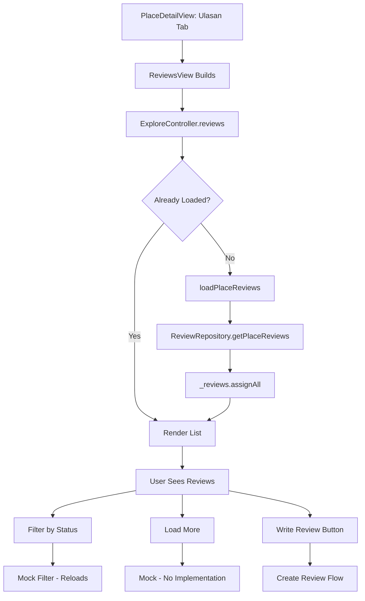
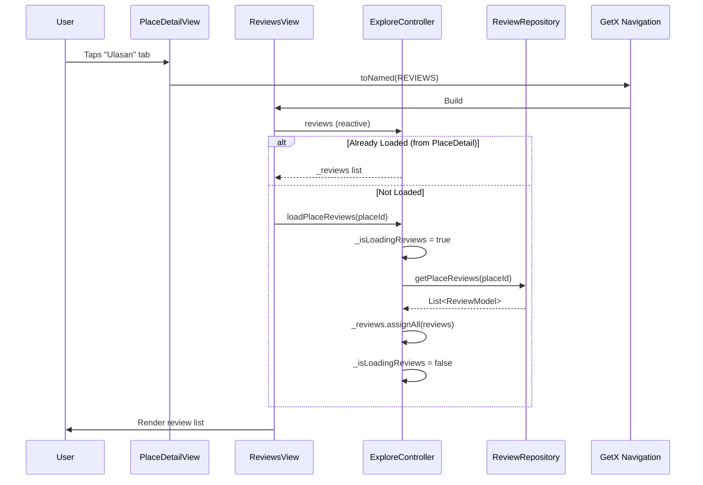
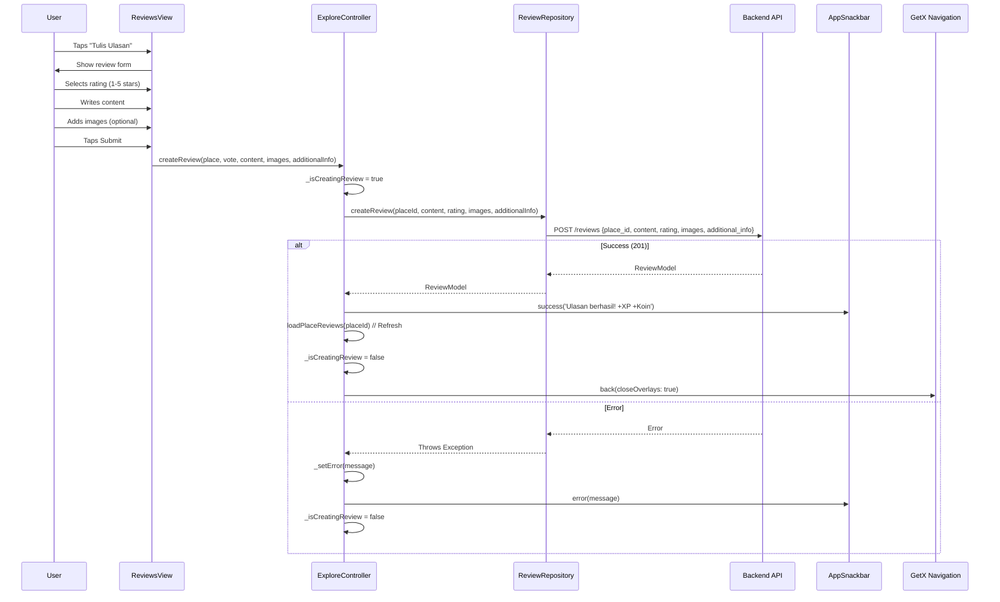

# User Flow: Explore - Reviews (View & Create)

## Overview
Reviews system for places: viewing existing reviews and creating new ones with ratings, photos, and metadata.

## Entry Points
- PlaceDetailView: "Ulasan" tab → `/reviews` route
- PlaceDetailView: "Tulis Ulasan" button → Direct create
- Route: `AppPages.REVIEWS = '/reviews'`

## Components
- **Controller**: `ExploreController` (shared)
- **Views**: `ReviewsView` (`lib/app/modules/explore/views/reviews_view.dart`)
- **Repository**: `ReviewRepository` (`lib/app/data/repositories/review_repository_impl.dart`)

## Activity Diagram: View Reviews



## Activity Diagram: Create Review

```mermaid
flowchart TD
    A[User Taps Write Review] --> B[Review Form Modal/Page]
    B --> C[User Inputs: Rating (1-5)]
    C --> D[User Inputs: Content Text]
    D --> E[User Adds: Images (Optional)]
    E --> F[User Selects: Food Types (Optional)]
    F --> G[User Selects: Place Values (Optional)]
    G --> H[User Answers: Survey 3 Questions (Optional)]
    H --> I[Tap Submit]
    I --> J{Validation}
    J -->|Invalid| K[Show Errors]
    K --> B
    J -->|Valid| L[ExploreController.createReview]
    L --> M[ReviewRepository.createReview]
    M --> N{API Success?}
    N -->|Yes| O[Snackbar: Success + XP/Coin]
    O --> P[loadPlaceReviews Refresh]
    P --> Q[Get.back Close Modal]
    N -->|No| R[Snackbar: Error]
    R --> B
```

## Sequence Diagram: View Reviews



## Sequence Diagram: Create Review



## Review Data Model

```dart
// Expected ReviewModel structure (from API)
class ReviewModel {
  final int id;
  final int placeId;
  final int userId;
  final String content;
  final int rating; // 1-5
  final List<String>? imageUrls;
  final Map<String, dynamic>? additionalInfo; // foodTypes, placeValues, survey, feedback
  final DateTime createdAt;
  final UserModel? user;
  final PlaceModel? place;
}
```

## Create Review Parameters

```dart
// ExploreController.createReview() lines 645-682
Future<void> createReview({
  required PlaceModel? place,
  required int vote,           // 1-5 rating
  required String content,     // Review text
  List<String>? imageUrls,     // Optional photos
  Map<String, dynamic> additionalInfo = const {}, // foodTypes, placeValues, survey
}) async {
  _isCreatingReview.value = true;
  _clearError();

  try {
    await reviewRepository.createReview(
      placeId: place!.id!,
      content: content,
      rating: vote,
      imageUrls: imageUrls,
      additionalInfo: additionalInfo,
    );

    AppSnackbar.success(
      'Ulasan berhasil dikirim! Kamu mendapatkan ${place.expReward ?? 50} XP dan ${place.coinReward ?? 25} Koin',
      duration: Duration(seconds: 3),
    );

    await loadPlaceReviews(place.id!);
    await Future.delayed(Duration(milliseconds: 100));
    Get.back(closeOverlays: true);
  } catch (e) {
    final msg = ErrorHandler.getReadableMessage(e, tag: 'ExploreController');
    _setError(msg);
    AppSnackbar.error(msg);
  }
  _isCreatingReview.value = false;
}
```

## Additional Info Structure (Sent to Backend)

```json
{
  "food_types": ["Indonesian", "Seafood"],
  "place_values": ["Cozy", "Instagrammable"],
  "survey": {
    "q1": true,
    "q2": false,
    "q3": true
  },
  "feedback": {
    "info_accurate": true,
    "best_photo_index": 0,
    "best_photo_url": "https://...",
    "is_hidden_gem": true,
    "recommend_rating": 5,
    "liked_features": ["Food", "Ambience"],
    "feedback_text": "Great place!"
  },
  "is_submitted_app_review": true
}
```

## ReviewsView Features

| Feature | Implementation |
|---------|----------------|
| List reviews | `ExploreController.reviews` |
| Filter by status | `filterByStatus()` - Mock, reloads |
| Load more | `loadMoreData()` - Mock |
| Review stats | `getReviewStats()` - Calculated locally |
| User review stats | `getUserReviewStats()` - Calculated locally |

## Navigation Flow

```
┌──────────────────┐
│ PlaceDetailView  │
│ Ulasan Tab       │
└────────┬─────────┘
         │
         ▼
┌──────────────────┐
│ /reviews         │
│ ReviewsView      │
│ Review List      │
└────────┬─────────┘
         │
    ┌────┴────┐
    ▼         ▼
 View      Write
Reviews    Review
    │         │
    ▼         ▼
  Filter   Form Modal
  Stats      │
             ▼
        Submit → API
             │
        ┌────┴────┐
        ▼         ▼
      Success    Error
        │         │
        ▼         ▼
   Snackbar +   Snackbar
   Refresh +    Stay on
   Close        Form
```

## Edge Cases

| Scenario | Handling |
|----------|----------|
| No reviews | Empty state widget |
| Rating required | Form validation |
| Content empty | Allows empty? (Backend may require) |
| Image upload fail | Not handled in createReview (images = URLs) |
| Network error | Snackbar + stay on form |
| 409 Conflict (already reviewed) | Should check `canReview` before showing form |
| Large content | No client-side limit shown |

## Testing Checklist

- [ ] Reviews tab loads existing reviews
- [ ] Review list renders correctly
- [ ] Write review opens form
- [ ] Rating selection (1-5 stars)
- [ ] Content text input
- [ ] Image selection (if implemented)
- [ ] Submit calls API with correct data
- [ ] Success: Snackbar with rewards, list refreshes, modal closes
- [ ] Error: Snackbar shown, form stays
- [ ] Filter/load more (mock) don't crash
- [ ] Stats calculate correctly

## Related Files

- `lib/app/modules/explore/controllers/explore_controller.dart` (lines 593-682)
- `lib/app/modules/explore/views/reviews_view.dart`
- `lib/app/data/repositories/review_repository_impl.dart`
- `lib/app/data/models/review_model.dart`
- `lib/app/modules/explore/views/place_detail_view.dart` (Ulasan tab)