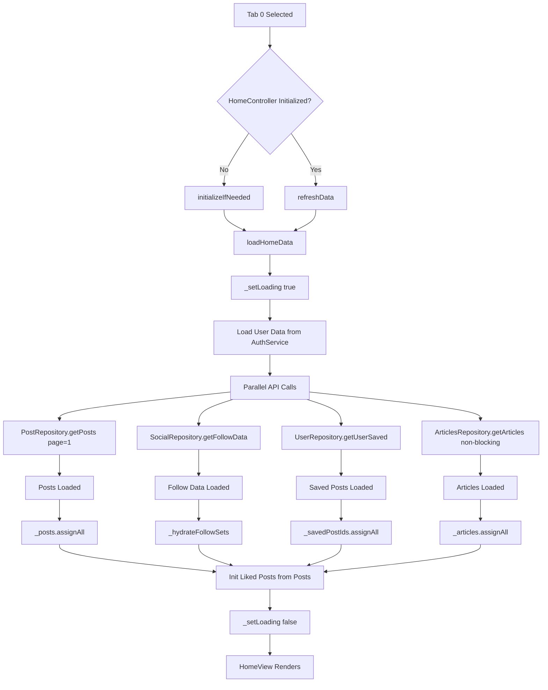
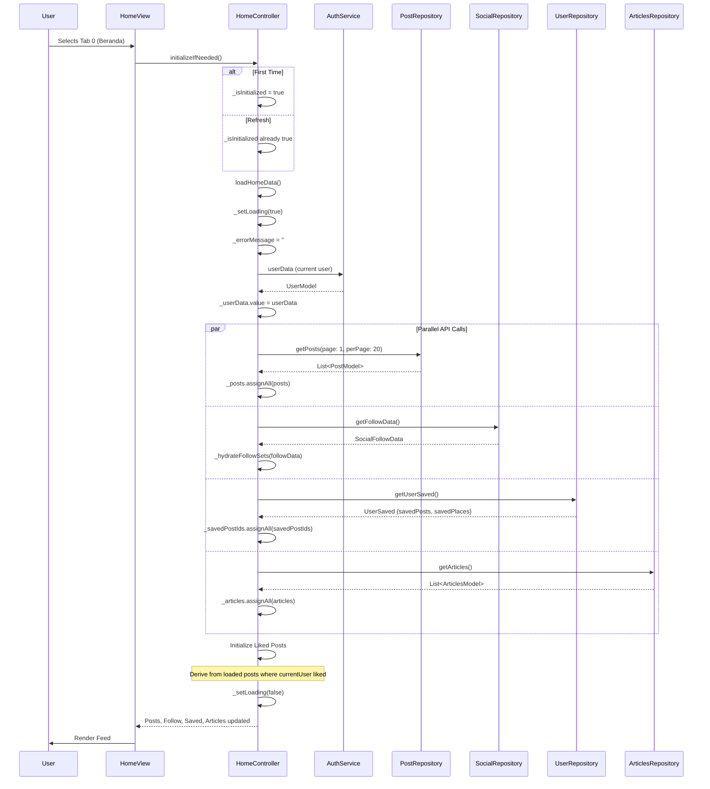

# User Flow: Home Feed Loading & Refresh

## Overview
Main social feed loading with parallel data fetching for posts, follow relations, saved posts, liked posts, and article carousel.

## Entry Points
- Tab 0 (Beranda) selected in MainLayout
- Pull-to-refresh on HomeView
- Route: `/main` (MainLayout with HomeController)

## Components
- **Controller**: `HomeController` (`lib/app/modules/home/controllers/home_controller.dart`)
- **View**: `HomeView` (`lib/app/modules/home/views/home_view.dart`)
- **Repositories**: `PostRepository`, `SocialRepository`, `UserRepository`, `ArticlesRepository`
- **Service**: `AuthService` (for current user data)

## Activity Diagram



## Sequence Diagram



## State Management (HomeController)

| Variable | Type | Description |
|----------|------|-------------|
| `_posts` | `RxList<PostModel>` | Feed posts |
| `_selectedPost` | `Rxn<PostModel>` | Post for detail view |
| `_selectedImageUrls` | `Rxn<List<String>>` | Images for detail carousel |
| `_userData` | `Rx<UserModel?>` | Current user from AuthService |
| `_isLoading` | `RxBool` | Loading indicator |
| `_errorMessage` | `RxString` | Error display |
| `_isInitialized` | `RxBool` | Prevents duplicate init |
| `_showBanner` | `RxBool` | Promo banner visibility |
| `_articles` | `RxList<ArticlesModel>` | Carousel articles |
| `_followerIds` | `RxList<int>` | User IDs following current user |
| `_followingIds` | `RxList<int>` | User IDs current user follows |
| `_followingOverrides` | `RxMap<int,bool>` | Optimistic follow state |
| `_savedPostIds` | `RxList<int>` | Saved post IDs |
| `_isTogglingSavedPostIds` | `RxList<int>` | In-flight save toggles |
| `_likedPostIds` | `RxList<int>` | Liked post IDs |
| `_isTogglingLikePostIds` | `RxList<int>` | In-flight like toggles |

## Parallel Data Loading

```dart
// HomeController.loadHomeData() lines 111-183
Future<void> loadHomeData() async {
  _setLoading(true);
  _errorMessage.value = '';

  try {
    // 1. User data from AuthService (local)
    if (authService.isLoggedIn) {
      final userData = authService.userData;
      if (userData != null) _userData.value = userData;
    }

    // 2. Parallel API calls
    final loadedPostsFuture = postRepository.getPosts(page: 1, perPage: 20);
    final followDataFuture = socialRepository.getFollowData();
    final savedFuture = userRepository.getUserSaved();

    final loadedPosts = await loadedPostsFuture;
    _posts.assignAll(loadedPosts);

    // Follow data (non-blocking)
    try {
      final followData = await followDataFuture;
      _hydrateFollowSets(followData);
    } catch (e) { Logger.warning(...); }

    // Saved posts (non-blocking)
    try {
      final saved = await savedFuture;
      final ids = saved.savedPosts?.map((e) => e.id).toList() ?? [];
      _savedPostIds.assignAll(ids);
    } catch (e) { Logger.warning(...); }

    // Liked posts (derived from loaded posts)
    try {
      final currentUserId = _userData.value?.id;
      if (currentUserId != null) {
        final likedIds = loadedPosts
            .where((post) => post.likes?.any((like) => like.userId == currentUserId) ?? false)
            .map((post) => post.id)
            .toList();
        _likedPostIds.assignAll(likedIds);
      }
    } catch (e) { Logger.warning(...); }

    // Articles for carousel (non-blocking)
    _loadArticles();

  } catch (e) {
    _errorMessage.value = ErrorHandler.getReadableMessage(e, tag: 'HomeController');
  }
  _setLoading(false);
}
```

## Follow State Hydration

```dart
// _hydrateFollowSets lines 185-201
void _hydrateFollowSets(SocialFollowData data) {
  final followers = (data.followers ?? [])
      .map((e) => e.followerId ?? e.follower?.id)
      .whereType<int>().toSet().toList();

  final following = (data.following ?? [])
      .map((e) => e.followingId ?? e.following?.id)
      .whereType<int>().toSet().toList();

  _followerIds.assignAll(followers);
  _followingIds.assignAll(following);
  _followingOverrides.clear(); // Reset optimistic overrides
}
```

## PostFollowState Enum

```dart
enum PostFollowState {
  friend,       // Following + Follower
  following,    // Following only
  followBack,   // Follower only
  follow,       // Neither
}

PostFollowState getFollowState(int userId) {
  final follower = _followerIds.contains(userId);
  final following = _followingOverrides[userId] ?? _followingIds.contains(userId);
  
  if (follower && following) return PostFollowState.friend;
  if (following) return PostFollowState.following;
  if (follower) return PostFollowState.followBack;
  return PostFollowState.follow;
}
```

## Navigation Flow

```
┌──────────────────┐
│ MainLayout       │
│ Tab 0: Beranda   │
└────────┬─────────┘
         │
         ▼
┌──────────────────┐
│ HomeController   │
│ initializeIfNeeded()
└────────┬─────────┘
         │
         ▼
┌──────────────────┐
│ loadHomeData()   │
│ Parallel Loads:  │
│ 1. Posts (20)    │
│ 2. Follow Data   │
│ 3. Saved Posts   │
│ 4. Articles      │
└────────┬─────────┘
         │
         ▼
┌──────────────────┐
│ HomeView         │
│ - Post Cards     │
│ - Article Carousel│
│ - Promo Banner   │
│ - Pull to Refresh│
└──────────────────┘
```

## Pull-to-Refresh

```dart
// HomeView uses RefreshIndicator
RefreshIndicator(
  onRefresh: () => homeController.refreshData(),
  child: ListView(...),
)

// HomeController.refreshData() line 215-217
Future<void> refreshData() async {
  await loadHomeData(); // Full reload
}
```

## Error Handling

| Failure | Behavior |
|---------|----------|
| Posts API fails | `_errorMessage` set, feed shows error state |
| Follow API fails | Logged warning, follow states empty |
| Saved posts API fails | Logged warning, saved states empty |
| Articles API fails | Logged warning, carousel empty |
| All succeed | Normal feed render |

## Edge Cases

| Scenario | Handling |
|----------|----------|
| Tab switch to Home (already initialized) | `MainController.changeTab(0)` → `refreshData()` |
| App backgrounded/foregrounded | No auto-refresh (manual pull only) |
| Empty posts list | Shows empty state widget |
| No internet | NetworkException → error state |
| Token expiry during load | Dio interceptor refreshes → retry |

## Testing Checklist

- [ ] First tab selection loads all data
- [ ] Pull-to-refresh reloads everything
- [ ] Tab switch from other tabs refreshes
- [ ] User data restored from AuthService
- [ ] Follow states computed correctly
- [ ] Saved posts synced from API
- [ ] Liked posts derived from post data
- [ ] Articles carousel populated
- [ ] Loading states shown correctly
- [ ] Error states handled gracefully
- [ ] No duplicate initialization

## Related Files

- `lib/app/modules/home/controllers/home_controller.dart` (lines 1-345)
- `lib/app/modules/home/views/home_view.dart`
- `lib/app/modules/shared/layout/controllers/main_controller.dart` (lines 35-44)
- `lib/app/data/repositories/post_repository_impl.dart`
- `lib/app/data/repositories/social_repository_impl.dart`
- `lib/app/data/repositories/user_repository_impl.dart`
- `lib/app/data/repositories/articles_repository_impl.dart`