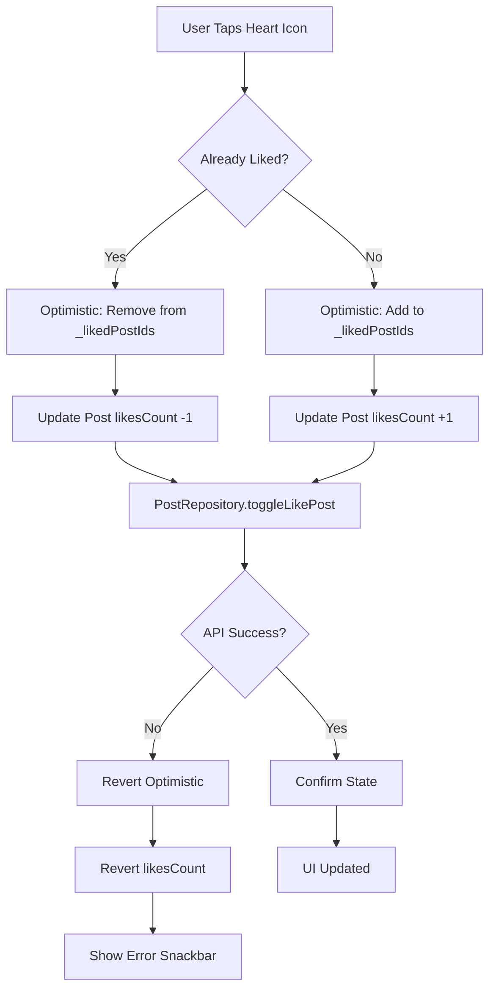
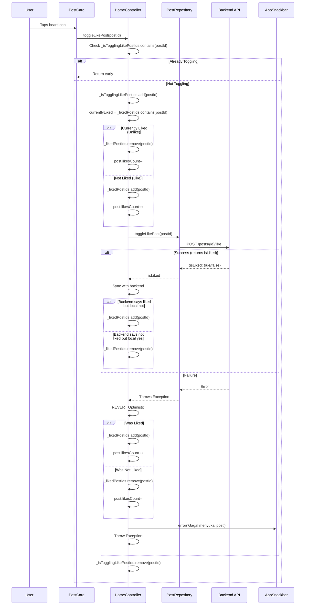
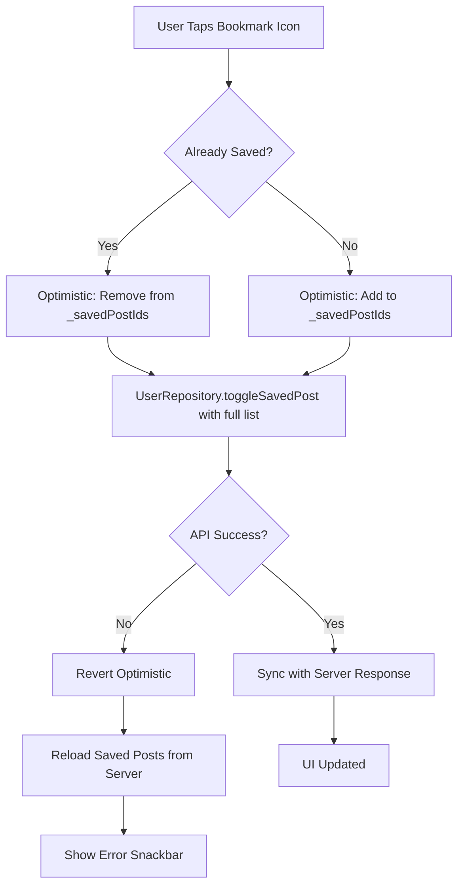
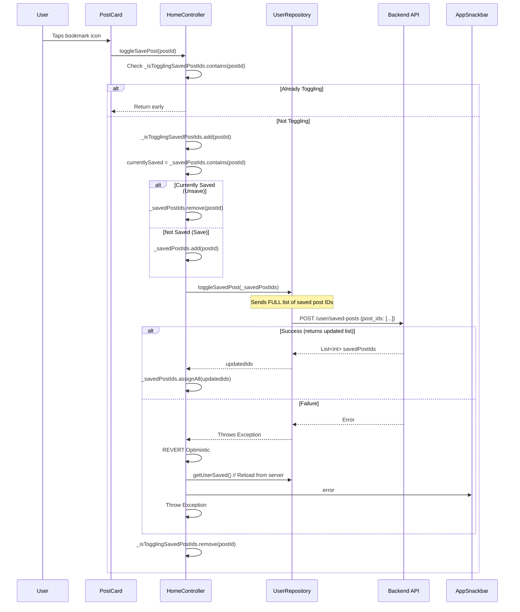
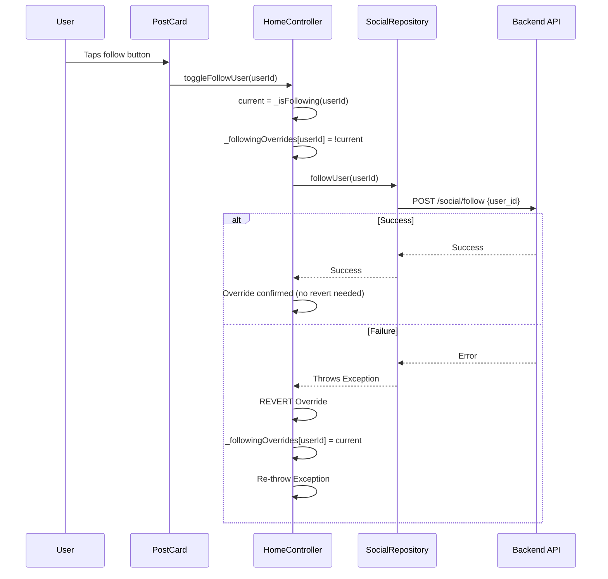
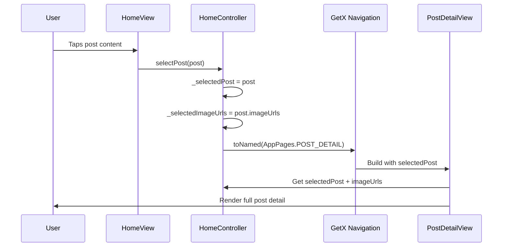
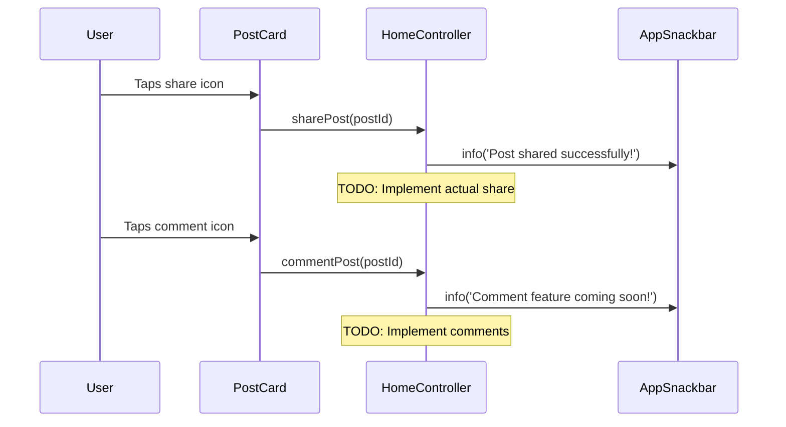

# User Flow: Post Interactions (Like, Save, Follow, Share, Comment, Detail)

## Overview
Optimistic UI updates for social interactions on home feed posts. All interactions use optimistic updates with rollback on failure.

## Entry Points
- HomeView: Post cards in feed
- PostDetailView: Individual post view
- Controller: `HomeController`

## Components
- **Controller**: `HomeController` (`lib/app/modules/home/controllers/home_controller.dart`)
- **Repositories**: `PostRepository`, `SocialRepository`, `UserRepository`
- **Views**: `HomeView`, `PostDetailView`, `PostCard` widget

## Activity Diagram: Like/Unlike Post



## Sequence Diagram: Like/Unlike Post



## Activity Diagram: Save/Unsave Post



## Sequence Diagram: Save/Unsave Post



## Activity Diagram: Follow/Unfollow User

```mermaid
flowchart TD
    A[User Taps Follow Button] --> B{Currently Following?}
    B -->|Yes| C[Optimistic: _followingOverrides[userId] = false]
    B -->|No| D[Optimistic: _followingOverrides[userId] = true]
    C --> E[SocialRepository.followUser]
    D --> E
    E --> F{API Success?}
    F -->|Yes| G[Override Confirmed]
    F -->|No| H[Revert Override]
    H --> I[Show Error Snackbar]
    G --> J[UI Updated]
```

## Sequence Diagram: Follow/Unfollow



## Post Detail Navigation



## Share & Comment (TODO)



## State Management (Interaction Tracking)

| Variable | Purpose |
|----------|---------|
| `_isTogglingLikePostIds` | Prevents double-tap on like |
| `_isTogglingSavedPostIds` | Prevents double-tap on save |
| `_followingOverrides` | Optimistic follow state (Map<userId, bool>) |
| `_likedPostIds` | Local cache of liked posts |
| `_savedPostIds` | Local cache of saved posts |

## Optimistic Update Pattern

```dart
// Generic pattern used for all interactions
Future<void> toggleXxx(int id) async {
  // 1. Guard against double execution
  if (_isTogglingXxxIds.contains(id)) return;
  _isTogglingXxxIds.add(id);
  
  // 2. Capture current state
  final currentlyXxx = _xxxIds.contains(id);
  
  // 3. Optimistic update
  if (currentlyXxx) _xxxIds.remove(id); else _xxxIds.add(id);
  // Update related UI state (counts, etc.)
  
  try {
    // 4. API call
    final result = await repository.toggleXxx(id);
    
    // 5. Sync with backend
    if (result != currentlyXxx) {
      if (result) _xxxIds.add(id); else _xxxIds.remove(id);
    }
  } catch (e) {
    // 6. Revert on failure
    if (currentlyXxx) _xxxIds.add(id); else _xxxIds.remove(id);
    // Revert UI state
    rethrow;
  } finally {
    _isTogglingXxxIds.remove(id);
  }
}
```

## Error Handling

| Interaction | Failure Behavior |
|-------------|------------------|
| Like | Revert heart state + count, snackbar "Gagal menyukai post" |
| Save | Revert bookmark state, reload saved from server, snackbar |
| Follow | Revert follow button, snackbar (error bubbles up) |
| Share | Snackbar only (TODO) |
| Comment | Snackbar only (TODO) |

## Navigation Flow

```
┌──────────────────┐
│ HomeView         │
│ Feed: Post Cards │
└────────┬─────────┘
         │
    ┌────┼────┐
    ▼    ▼    ▼
 Like  Save  Follow
    │    │    │
    ▼    ▼    ▼
Optimistic    Optimistic    Optimistic
Update       Update         Update
    │    │    │
    └────┼────┘
         ▼
┌──────────────────┐
│ API Calls        │
│ (Parallel)       │
└────────┬─────────┘
         │
    ┌────┴────┐
    ▼         ▼
 Success    Failure
    │         │
    ▼         ▼
 Confirm    Revert + Snackbar
 State
```

## Edge Cases

| Scenario | Handling |
|----------|----------|
| Rapid double-tap | `_isTogglingXxxIds` guard prevents duplicate API calls |
| Network timeout | Revert + snackbar |
| 401 during interaction | Dio interceptor refreshes token → retry (transparent) |
| 403/404 (post deleted) | Error snackbar, post may be removed from feed |
| Offline | NetworkException → revert + snackbar |
| Post updated externally | `HomeController.updatePost()` called from detail view |

## Testing Checklist

- [ ] Like: Heart toggles, count updates optimistically
- [ ] Like: Failure reverts heart + count, shows snackbar
- [ ] Save: Bookmark toggles optimistically
- [ ] Save: Failure reverts, reloads from server
- [ ] Follow: Button toggles optimistically
- [ ] Follow: Failure reverts button state
- [ ] Post detail: Navigates with correct data
- [ ] Share: Shows "coming soon" snackbar
- [ ] Comment: Shows "coming soon" snackbar
- [ ] Multiple rapid interactions handled correctly
- [ ] Token refresh during interaction works transparently

## Related Files

- `lib/app/modules/home/controllers/home_controller.dart` (lines 219-340)
- `lib/app/modules/home/views/home_view.dart`
- `lib/app/modules/home/views/post_detail_view.dart`
- `lib/app/modules/shared/widgets/_card_widgets/post_card.dart`
- `lib/app/data/repositories/post_repository_impl.dart`
- `lib/app/data/repositories/social_repository_impl.dart`
- `lib/app/data/repositories/user_repository_impl.dart`