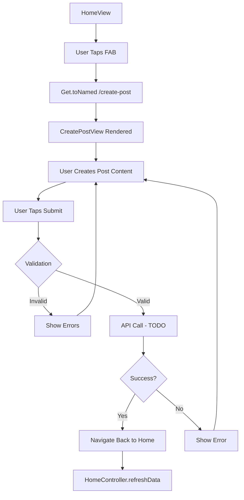
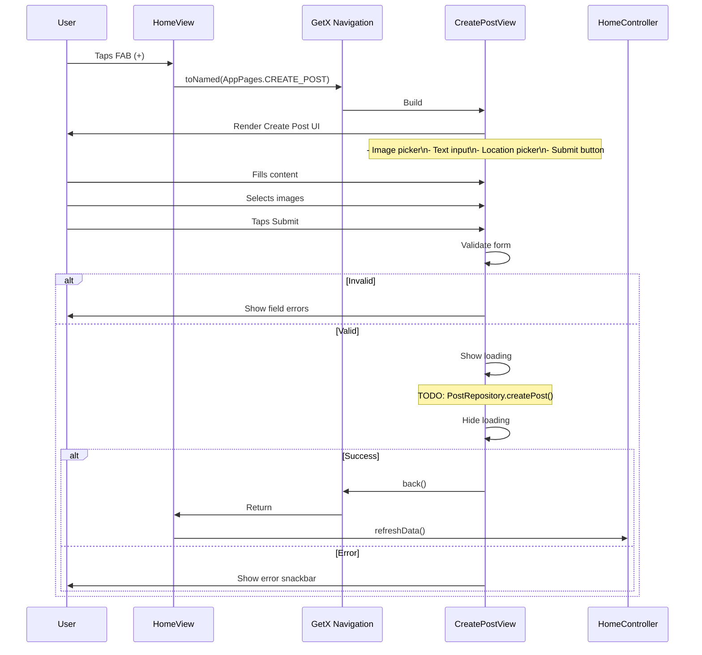

# User Flow: Create Post

## Overview
Flow for creating a new post from the home feed. Currently basic implementation with navigation only.

## Entry Points
- HomeView: Floating Action Button (FAB)
- Route: `/create-post` (AppPages.CREATE_POST)

## Components
- **View**: `CreatePostView` (`lib/app/modules/home/views/create_post_view.dart`)
- **Route**: `AppPages.CREATE_POST = '/create-post'`
- **No Controller**: Direct navigation (no binding)
- **Status**: Basic UI implementation only

## Activity Diagram



## Sequence Diagram



## Current Implementation (CreatePostView)

```dart
// lib/app/modules/home/views/create_post_view.dart
class CreatePostView extends StatelessWidget {
  @override
  Widget build(BuildContext context) {
    return Scaffold(
      appBar: AppBar(title: Text('Buat Postingan')),
      body: SingleChildScrollView(
        child: Column(
          children: [
            // Image selection area
            // Text input for content
            // Location picker
            // Tags/mentions
            // Submit button
          ],
        ),
      ),
    );
  }
}
```

## Route Definition

```dart
// lib/app/routes/app_pages.dart
static const CREATE_POST = '/create-post';

GetPage(
  name: CREATE_POST,
  page: () => const CreatePostView(),
  // No binding - stateless view
),
```

## Navigation Flow

```
┌──────────────────┐
│ HomeView         │
│ FAB Button       │
└────────┬─────────┘
         │
         ▼
┌──────────────────┐
│ /create-post     │
│ CreatePostView   │
└────────┬─────────┘
         │
    ┌────┴────┐
    ▼         ▼
 Cancel    Submit
    │         │
    ▼         ▼
 Back to   Loading →
 Home      API → Success → Back + Refresh
                Error → Stay + Snackbar
```

## Expected Data Model (Post Creation)

```dart
// Expected request structure (not yet implemented)
class CreatePostRequest {
  final String content;
  final List<File> images;
  final double? latitude;
  final double? longitude;
  final String? placeId;
  final List<String> tags;
  final bool isAnonymous;
}
```

## TODO Implementation Checklist

| Feature | Status | Notes |
|---------|--------|-------|
| Image picker (camera/gallery) | ❌ | Use `image_picker` package |
| Text content input | ❌ | Min/max length validation |
| Location picker | ❌ | Use `geolocator` + map |
| Place selection | ❌ | Link to Explore places |
| Tags/mentions | ❌ | @username, #hashtag |
| Anonymous toggle | ❌ | Hide username |
| Draft saving | ❌ | Local persistence |
| Upload progress | ❌ | Cloudinary for images |
| Submit API call | ❌ | `PostRepository.createPost()` |
| Success handling | ❌ | Navigate back + refresh |
| Error handling | ❌ | Snackbar + retry |

## Edge Cases

| Scenario | Expected Handling |
|----------|-------------------|
| No images selected | Allow text-only posts |
| Large images | Compress before upload |
| Upload failure mid-batch | Retry individual images |
| Network loss during upload | Resume from last successful |
| User navigates away | Save draft locally |
| Token expiry during upload | Auto-refresh + retry |
| Duplicate submission | Prevent with loading state |

## Testing Checklist (When Implemented)

- [ ] FAB navigates to create post
- [ ] Image picker works (camera + gallery)
- [ ] Text input validation
- [ ] Location picker selects place
- [ ] Submit uploads images to Cloudinary
- [ ] Submit calls API with correct data
- [ ] Success: Returns to home, feed refreshes
- [ ] Error: Shows snackbar, stays on screen
- [ ] Loading state prevents double submit
- [ ] Draft persists on accidental close

## Related Files

- `lib/app/modules/home/views/create_post_view.dart`
- `lib/app/routes/app_pages.dart` (CREATE_POST route)
- `lib/app/modules/home/views/home_view.dart` (FAB)
- `lib/app/data/repositories/post_repository_impl.dart` (needs createPost method)