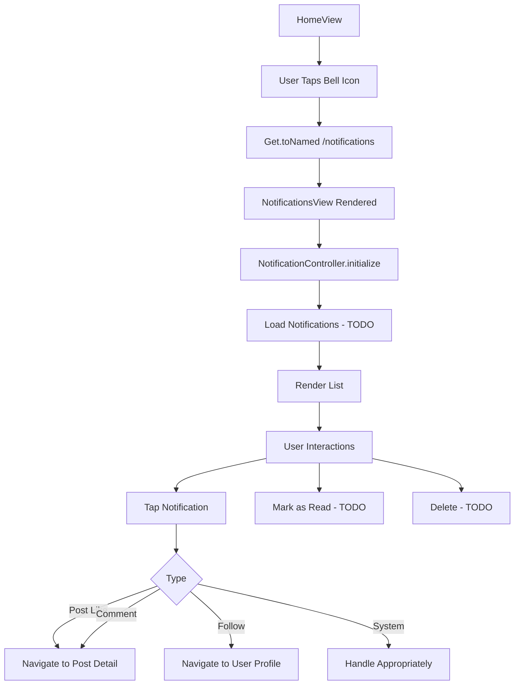
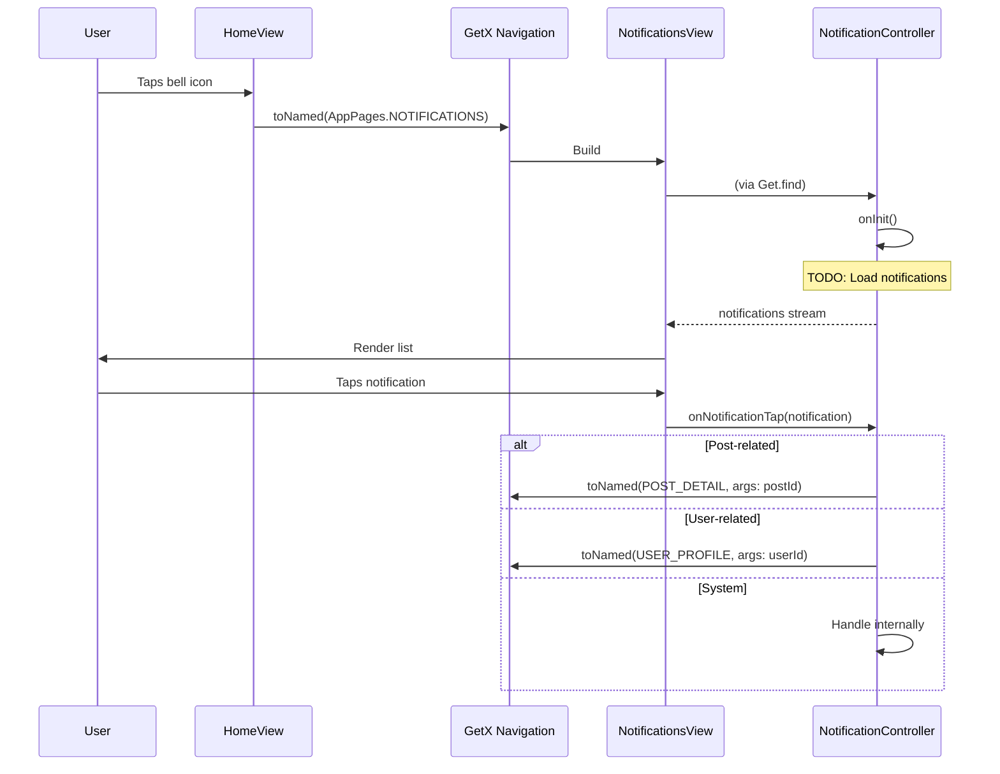

# User Flow: Notifications

## Overview
Notifications screen accessible from home feed bell icon. Currently UI/navigation only.

## Entry Points
- HomeView: Bell icon in AppBar
- Route: `/notifications` (AppPages.NOTIFICATIONS)

## Components
- **Controller**: `NotificationController` (`lib/app/modules/home/controllers/notification_controller.dart`)
- **View**: `NotificationsView` (`lib/app/modules/home/views/notifications_view.dart`)
- **Route**: `AppPages.NOTIFICATIONS = '/notifications'`
- **Status**: UI only, no API integration

## Activity Diagram



## Sequence Diagram



## Current Implementation

### NotificationController
```dart
// lib/app/modules/home/controllers/notification_controller.dart
class NotificationController extends GetxController {
  final _notifications = <NotificationModel>[].obs;
  final _isLoading = false.obs;
  
  List<NotificationModel> get notifications => _notifications;
  bool get isLoading => _isLoading.value;
  
  @override
  void onInit() {
    super.onInit();
    // TODO: Load notifications
  }
  
  Future<void> loadNotifications() async {
    _isLoading.value = true;
    // TODO: NotificationRepository.getNotifications()
    _isLoading.value = false;
  }
  
  void markAsRead(int id) {
    // TODO: API call
  }
  
  void deleteNotification(int id) {
    // TODO: API call + local remove
  }
}
```

### NotificationsView
```dart
// lib/app/modules/home/views/notifications_view.dart
class NotificationsView extends GetView<NotificationController> {
  @override
  Widget build(BuildContext context) {
    return Scaffold(
      appBar: AppBar(title: Text('Notifikasi')),
      body: Obx(() => controller.isLoading
        ? Center(child: CircularProgressIndicator())
        : controller.notifications.isEmpty
          ? EmptyStateWidget(...)
          : ListView.builder(
              itemCount: controller.notifications.length,
              itemBuilder: (context, index) {
                final n = controller.notifications[index];
                return NotificationCardWidget(notification: n);
              },
            ),
      ),
    );
  }
}
```

## Route Definition

```dart
// lib/app/routes/app_pages.dart
static const NOTIFICATIONS = '/notifications';

GetPage(
  name: NOTIFICATIONS,
  page: () => const NotificationsView(),
  // No binding - controller auto-registered via Get.find
),
```

## Navigation Flow

```
┌──────────────────┐
│ HomeView         │
│ Bell Icon        │
└────────┬─────────┘
         │
         ▼
┌──────────────────┐
│ /notifications   │
│ NotificationsView│
│ NotificationCtrl │
└────────┬─────────┘
         │
    ┌────┼────┐
    ▼    ▼    ▼
  Post   User  System
 Like   Follow  Alert
    │    │    │
    ▼    ▼    ▼
Post    User   In-app
Detail  Profile Action
```

## Notification Types (Expected)

| Type | Title | Action | Navigation Target |
|------|-------|--------|-------------------|
| `post_like` | "User liked your post" | Tap → Post | `/post-detail` |
| `post_comment` | "User commented" | Tap → Post | `/post-detail` |
| `user_follow` | "User followed you" | Tap → Profile | `/user-profile` |
| `review_reply` | "Reply to your review" | Tap → Review | `/reviews` |
| `achievement_unlock` | "New achievement!" | Tap → Achievements | `/achievements` |
| `challenge_complete` | "Challenge completed" | Tap → Challenges | `/challenges` |
| `system_update` | "App update available" | Tap → Update | External/Internal |
| `promo` | "Special offer" | Tap → Promo | Internal/External |

## TODO Implementation Checklist

| Feature | Status | Notes |
|---------|--------|-------|
| NotificationRepository | ❌ | New repository needed |
| API endpoint | ❌ | `GET /notifications` |
| Real-time (FCM) | ❌ | Firebase Messaging |
| Push notifications | ❌ | Background handling |
| Mark as read | ❌ | `PATCH /notifications/{id}/read` |
| Delete notification | ❌ | `DELETE /notifications/{id}` |
| Badge count | ❌ | App icon badge |
| Grouping | ❌ | By date/type |
| Filter (unread/all) | ❌ | Tab/filter UI |

## Edge Cases

| Scenario | Expected Handling |
|----------|-------------------|
| No notifications | Empty state widget |
| Pull-to-refresh | Reload list |
| Deep link from push | Navigate directly to target |
| Token expiry | Auto-refresh + retry |
| Offline | Cached notifications + sync indicator |
| Large list | Pagination/infinite scroll |

## Testing Checklist (When Implemented)

- [ ] Bell icon navigates to notifications
- [ ] List loads from API
- [ ] Real-time updates (FCM)
- [ ] Tap post-like → post detail
- [ ] Tap follow → user profile
- [ ] Mark as read updates badge
- [ ] Delete removes from list
- [ ] Pull-to-refresh works
- [ ] Empty state shows correctly
- [ ] Badge count updates

## Related Files

- `lib/app/modules/home/controllers/notification_controller.dart`
- `lib/app/modules/home/views/notifications_view.dart`
- `lib/app/routes/app_pages.dart` (NOTIFICATIONS route)
- `lib/app/modules/home/views/home_view.dart` (bell icon)
- `lib/app/modules/shared/widgets/_card_widgets/notification_card_widget.dart`