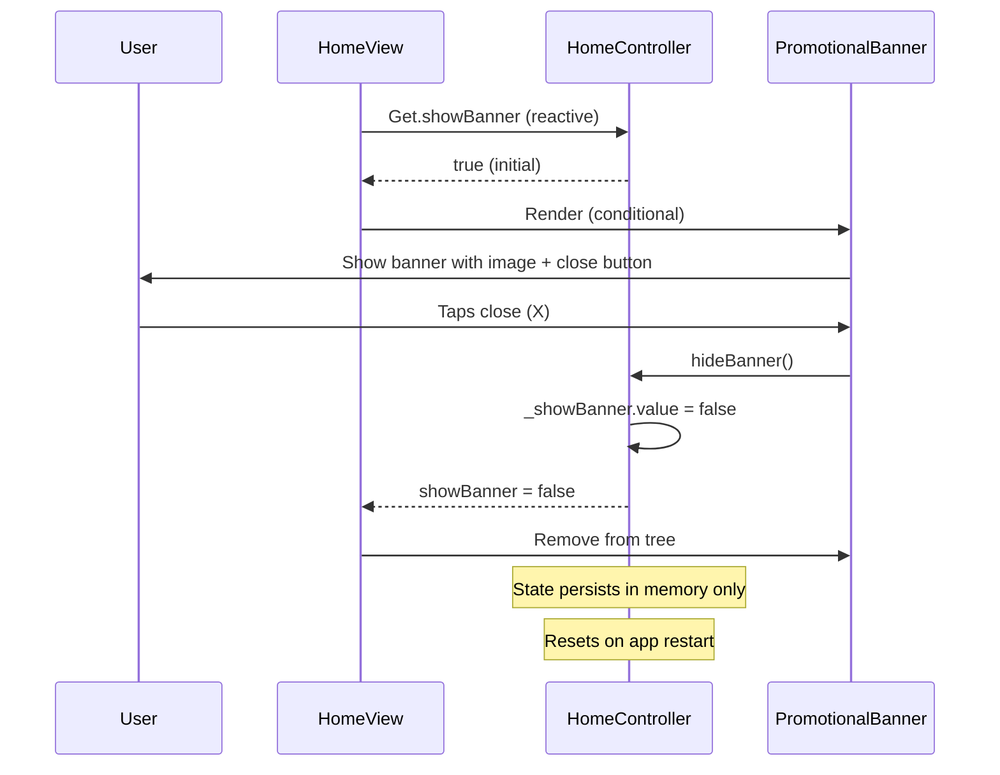

# User Flow: Promotional Banner

## Overview
Dismissible promotional banner displayed at top of home feed. Session-persisted dismissal.

## Entry Points
- HomeView: Top of feed (when `HomeController.showBanner == true`)
- Component: `PromotionalBanner` widget

## Components
- **Controller**: `HomeController` (manages `showBanner` state)
- **Widget**: `PromotionalBanner` (`lib/app/modules/shared/widgets/_card_widgets/promotional_banner.dart`)
- **View**: `HomeView` (renders banner conditionally)

## Activity Diagram

```mermaid
flowchart TD
    A[HomeView Builds] --> B{HomeController.showBanner?}
    B -->|Yes| C[Render PromotionalBanner]
    B -->|No| D[Skip Banner]
    C --> E[User Sees Banner]
    E --> F[User Taps Close (X)]
    F --> G[HomeController.hideBanner]
    G --> H[showBanner = false]
    H --> I[Banner Removed from View]
    I --> J[Persists Until App Restart]
```

## Sequence Diagram



## Implementation

### HomeController State
```dart
// lib/app/modules/home/controllers/home_controller.dart
final _showBanner = true.obs;

bool get showBanner => _showBanner.value;

void hideBanner() => _showBanner.value = false;
```

### HomeView Rendering
```dart
// lib/app/modules/home/views/home_view.dart
Obx(() => homeController.showBanner
  ? PromotionalBanner(
      onDismiss: homeController.hideBanner,
    )
  : SizedBox.shrink(),
),
```

### PromotionalBanner Widget
```dart
// lib/app/modules/shared/widgets/_card_widgets/promotional_banner.dart
class PromotionalBanner extends StatelessWidget {
  final VoidCallback onDismiss;
  
  @override
  Widget build(BuildContext context) {
    return Container(
      margin: EdgeInsets.all(16),
      decoration: BoxDecoration(
        borderRadius: BorderRadius.circular(12),
        image: DecorationImage(
          image: AssetImage('assets/images/promo/banner.png'),
          fit: BoxFit.cover,
        ),
      ),
      child: Stack(
        children: [
          // Banner content
          Positioned(
            top: 8,
            right: 8,
            child: IconButton(
              icon: Icon(Icons.close, color: Colors.white),
              onPressed: onDismiss,
            ),
          ),
        ],
      ),
    );
  }
}
```

## Navigation Flow

```
┌──────────────────┐
│ HomeView         │
│ (Feed Loads)     │
└────────┬─────────┘
         │
         ▼
┌──────────────────┐
│ showBanner?      │──No──► No Banner
└────────┬─────────┘
         │ Yes
         ▼
┌──────────────────┐
│ PromotionalBanner│
│ - Image          │
│ - Close (X)      │
└────────┬─────────┘
         │
         ▼
┌──────────────────┐
│ User Taps Close  │
└────────┬─────────┘
         │
         ▼
┌──────────────────┐
│ hideBanner()     │
│ _showBanner=false│
└────────┬─────────┘
         │
         ▼
┌──────────────────┐
│ Banner Removed   │
│ (Until Restart)  │
└──────────────────┘
```

## State Persistence

| Aspect | Behavior |
|--------|----------|
| Initial State | `true` (shown on every app start) |
| Dismissal | In-memory only (`RxBool`) |
| Persistence | None (resets on app restart) |
| Server Sync | Not implemented |

## Customization Points

| Element | Current | Extensible To |
|---------|---------|---------------|
| Image | Static asset | Remote URL (API) |
| Action | Dismiss only | Tap → deep link |
| Targeting | All users | User segments |
| Frequency | Every session | Daily/weekly/once |
| Content | Image only | Rich content (video, carousel) |

## Edge Cases

| Scenario | Handling |
|----------|----------|
| Image fails to load | Shows placeholder/empty space |
| Rapid tap close | `onDismiss` called once (idempotent) |
| App backgrounded | State preserved in memory |
| App killed | Resets to shown on next launch |
| Multiple banners | Not supported (single banner) |

## Testing Checklist

- [ ] Banner shows on home feed load
- [ ] Close button removes banner
- [ ] Banner stays hidden during session
- [ ] Banner reappears after app restart
- [ ] Banner doesn't affect feed scroll
- [ ] Image loads correctly
- [ ] No layout overflow
- [ ] Accessibility: close button labeled

## Enhancement Ideas (Future)

1. **Server-driven**: Fetch banner config from API (image URL, target URL, start/end dates)
2. **Persistence**: Store dismissal timestamp in SharedPreferences with expiry
3. **Targeting**: Show based on user segment, location, behavior
4. **Analytics**: Track impressions, dismissals, click-throughs
5. **Multiple**: Carousel of banners with pagination
6. **Rich Media**: Video, interactive elements

## Related Files

- `lib/app/modules/home/controllers/home_controller.dart` (lines 44, 66)
- `lib/app/modules/home/views/home_view.dart` (banner rendering)
- `lib/app/modules/shared/widgets/_card_widgets/promotional_banner.dart`