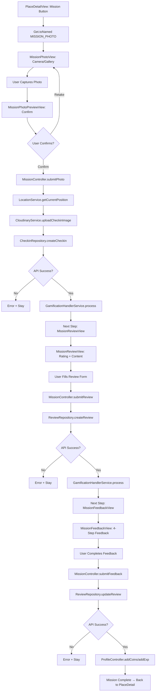
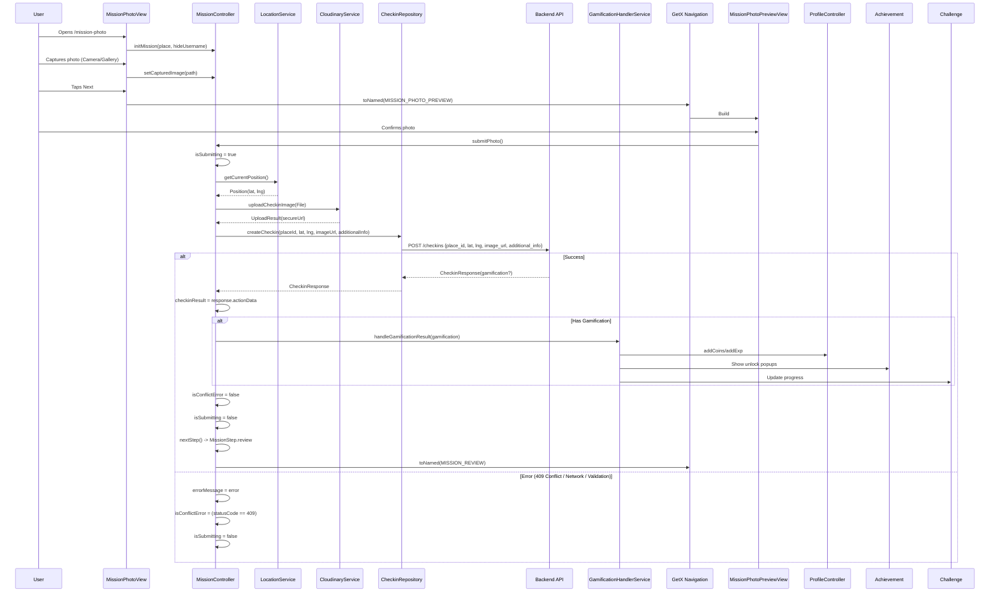

# User Flow: Mission (Check-in + Review + Feedback) - Gamification

## Overview
Multi-step mission flow combining check-in, review, and app feedback for maximum gamification rewards (XP, coins, achievements, challenges).

## Entry Points
- PlaceDetailView: "Mulai Mission" button (when eligible)
- Route: `/mission-photo` → `/mission-photo-preview` → `/mission-review`
- Controller: `MissionController` (fresh per mission via `MissionBinding`)

## Components
- **Controller**: `MissionController` (`lib/app/modules/mission/controllers/mission_controller.dart`)
- **Views**: `MissionPhotoView`, `MissionPhotoPreviewView`, `MissionReviewView`, `MissionFeedbackView`
- **Repositories**: `CheckinRepository`, `ReviewRepository`
- **Services**: `CloudinaryService`, `LocationService`, `GamificationHandlerService`, `ProfileController`
- **Binding**: `MissionBinding` (fresh controller per mission)

## Activity Diagram: Complete Mission Flow



## Sequence Diagram: Step 1 - Photo (Check-in)



## Sequence Diagram: Step 2 - Review

```mermaid
sequenceDiagram
    participant User
    participant MissionReviewView
    participant MissionController
    participant ReviewRepository
    participant Backend API
    participant GamificationHandlerService
    participant GetX Navigation

    User->>MissionReviewView: Opens /mission-review
    MissionReviewView->>MissionController: (Shared instance)
    
    User->>MissionReviewView: Selects rating (1-5) - REQUIRED
    User->>MissionReviewView: Writes content
    User->>MissionReviewView: Adds media (photos/videos)
    User->>MissionReviewView: Selects food types (multi)
    User->>MissionReviewView: Selects place values (multi)
    User->>MissionReviewView: Answers survey (3 yes/no)
    User->>MissionReviewView: Taps Submit
    
    MissionReviewView->>MissionController: submitReview()
    
    MissionController->>MissionController: isSubmitting = true
    
    %% Prepare data
    MissionController->>MissionController: imageUrls = [checkinImage] + reviewMedia
    MissionController->>MissionController: additionalInfo = {
      hide_username, food_types, place_values, survey
    }
    
    MissionController->>ReviewRepository: createReview(placeId, content, rating, imageUrls, additionalInfo)
    ReviewRepository->>Backend API: POST /reviews {place_id, content, rating, images, additional_info}
    
    alt Success
        Backend API-->>ReviewRepository: ReviewResponse(gamification?)
        ReviewRepository-->>MissionController: ReviewResponse
        MissionController->>MissionController: reviewResult = response.actionData
        
        alt Has Gamification
            MissionController->>GamificationHandlerService: handleGamificationResult(gamification)
        end
        
        MissionController->>MissionController: isConflictError = false
        MissionController->>MissionController: nextStep() -> MissionStep.feedback
        MissionController->>GetX Navigation: toNamed(MISSION_FEEDBACK)
    else Error (409 / Network / Validation)
        MissionController->>MissionController: errorMessage / isConflictError
    end
    
    MissionController->>MissionController: isSubmitting = false
```

## Sequence Diagram: Step 3 - Feedback (App Review)

```mermaid
sequenceDiagram
    participant User
    participant MissionFeedbackView
    participant MissionController
    participant ReviewRepository
    participant Backend API
    participant ProfileController
    participant GetX Navigation

    User->>MissionFeedbackView: Opens /mission-feedback
    MissionFeedbackView->>MissionController: (Shared instance)
    
    %% 4 Feedback Steps
    User->>MissionFeedbackView: Step 1: Info Accurate? (Yes/No)
    User->>MissionFeedbackView: Step 2: Best Photo? (Select index)
    User->>MissionFeedbackView: Step 3: Hidden Gem? (Yes/No) + Recommend (1-5)
    User->>MissionFeedbackView: Step 4: Liked Features (Multi) + Free Text
    User->>MissionFeedbackView: Taps Submit
    
    MissionFeedbackView->>MissionController: submitFeedback()
    
    MissionController->>MissionController: isSubmitting = true
    
    MissionController->>MissionController: feedbackData = {
      info_accurate, best_photo_index, best_photo_url,
      is_hidden_gem, recommend_rating, liked_features, feedback_text
    }
    
    MissionController->>MissionController: existingInfo = reviewResult.additionalInfo
    MissionController->>MissionController: updatedInfo = existingInfo + {feedback, is_submitted_app_review: true}
    
    MissionController->>ReviewRepository: updateReview(reviewId, additionalInfo: updatedInfo)
    ReviewRepository->>Backend API: PATCH /reviews/{id} {additional_info}
    
    alt Success
        Backend API-->>ReviewRepository: UpdatedReviewModel
        ReviewRepository-->>MissionController: UpdatedReviewModel
        MissionController->>MissionController: reviewResult = updated
        
        MissionController->>ProfileController: addCoins(coinReward)
        MissionController->>ProfileController: addExp(expReward)
        
        MissionController->>MissionController: isSubmitting = false
        MissionController->>GetX Navigation: back(closeOverlays: true) -> PlaceDetail
    else Error
        MissionController->>MissionController: errorMessage
    end
```

## Mission Steps Enum

```dart
// MissionController lines 22-27
enum MissionStep {
  photo,    // Step 1: Capture check-in photo
  review,   // Step 2: Write review + survey
  feedback, // Step 3: App feedback (4 sub-steps)
}
```

## State Management (MissionController)

| Variable | Type | Description |
|----------|------|-------------|
| `currentPlace` | `PlaceModel?` | Place for this mission |
| `currentStep` | `Rx<MissionStep>` | Current step (photo/review/feedback) |
| `capturedImagePath` | `Rxn<String>` | Local photo path |
| `uploadedImageUrl` | `Rxn<String>` | Cloudinary URL after upload |
| `reviewController` | `TextEditingController` | Review text input |
| `rating` | `RxInt` | 1-5 rating (0 = not selected) |
| `reviewMediaPaths` | `RxList<String>` | Review photos/videos |
| `selectedFoodTypes` | `RxList<FoodType>` | Food type selections |
| `selectedPlaceValues` | `RxList<PlaceValue>` | Place value selections |
| `surveyAnswers` | `RxMap<String,dynamic>` | 3 yes/no questions |
| `feedbackStep` | `RxInt` | 0-3 for feedback sub-steps |
| `feedbackAnswers` | `RxMap<String,dynamic>` | Feedback form data |
| `hideUsername` | `RxBool` | Anonymous preference |
| `isLoading` | `RxBool` | General loading |
| `isSubmitting` | `RxBool` | API in progress |
| `errorMessage` | `Rxn<String>` | Error display |
| `isConflictError` | `RxBool` | 409 conflict flag |
| `checkinResult` | `Rxn<CheckinModel>` | Check-in response |
| `reviewResult` | `Rxn<ReviewModel>` | Review response |

## Gamification Handling

```dart
// GamificationHandlerService.handleGamificationResult()
static Future<void> handleGamificationResult(GamificationResponse gamification) async {
  // 1. Update ProfileController coins/XP
  final profileController = Get.find<ProfileController>();
  if (gamification.coinReward > 0) {
    await profileController.addCoins(gamification.coinReward);
  }
  if (gamification.expReward > 0) {
    await profileController.addExp(gamification.expReward);
  }
  
  // 2. Show Achievement Popups (sequential, non-stacking)
  for (final achievement in gamification.newAchievements ?? []) {
    await AchievementUnlockModal.show(achievement);
  }
  
  // 3. Update Challenges (background)
  profileController.loadChallenges();
}
```

## Conflict Handling (409 Errors)

| Step | Conflict Condition | UI Response |
|------|-------------------|-------------|
| Photo (Check-in) | Already checked in this month | `isConflictError = true`, show "Sudah check-in bulan ini" |
| Review | Already reviewed this month | `isConflictError = true`, show "Sudah ulasan bulan ini" |
| Feedback | Already submitted app review | Error: "Feedback sudah dikirim" |

## Navigation Flow

```
┌──────────────────┐
│ PlaceDetailView  │
│ Mission Button   │
└────────┬─────────┘
         │
         ▼
┌──────────────────┐
│ /mission-photo   │
│ MissionPhotoView │
│ Camera/Gallery   │
└────────┬─────────┘
         │ Confirm
         ▼
┌──────────────────┐
│ /mission-photo-  │
│ preview          │
│ Confirm/Retake   │
└────────┬─────────┘
         │ Confirm
         ▼
┌──────────────────┐
│ submitPhoto()    │
│ GPS + Cloudinary │
│ + Checkin API    │
│ + Gamification   │
└────────┬─────────┘
         │ Success
         ▼
┌──────────────────┐
│ /mission-review  │
│ MissionReviewView│
│ Rating + Content │
│ Food/Place/Survey│
└────────┬─────────┘
         │ Submit
         ▼
┌──────────────────┐
│ submitReview()   │
│ Review API       │
│ + Gamification   │
└────────┬─────────┘
         │ Success
         ▼
┌──────────────────┐
│ /mission-feedback│
│ MissionFeedbackV │
│ 4 Steps          │
└────────┬─────────┘
         │ Submit
         ▼
┌──────────────────┐
│ submitFeedback() │
│ Update Review    │
│ + Profile Coins  │
└────────┬─────────┘
         │ Success
         ▼
┌──────────────────┐
│ Back to          │
│ PlaceDetailView  │
└──────────────────┘
```

## Edge Cases

| Scenario | Handling |
|----------|----------|
| Location permission denied | Error: "Failed to get location" |
| Cloudinary upload fails | Error: Upload error message |
| 409 on check-in | `isConflictError`, show conflict UI |
| 409 on review | `isConflictError`, show conflict UI |
| Survey incomplete | Error: "Please answer all survey questions" |
| Feedback already submitted | Error: "Feedback sudah dikirim" |
| Network loss mid-mission | Error snackbar, stay on current step |
| User closes app mid-mission | State lost (controller fresh per mission) |
| Achievements unlock | Sequential modals via GamificationHandler |

## Testing Checklist

- [ ] Mission button starts flow
- [ ] Photo capture (camera + gallery)
- [ ] Preview confirm/retake
- [ ] GPS location obtained
- [ ] Cloudinary upload works
- [ ] Check-in API called with correct data
- [ ] Gamification processed (XP/coins/achievements)
- [ ] Review step: rating required
- [ ] Review step: content + media
- [ ] Review step: food types + place values
- [ ] Review step: survey (3 questions)
- [ ] Review API + gamification
- [ ] Feedback step: 4 sub-steps
- [ ] Feedback updates review + profile
- [ ] 409 conflicts show proper UI
- [ ] Complete flow returns to place detail
- [ ] Profile coins/XP updated

## Related Files

- `lib/app/modules/mission/controllers/mission_controller.dart` (full)
- `lib/app/modules/mission/views/mission_photo_view.dart`
- `lib/app/modules/mission/views/mission_photo_preview_view.dart`
- `lib/app/modules/mission/views/mission_review_view.dart`
- `lib/app/modules/mission/views/mission_feedback_view.dart`
- `lib/app/modules/mission/bindings/mission_binding.dart`
- `lib/app/core/services/gamification_handler_service.dart`
- `lib/app/core/services/cloudinary_service.dart`
- `lib/app/core/services/location_service.dart`
- `lib/app/routes/app_pages.dart` (MISSION_PHOTO, MISSION_PHOTO_PREVIEW, MISSION_REVIEW)