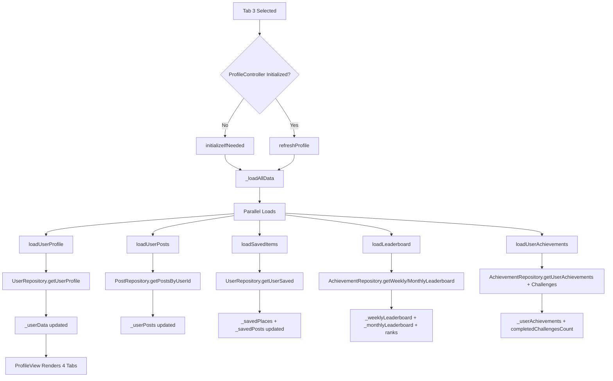
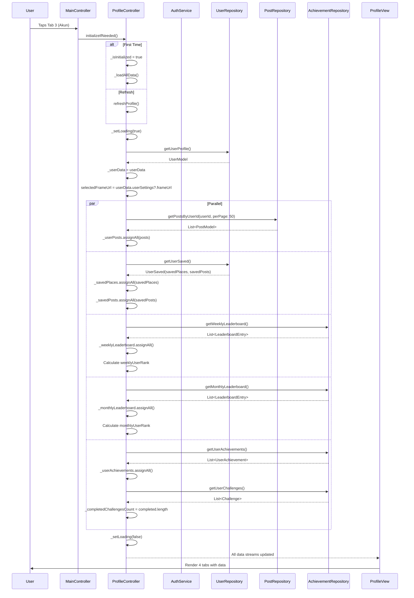

# User Flow: Profile - Main Profile Loading & Tabs

## Overview
User profile tab showing stats, posts, saved items, leaderboard, and achievements with 4 sub-tabs.

## Entry Points
- Tab 3 (Akun) in MainLayout
- Route: `/profile` (within MainLayout, ProfileController)

## Components
- **Controller**: `ProfileController` (`lib/app/modules/profile/controllers/profile_controller.dart`)
- **View**: `ProfileView` (`lib/app/modules/profile/views/profile_view.dart`)
- **Repositories**: `UserRepository`, `PostRepository`, `AchievementRepository`
- **Service**: `AuthService`

## Activity Diagram



## Sequence Diagram



## State Management (ProfileController)

| Variable | Type | Description |
|----------|------|-------------|
| `_userData` | `Rx<UserModel?>` | Current user profile |
| `_userPosts` | `RxList<PostModel>` | User's posts |
| `_savedPlaces` | `RxList<SavedPlacePreview>` | Saved places with preview |
| `_savedPosts` | `RxList<SavedPostPreview>` | Saved posts with preview |
| `_weeklyLeaderboard` | `RxList<LeaderboardEntry>` | Weekly rankings |
| `_monthlyLeaderboard` | `RxList<LeaderboardEntry>` | Monthly rankings |
| `_userAchievements` | `RxList<UserAchievement>` | Unlocked achievements |
| `_weeklyUserRank` | `Rxn<int>` | Current user's weekly rank |
| `_monthlyUserRank` | `Rxn<int>` | Current user's monthly rank |
| `_isLoading` | `RxBool` | Main loading |
| `_isLoadingPosts` | `RxBool` | Posts loading |
| `_isLoadingSaved` | `RxBool` | Saved items loading |
| `_isLoadingAchievements` | `RxBool` | Achievements/leaderboard loading |
| `_isInitialized` | `RxBool` | Init guard |
| `_selectedTabIndex` | `RxInt` | Active sub-tab (0-3) |
| `selectedFrameUrl` | `Rx<String?>` | Avatar frame URL |

## Profile Sub-Tabs

| Index | Tab | Content | Key Data |
|-------|-----|---------|----------|
| 0 | Profil | Stats, posts grid, edit button | `_userData`, `_userPosts` |
| 1 | Tersimpan | Saved places + posts toggle | `_savedPlaces`, `_savedPosts` |
| 2 | Peringkat | Weekly/Monthly leaderboard toggle | `_weeklyLeaderboard`, `_monthlyLeaderboard`, ranks |
| 3 | Pencapaian | Achievements + challenges badge | `_userAchievements`, `_completedChallengesCount` |

## Profile Stats (from UserModel)

```dart
// ProfileController getters (lines 65-80)
String get userName => _userData.value?.name ?? 'User';
String get userNickname => _userData.value?.username ?? '';
String get userAvatar => _userData.value?.imageUrl ?? '';
int get totalCoins => _userData.value?.totalCoin ?? 0;
int get totalExp => _userData.value?.totalExp ?? 0;
int get totalFollowing => _userData.value?.totalFollowing ?? 0;
int get totalFollowers => _userData.value?.totalFollower ?? 0;
int get totalCheckins => _userData.value?.totalCheckin ?? 0;
int get totalPosts => _userData.value?.totalPost ?? 0;
int get totalArticles => _userData.value?.totalArticle ?? 0;
int get totalReviews => _userData.value?.totalReview ?? 0;
int get totalAchievements => _userData.value?.totalAchievement ?? 0;
int get totalChallenges => _completedChallengesCount.value;
```

## Auth State Listener

```dart
// ProfileController.onInit() lines 94-104
@override
void onInit() {
  super.onInit();
  Logger.debug('ProfileController created (not initialized yet)', 'Profile');

  ever(authService.isLoggedInObs, (isLoggedIn) {
    if (isLoggedIn && _isInitialized.value) {
      loadUserProfile(); // Refresh on auth change
    }
  });
}
```

## Real-time Updates

```dart
// ProfileController methods for gamification updates
void incrementCompletedChallenges(int count) {
  _completedChallengesCount.value += count;
}

void resetCompletedChallengesBadge() {
  _completedChallengesCount.value = 0;
}

Future<void> addCoins(int amount) async {
  if (_userData.value != null) {
    _userData.value = UserModel()
      ..id = _userData.value!.id
      ..totalCoin = (_userData.value!.totalCoin ?? 0) + amount
      // ... copy other fields
  }
}

Future<void> addExp(int amount) async {
  if (_userData.value != null) {
    _userData.value = UserModel()
      ..id = _userData.value!.id
      ..totalExp = (_userData.value!.totalExp ?? 0) + amount
      // ... copy other fields
  }
}
```

## Navigation Flow

```
┌──────────────────┐
│ MainLayout       │
│ Tab 3: Akun      │
└────────┬─────────┘
         │
         ▼
┌──────────────────┐
│ ProfileController│
│ initializeIfNeeded│
└────────┬─────────┘
         │
         ▼
┌──────────────────┐
│ _loadAllData()   │
│ 5 Parallel Loads │
└────────┬─────────┘
         │
         ▼
┌──────────────────┐
│ /profile         │
│ ProfileView      │
│ 4 Sub-Tabs       │
└────────┬─────────┘
         │
    ┌────┼────┐
    ▼    ▼    ▼
 Profil Tersimpan Peringkat Pencapaian
    │    │      │        │
    ▼    ▼      ▼        ▼
 Stats  Places  Weekly  Achievements
 Posts  Posts  Monthly Challenges
 Edit   Toggle  Toggle  Badge Count
```

## Pull-to-Refresh

```dart
// ProfileController.refreshProfile() lines 283-285
Future<void> refreshProfile() async {
  await _loadAllData();
}
```

## Edge Cases

| Scenario | Handling |
|----------|----------|
| Not logged in | Should not reach (tab hidden) |
| User data load fails | `_userData = null`, stats show 0 |
| Posts load fails | Empty posts grid |
| Saved items fail | Empty saved tabs |
| Leaderboard fails | Empty leaderboard |
| Achievements fail | Empty achievements |
| Auth changes | `ever` listener triggers reload |

## Testing Checklist

- [ ] Tab select loads all data
- [ ] Profile stats display correctly
- [ ] Posts grid shows user's posts
- [ ] Saved places/posts toggle works
- [ ] Weekly/Monthly leaderboard toggle
- [ ] User rank highlighted in leaderboard
- [ ] Achievements list renders
- [ ] Challenges badge count shows
- [ ] Pull-to-refresh reloads all
- [ ] Auth change triggers reload
- [ ] Real-time coin/XP updates work
- [ ] Frame URL syncs from backend

## Related Files

- `lib/app/modules/profile/controllers/profile_controller.dart` (lines 1-130)
- `lib/app/modules/profile/views/profile_view.dart`
- `lib/app/data/repositories/user_repository_impl.dart`
- `lib/app/data/repositories/post_repository_impl.dart`
- `lib/app/data/repositories/achievement_repository_impl.dart`
- `lib/app/routes/app_pages.dart` (PROFILE route)