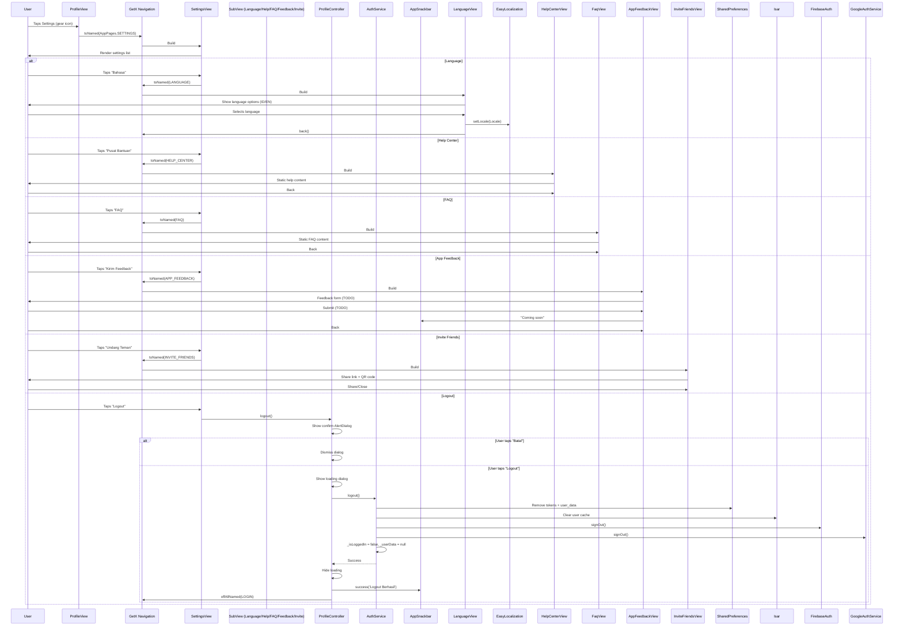

# User Flow: Profile - Settings & Sub-Pages

## Overview
Settings page and all sub-pages accessible from profile tab: Language, Help Center, FAQ, App Feedback, Invite Friends, Logout.

## Entry Points
- ProfileView (Tab 0): Settings button → `/settings`
- SettingsView: Various sub-menu items
- Routes: `SETTINGS`, `LANGUAGE`, `HELP_CENTER`, `FAQ`, `APP_FEEDBACK`, `INVITE_FRIENDS`

## Components
- **Controller**: `ProfileController` (shared for auth state)
- **Views**: `SettingsView`, `LanguageView`, `HelpCenterView`, `FaqView`, `AppFeedbackView`, `InviteFriendsView`
- **Service**: `AuthService` (for logout)
- **Routes**: Defined in `AppPages`

## Activity Diagram: Settings Flow

```mermaid
flowchart TD
    A[ProfileView: Tab 0] --> B[Taps Settings Icon]
    B --> C[Get.toNamed SETTINGS]
    C --> D[SettingsView Renders]
    D --> E[User Selects Option]
    E --> F{Option}
    F -->|Language| G[/language LanguageView]
    F -->|Help Center| H[/help-center HelpCenterView]
    F -->|FAQ| I[/faq FaqView]
    F -->|App Feedback| J[/app-feedback AppFeedbackView]
    F -->|Invite Friends| K[/invite-friends InviteFriendsView]
    F -->|Logout| L[ProfileController.logout]
    L --> M[Confirm Dialog]
    M --> N{Confirm?}
    N -->|Yes| O[AuthService.logout]
    O --> P[Clear Tokens + Cache]
    P --> Q[Get.offAllNamed LOGIN]
    N -->|No| D
```

## Sequence Diagram: Settings & Sub-Pages



## Language Selection

```dart
// LanguageView uses EasyLocalization
// lib/app/modules/profile/views/language_view.dart

class LanguageView extends StatelessWidget {
  @override
  Widget build(BuildContext context) {
    return Scaffold(
      appBar: AppBar(title: Text('Bahasa')),
      body: ListView(
        children: [
          ListTile(
            title: Text('Indonesia'),
            trailing: context.locale == Locale('id') ? Icon(Icons.check) : null,
            onTap: () => context.setLocale(Locale('id')),
          ),
          ListTile(
            title: Text('English'),
            trailing: context.locale == Locale('en') ? Icon(Icons.check) : null,
            onTap: () => context.setLocale(Locale('en')),
          ),
        ],
      ),
    );
  }
}
```

## Invite Friends / Share Profile

```dart
// InviteFriendsView features
// lib/app/modules/profile/views/invite_friends_view.dart

class InviteFriendsView extends StatelessWidget {
  // Generates shareable link with user ID
  // Shows QR code using qr_flutter
  // Uses share_plus for native sharing
  
  String get inviteLink => 'https://snappie.app/user/${userId}';
  
  Widget buildQrCode() => QrImageView(
    data: inviteLink,
    size: 200,
  );
  
  void share() => Share.share(
    'Join me on Snappie! $inviteLink',
    subject: 'Snappie Invitation',
  );
}
```

## Route Definitions

```dart
// lib/app/routes/app_pages.dart
static const SETTINGS = '/settings';
static const LANGUAGE = '/language';
static const HELP_CENTER = '/help-center';
static const FAQ = '/faq';
static const APP_FEEDBACK = '/app-feedback';
static const INVITE_FRIENDS = '/invite-friends';

GetPage(name: SETTINGS, page: () => SettingsView());
GetPage(name: LANGUAGE, page: () => LanguageView());
GetPage(name: HELP_CENTER, page: () => HelpCenterView());
GetPage(name: FAQ, page: () => FaqView());
GetPage(name: APP_FEEDBACK, page: () => AppFeedbackView());
GetPage(name: INVITE_FRIENDS, page: () => InviteFriendsView());
```

## Navigation Flow

```
┌──────────────────┐
│ ProfileView      │
│ Settings Button  │
└────────┬─────────┘
         │
         ▼
┌──────────────────┐
│ /settings        │
│ SettingsView     │
│ Menu List        │
└────────┬─────────┘
         │
    ┌────┼────┬────┐
    ▼    ▼    ▼    ▼
Language Help FAQ Feedback Invite Logout
    │    │    │    │      │     │
    ▼    ▼    ▼    ▼      ▼     ▼
 /lang /help /faq /feed /invite /login
```

## Edge Cases

| Scenario | Handling |
|----------|----------|
| Logout during loading | Loading dialog blocks interaction |
| Network error on logout | Error snackbar, stay on settings |
| Language change | Immediate via EasyLocalization |
| Share fails | Fallback to clipboard |
| QR generation fails | Show link only |

## Testing Checklist

- [ ] Settings accessible from profile
- [ ] Language: ID/EN switch works
- [ ] Help Center: Static content renders
- [ ] FAQ: Static content renders
- [ ] App Feedback: Form UI (TODO)
- [ ] Invite Friends: Link + QR + Share
- [ ] Logout: Confirm dialog shows
- [ ] Logout: Success → login screen
- [ ] Logout: Cancel → stays on settings
- [ ] Logout: Clears all auth data
- [ ] Back navigation works from all sub-pages

## Related Files

- `lib/app/modules/profile/views/settings_view.dart`
- `lib/app/modules/profile/views/language_view.dart`
- `lib/app/modules/profile/views/help_center_view.dart`
- `lib/app/modules/profile/views/faq_view.dart`
- `lib/app/modules/profile/views/app_feedback_view.dart`
- `lib/app/modules/profile/views/invite_friends_view.dart`
- `lib/app/modules/profile/controllers/profile_controller.dart` (logout method)
- `lib/app/core/services/auth_service.dart` (logout)
- `lib/app/routes/app_pages.dart`