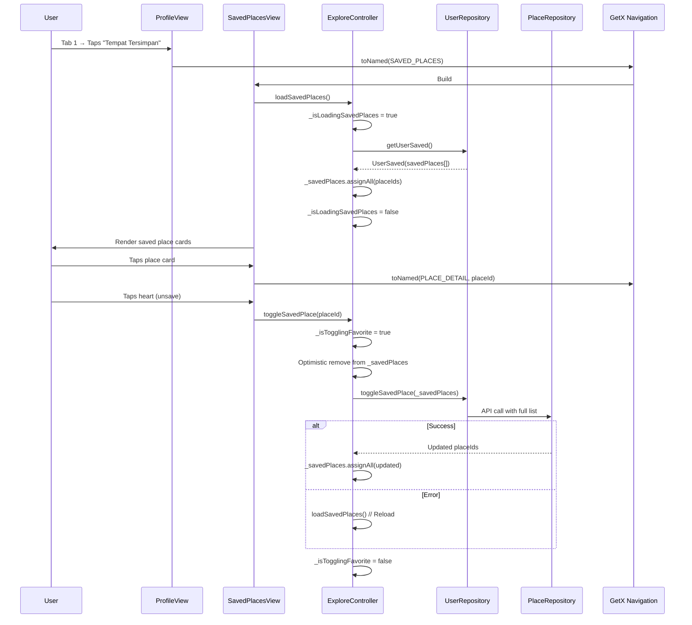
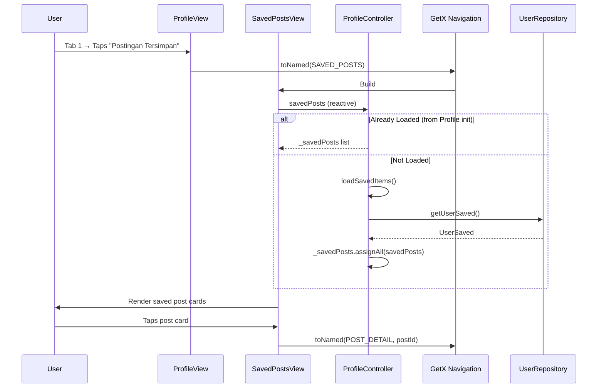
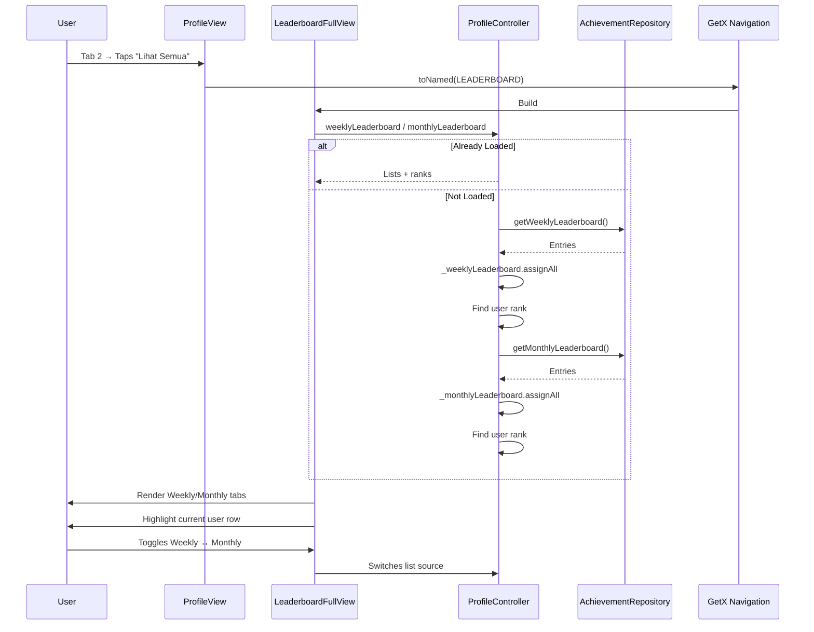

# User Flow: Profile - Saved Items, Leaderboard, Achievements & Challenges

## Overview
Full-screen views for saved places, saved posts, leaderboards, achievements, and challenges accessible from profile sub-tabs.

## Entry Points
- ProfileView Tab 1 (Tersimpan): Saved Places / Saved Posts
- ProfileView Tab 2 (Peringkat): Leaderboard Full View
- ProfileView Tab 3 (Pencapaian): Achievements / Challenges
- Routes: `SAVED_PLACES`, `SAVED_POSTS`, `LEADERBOARD`, `ACHIEVEMENTS`, `CHALLENGES`

## Components
- **Controller**: `ProfileController` (shared) + `ExploreController` (for saved places)
- **Views**: `SavedPlacesView`, `SavedPostsView`, `LeaderboardFullView`, `UserAchievementView`, `UserChallengesView`
- **Repositories**: `UserRepository`, `AchievementRepository`, `PlaceRepository`

---

## 1. Saved Places (`/saved-places`)

### Activity Diagram

```mermaid
flowchart TD
    A[ProfileView: Tersimpan Tab] --> B[Taps "Tempat Tersimpan"]
    B --> C[Get.toNamed SAVED_PLACES]
    C --> D[SavedPlacesView Builds]
    D --> E[ExploreController.loadSavedPlaces]
    E --> F[UserRepository.getUserSaved]
    F --> G[Extract place IDs]
    G --> H[_savedPlaces.assignAll]
    H --> I[Render Place Cards]
    I --> J[User Taps Place]
    J --> K[Navigate to PlaceDetail]
    I --> L[User Taps Heart Icon]
    L --> M[ExploreController.toggleSavedPlace]
    M --> N{API Success?}
    N -->|Yes| O[_savedPlaces Sync]
    N -->|No| P[Revert + Reload]
```

### Sequence Diagram



---

## 2. Saved Posts (`/saved-posts`)

### Activity Diagram

```mermaid
flowchart TD
    A[ProfileView: Tersimpan Tab] --> B[Taps "Postingan Tersimpan"]
    B --> C[Get.toNamed SAVED_POSTS]
    C --> D[SavedPostsView Builds]
    D --> E[ProfileController.savedPosts]
    E --> F{Already Loaded?}
    F -->|Yes| G[Render]
    F -->|No| H[loadSavedItems in init]
    H --> I[UserRepository.getUserSaved]
    I --> J[_savedPosts.assignAll]
    J --> G
    G --> K[User Taps Post]
    K --> L[Navigate to PostDetail]
```

### Sequence Diagram



---

## 3. Leaderboard Full View (`/leaderboard`)

### Activity Diagram

```mermaid
flowchart TD
    A[ProfileView: Peringkat Tab] --> B[Taps "Lihat Semua"]
    B --> C[Get.toNamed LEADERBOARD]
    C --> D[LeaderboardFullView Builds]
    D --> E[ProfileController.weekly/monthlyLeaderboard]
    E --> F{Data Loaded?}
    F -->|Yes| G[Render Tabs]
    F -->|No| H[loadLeaderboard in init]
    H --> I[AchievementRepository.getWeekly/Monthly]
    I --> J[_weeklyLeaderboard + _monthlyLeaderboard]
    J --> K[Calculate user ranks]
    K --> G
    G --> L[User Toggles Weekly/Monthly]
    L --> M[Switch Leaderboard]
```

### Sequence Diagram



---

## 4. Achievements (`/achievements`)

### Activity Diagram

```mermaid
flowchart TD
    A[ProfileView: Pencapaian Tab] --> B[Taps "Lihat Semua Pencapaian"]
    B --> C[Get.toNamed ACHIEVEMENTS]
    C --> D[UserAchievementView Builds]
    D --> E[ProfileController.userAchievements]
    E --> F{Loaded?}
    F -->|Yes| G[Render Grid]
    F -->|No| H[loadUserAchievements in init]
    H --> I[AchievementRepository.getUserAchievements]
    I --> J[_userAchievements.assignAll]
    J --> G
    G --> K[User Taps Achievement]
    K --> L[Show Detail Modal - TODO]
```

---

## 5. Challenges (`/challenges`)

### Activity Diagram

```mermaid
flowchart TD
    A[ProfileView: Pencapaian Tab] --> B[Sees Challenge Badge]
    B --> C[Taps "Tantangan"]
    C --> D[Get.toNamed CHALLENGES]
    D --> E[UserChallengesView Builds]
    E --> F[ProfileController.completedChallengesCount]
    F --> G[Badge Shows Count]
    G --> H[Taps to View]
    H --> I[ProfileController.resetCompletedChallengesBadge]
    I --> J[ProfileController.loadChallenges]
    J --> K[AchievementRepository.getChallenges]
    K --> L[Render Challenge List]
```

### Badge Logic

```dart
// ProfileController (lines 82-84, 370-396)
final _completedChallengesCount = 0.obs;
int get completedChallengesCount => _completedChallengesCount.value;

void incrementCompletedChallenges(int count) {
  _completedChallengesCount.value += count;
}

void resetCompletedChallengesBadge() {
  _completedChallengesCount.value = 0;
}

Future<void> loadChallenges() async {
  final userId = _userData.value?.id;
  if (userId == null) return;
  await achievementRepository.getChallenges(userId);
}
```

---

## Navigation Flow Summary

```
┌──────────────────┐
│ ProfileView      │
│ 4 Sub-Tabs       │
└────────┬─────────┘
         │
    ┌────┼────┬────┐
    ▼    ▼    ▼    ▼
Tab 1  Tab 2  Tab 3  Tab 3
Tersimpan Peringkat Pencapaian
    │      │       │
    ▼      ▼       ▼
┌──────┐ ┌──────┐ ┌──────────┐
│Places│ │Posts │ │Weekly/   │
│/saved│ │/saved│ │Monthly   │
│places│ │posts │ │/leaderb  │
└──────┘ └──────┘ └──────────┘
                    │
                    ▼
             ┌──────────┐
             │Achievemts│
             │/achieve  │
             └──────────┘
                    │
                    ▼
             ┌──────────┐
             │Challenges│
             │/challenge│
             └──────────┘
```

## Route Definitions

```dart
// lib/app/routes/app_pages.dart
static const SAVED_PLACES = '/saved-places';
static const SAVED_POSTS = '/saved-posts';
static const LEADERBOARD = '/leaderboard';
static const ACHIEVEMENTS = '/achievements';
static const CHALLENGES = '/challenges';

GetPage(name: SAVED_PLACES, page: () => SavedPlacesView());
GetPage(name: SAVED_POSTS, page: () => SavedPostsView());
GetPage(name: LEADERBOARD, page: () => LeaderboardFullView());
GetPage(name: ACHIEVEMENTS, page: () => UserAchievementView());
GetPage(name: CHALLENGES, page: () => UserChallengesView());
```

## Edge Cases

| View | Scenario | Handling |
|------|----------|----------|
| Saved Places | Empty | Empty state widget |
| Saved Places | Toggle unsave | Optimistic + API sync |
| Saved Posts | Empty | Empty state widget |
| Leaderboard | No data | Empty state |
| Leaderboard | User not in top | Rank = null |
| Achievements | None unlocked | Empty state + encouragement |
| Challenges | None completed | Badge = 0, list empty |

## Testing Checklist

- [ ] Saved Places: Loads from API
- [ ] Saved Places: Unsave works (optimistic + sync)
- [ ] Saved Places: Tap → PlaceDetail
- [ ] Saved Posts: Loads from ProfileController
- [ ] Saved Posts: Tap → PostDetail
- [ ] Leaderboard: Weekly/Monthly toggle
- [ ] Leaderboard: User rank highlighted
- [ ] Achievements: Grid renders
- [ ] Challenges: Badge count shows
- [ ] Challenges: Badge resets on view
- [ ] All: Pull-to-refresh works
- [ ] All: Back navigation works

## Related Files

- `lib/app/modules/profile/views/saved_places_view.dart`
- `lib/app/modules/profile/views/saved_posts_view.dart`
- `lib/app/modules/profile/views/leaderboard_full_view.dart`
- `lib/app/modules/profile/views/user_achievement_view.dart`
- `lib/app/modules/profile/views/user_challenge_view.dart`
- `lib/app/modules/profile/controllers/profile_controller.dart`
- `lib/app/modules/explore/controllers/explore_controller.dart` (saved places)
- `lib/app/data/repositories/user_repository_impl.dart`
- `lib/app/data/repositories/achievement_repository_impl.dart`
- `lib/app/routes/app_pages.dart`