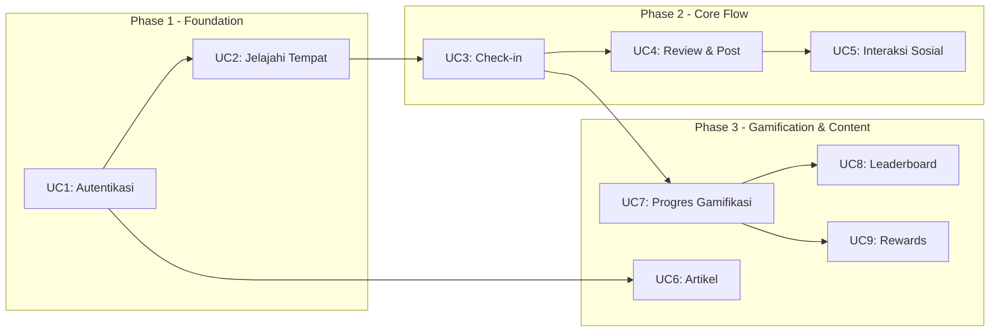
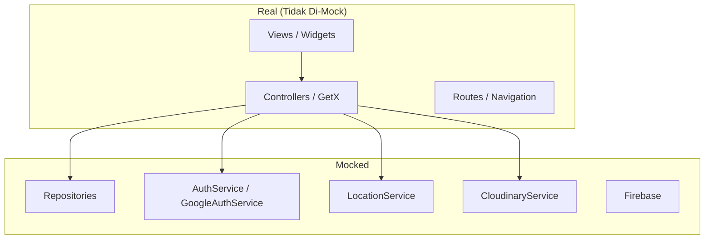

# 🧪 Patrol Integration Testing Plan — Snappie App

> **Berdasarkan**: [USE_CASES.md](file:///d:/Code/snappie/snappie_app%20(test)/docs/USE_CASES.md)  
> **Framework**: [Patrol](https://patrol.leancode.co) (E2E UI Testing for Flutter)  
> **Tanggal**: 2026-04-08

---

## Daftar Isi

1. [Overview & Tujuan](#1-overview--tujuan)
2. [Project Setup](#2-project-setup)
3. [Struktur Direktori](#3-struktur-direktori)
4. [Strategi Mocking & Test App Initialization](#4-strategi-mocking--test-app-initialization)
5. [Test Scenarios per Use Case](#5-test-scenarios-per-use-case)
6. [Prioritas Implementasi](#6-prioritas-implementasi)
7. [Fase Implementasi](#7-fase-implementasi)

---

## 1. Overview & Tujuan

### Mengapa Patrol?

| Aspek | `integration_test` (bawaan) | `patrol` |
|---|---|---|
| Flutter widget interaction | ✅ | ✅ |
| Native UI interaction (permission dialogs, notifications) | ❌ | ✅ |
| Google Sign-In popup handling | ❌ | ✅ |
| Camera/Gallery native picker | ❌ | ✅ |
| Custom finders (concise syntax) | ❌ | ✅ |
| Parallel test execution | ❌ | ✅ |

### Tujuan Testing

- **Validasi end-to-end flow** untuk setiap use case utama
- **Regresi otomatis** untuk fitur kritis (auth, check-in, gamifikasi)
- **Menangani interaksi native** (Google Sign-In, kamera, lokasi permission)
- **CI/CD-ready** untuk automated testing pipeline

### Scope

Mengcover **9 use case** dari dokumen USE_CASES.md:



---

## 2. Project Setup

### 2.1 Install Dependencies

```yaml
# pubspec.yaml - tambahkan di dev_dependencies
dev_dependencies:
  flutter_test:
    sdk: flutter
  patrol: ^3.13.0
  mockito: ^5.4.4
  # ... existing dev_dependencies
```

### 2.2 Konfigurasi Patrol di `pubspec.yaml`

```yaml
# Tambahkan section patrol di root pubspec.yaml
patrol:
  app_name: Snappie App
  test_directory: patrol_test
  android:
    package_name: com.justtffy.snappie_app
```

### 2.3 Install Patrol CLI

```bash
# Install patrol CLI secara global
flutter pub global activate patrol_cli

# Verifikasi instalasi
patrol doctor
```

### 2.4 Update `.gitignore`

```gitignore
# Patrol generated files
patrol_test/test_bundle.dart
```

### 2.5 Update Android `build.gradle.kts`

Tambahkan `testInstrumentationRunner` di `android/app/build.gradle.kts`:

```diff
 defaultConfig {
     applicationId = "com.justtffy.snappie_app"
     minSdk = flutter.minSdkVersion
     targetSdk = 36
     versionCode = flutter.versionCode
     versionName = flutter.versionName
+    testInstrumentationRunner = "pl.leancode.patrol.PatrolJUnitRunner"
 }
```

---

## 3. Struktur Direktori

```
patrol_test/
├── common/
│   ├── test_app.dart              # App initializer (pengganti main.dart)
│   ├── test_constants.dart        # Konstanta test (dummy data, timeouts)
│   └── test_helpers.dart          # Utility functions (login helper, dll)
├── mocks/
│   ├── mock_auth_service.dart     # Mock AuthService & GoogleAuthService
│   ├── mock_repositories.dart     # Mock semua repositories
│   ├── mock_services.dart         # Mock LocationService, CloudinaryService
│   └── mock_data.dart             # Factory untuk dummy models
├── scenarios/
│   ├── auth/
│   │   ├── login_test.dart             # UC1: Login flow
│   │   ├── registration_test.dart      # UC1: Registration flow
│   │   └── onboarding_test.dart        # UC1: Onboarding flow
│   ├── explore/
│   │   ├── browse_places_test.dart     # UC2: Browse & filter places
│   │   ├── search_places_test.dart     # UC2: Search dengan debounce
│   │   ├── place_detail_test.dart      # UC2: Place detail view
│   │   └── save_place_test.dart        # UC2: Toggle favorite
│   ├── checkin/
│   │   ├── photo_capture_test.dart     # UC3: Camera & photo flow
│   │   └── checkin_submit_test.dart    # UC3: Submit check-in + reward
│   ├── review_post/
│   │   ├── submit_review_test.dart     # UC4: Review flow
│   │   └── create_post_test.dart       # UC4: Create post flow
│   ├── social/
│   │   ├── like_post_test.dart         # UC5: Like post (optimistic)
│   │   └── save_post_test.dart         # UC5: Save post (optimistic)
│   ├── articles/
│   │   ├── browse_articles_test.dart   # UC6: Browse & search articles
│   │   └── article_detail_test.dart    # UC6: Article detail & bookmark
│   ├── gamification/
│   │   ├── achievements_test.dart      # UC7: View achievements
│   │   ├── challenges_test.dart        # UC7: View & claim challenges
│   │   └── coins_history_test.dart     # UC7: Coins & transaction history
│   ├── leaderboard/
│   │   └── leaderboard_test.dart       # UC8: Weekly & monthly leaderboard
│   └── rewards/
│       └── redeem_reward_test.dart     # UC9: View & use rewards
└── flows/
    ├── full_mission_flow_test.dart     # E2E: Explore → Check-in → Review → Reward
    └── new_user_flow_test.dart         # E2E: Onboarding → Register → Explore
```

---

## 4. Strategi Mocking & Test App Initialization

### 4.1 Pendekatan Mock

Karena Patrol menjalankan test di **real device/emulator**, kita menggunakan strategi **mock di layer repository** sehingga:
- ✅ UI, routing, dan controller logic tetap berjalan asli
- ✅ Tidak ada network call ke backend sesungguhnya
- ✅ Behavior bisa dikontrol (success/error scenarios)
- ✅ Native interactions (camera, location) di-mock via service layer



### 4.2 Test App Initializer

> [!IMPORTANT]
> Patrol **TIDAK** boleh memanggil `WidgetsFlutterBinding.ensureInitialized()` atau `runApp()`.
> Gunakan `$.pumpWidgetAndSettle()` sebagai gantinya.

```dart
// patrol_test/common/test_app.dart

import 'package:flutter/material.dart';
import 'package:get/get.dart';
import 'package:flutter_screenutil/flutter_screenutil.dart';
import 'package:patrol/patrol.dart';
import 'package:snappie_app/app/routes/app_pages.dart';
import 'package:snappie_app/app/core/constants/app_theme.dart';
import 'package:snappie_app/app/core/helpers/app_snackbar.dart';

// Import mocks
import '../mocks/mock_auth_service.dart';
import '../mocks/mock_repositories.dart';
import '../mocks/mock_services.dart';

/// Inisialisasi app untuk testing tanpa Firebase, tanpa network calls.
/// Semua dependencies di-mock via GetX DI.
Future<void> initTestApp({
  required PatrolTester $,
  String initialRoute = AppPages.MAIN,
  bool isLoggedIn = true,
}) async {
  // Reset GetX
  Get.reset();

  // Register mock core services
  registerMockCoreServices(isLoggedIn: isLoggedIn);

  // Register mock repositories
  registerMockRepositories();

  // Pump the app widget
  await $.pumpWidgetAndSettle(
    ScreenUtilInit(
      designSize: const Size(375, 812),
      minTextAdapt: true,
      builder: (context, child) {
        return GetMaterialApp(
          title: "Snappie App Test",
          initialRoute: initialRoute,
          getPages: AppPages.routes,
          scaffoldMessengerKey: AppSnackbar.messengerKey,
          unknownRoute: GetPage(
            name: '/not-found',
            page: () => const SizedBox.shrink(),
          ),
          debugShowCheckedModeBanner: false,
          theme: AppTheme.lightTheme,
          themeMode: ThemeMode.light,
        );
      },
    ),
  );
}
```

### 4.3 Mock Registration

```dart
// patrol_test/mocks/mock_services.dart

import 'package:get/get.dart';
import 'package:snappie_app/app/core/services/auth_service.dart';
import 'package:snappie_app/app/core/services/google_auth_service.dart';
import 'package:snappie_app/app/core/services/location_service.dart';
import 'package:snappie_app/app/core/services/cloudinary_service.dart';
import 'package:snappie_app/app/core/services/onboarding_service.dart';
import 'package:snappie_app/app/core/network/network_info.dart';

// Reusable mock registration
void registerMockCoreServices({bool isLoggedIn = true}) {
  // Mock NetworkInfo — selalu online
  Get.put<NetworkInfo>(MockNetworkInfo(), permanent: true);

  // Mock AuthService — sesuai skenario logged in atau tidak
  Get.put<AuthService>(
    MockAuthService(isLoggedIn: isLoggedIn),
    permanent: true,
  );

  // Mock GoogleAuthService — no real Google popup
  Get.put<GoogleAuthService>(MockGoogleAuthService(), permanent: true);

  // Mock LocationService — return fixed coordinates
  Get.put<LocationService>(MockLocationService(), permanent: true);

  // Mock CloudinaryService — return fake URL
  Get.put<CloudinaryService>(MockCloudinaryService(), permanent: true);

  // Mock OnboardingService
  Get.put<OnboardingService>(MockOnboardingService(), permanent: true);
}
```

### 4.4 Mock Data Factory

```dart
// patrol_test/mocks/mock_data.dart

import 'package:snappie_app/app/data/models/user_model.dart';
import 'package:snappie_app/app/data/models/place_model.dart';
import 'package:snappie_app/app/data/models/post_model.dart';
// ... other model imports

class MockData {
  static UserModel get testUser => UserModel(
    id: 1,
    name: 'Test User',
    username: 'testuser',
    email: 'test@snappie.com',
    // ... fill with test data
  );

  static List<PlaceModel> get testPlaces => [
    PlaceModel(
      id: 1,
      name: 'Warung Hidden Gem',
      category: 'Indonesian',
      rating: 4.5,
      // ... fill with test data
    ),
    PlaceModel(
      id: 2,
      name: 'Kedai Rahasia',
      category: 'Coffee',
      rating: 4.8,
      // ... fill with test data
    ),
  ];

  static List<PostModel> get testPosts => [
    PostModel(
      id: 1,
      content: 'Tempat ini amazing!',
      // ... fill with test data
    ),
  ];

  // ... factory methods untuk model lain
}
```

---

## 5. Test Scenarios per Use Case

### UC1: Autentikasi Pengguna (Login dan Registrasi)

| # | Test Scenario | Prioritas | Tipe |
|---|---|---|---|
| 1.1 | Onboarding swipe & skip → tampil halaman login | 🔴 High | Happy path |
| 1.2 | Login dengan Google → sukses → redirect ke `/main/` | 🔴 High | Happy path |
| 1.3 | Login user baru → redirect ke `/register/` | 🔴 High | Happy path |
| 1.4 | Registrasi: isi form profil + food types (≥3) + place values (≥3) → sukses | 🔴 High | Happy path |
| 1.5 | Registrasi: validasi gagal (food types < 3) → tampil error | 🟡 Medium | Error path |
| 1.6 | Login cancelled oleh user → tampil info dibatalkan | 🟡 Medium | Error path |
| 1.7 | Login error: `hasActiveSession` → tampil pesan sesi aktif | 🟢 Low | Error path |
| 1.8 | Auto-login jika session token masih valid | 🔴 High | Happy path |

**Contoh Test Code:**

```dart
// patrol_test/scenarios/auth/login_test.dart
import 'package:patrol/patrol.dart';
import '../../common/test_app.dart';

void main() {
  patrolTest(
    'UC1.1 - Onboarding swipe lalu skip menampilkan halaman login',
    ($) async {
      await initTestApp($, initialRoute: '/onboarding', isLoggedIn: false);

      // Verify onboarding page 1 visible
      expect($('Temukan Hidden Gems'), findsOneWidget);

      // Swipe to page 2
      await $(#onboardingPageView).scrollTo(find.text('Kumpulkan Reward'));

      // Tap skip
      await $('Skip').tap();

      // Verify login page
      expect($('Masuk dengan Google'), findsOneWidget);
    },
  );

  patrolTest(
    'UC1.2 - Login Google sukses redirect ke main',
    ($) async {
      await initTestApp($, initialRoute: '/login', isLoggedIn: false);

      // Tap login button
      await $('Masuk dengan Google').tap();

      // MockGoogleAuthService returns success
      // Verify redirected to main
      await $.pumpAndSettle();
      expect($(#mainLayout), findsOneWidget);
    },
  );

  patrolTest(
    'UC1.8 - Auto-login jika token valid',
    ($) async {
      // isLoggedIn: true → AuthService sudah punya token
      await initTestApp($, isLoggedIn: true);

      // Should go directly to main
      expect($(#mainLayout), findsOneWidget);
    },
  );
}
```

**File Reference:**
- [auth_controller.dart](file:///d:/Code/snappie/snappie_app%20(test)/lib/app/modules/auth/controllers/auth_controller.dart)
- [onboarding_controller.dart](file:///d:/Code/snappie/snappie_app%20(test)/lib/app/modules/auth/controllers/onboarding_controller.dart)

---

### UC2: Menelusuri Tempat Kuliner Hidden Gems

| # | Test Scenario | Prioritas | Tipe |
|---|---|---|---|
| 2.1 | Buka tab Jelajahi → load daftar tempat | 🔴 High | Happy path |
| 2.2 | Search tempat dengan keyword → results terfilter (debounce 300ms) | 🔴 High | Happy path |
| 2.3 | Filter berdasarkan kategori → results sesuai | 🟡 Medium | Happy path |
| 2.4 | Toggle food type filter → results update | 🟡 Medium | Happy path |
| 2.5 | Clear all filters → tampilkan semua tempat | 🟡 Medium | Happy path |
| 2.6 | Tap place card → navigate ke detail tempat | 🔴 High | Happy path |
| 2.7 | Di detail: toggle favorite/save → icon berubah | 🟡 Medium | Happy path |
| 2.8 | Di detail: lihat reviews → navigate ke reviews page | 🟢 Low | Happy path |

**Contoh Test Code:**

```dart
// patrol_test/scenarios/explore/browse_places_test.dart
import 'package:patrol/patrol.dart';
import '../../common/test_app.dart';

void main() {
  patrolTest(
    'UC2.1 - Buka tab Jelajahi menampilkan daftar tempat',
    ($) async {
      await initTestApp($);

      // Navigate to Explore tab
      await $(#bottomNavExplore).tap();

      // Verify places are loaded
      await $.pumpAndSettle();
      expect($('Warung Hidden Gem'), findsOneWidget);
      expect($('Kedai Rahasia'), findsOneWidget);
    },
  );

  patrolTest(
    'UC2.2 - Search tempat dengan keyword',
    ($) async {
      await initTestApp($);
      await $(#bottomNavExplore).tap();

      // Type in search
      await $(#searchInput).enterText('Warung');

      // Wait for debounce
      await $.pump(const Duration(milliseconds: 400));
      await $.pumpAndSettle();

      // Should filter results
      expect($('Warung Hidden Gem'), findsOneWidget);
      expect($('Kedai Rahasia'), findsNothing);
    },
  );

  patrolTest(
    'UC2.6 - Tap place card navigasi ke detail',
    ($) async {
      await initTestApp($);
      await $(#bottomNavExplore).tap();
      await $.pumpAndSettle();

      // Tap on place card
      await $('Warung Hidden Gem').tap();
      await $.pumpAndSettle();

      // Verify detail page
      expect($(#placeDetailView), findsOneWidget);
    },
  );
}
```

**File Reference:**
- [explore_controller.dart](file:///d:/Code/snappie/snappie_app%20(test)/lib/app/modules/explore/controllers/explore_controller.dart)
- [explore_view.dart](file:///d:/Code/snappie/snappie_app%20(test)/lib/app/modules/explore/views/explore_view.dart)

---

### UC3: Melakukan Check-in Tempat

| # | Test Scenario | Prioritas | Tipe |
|---|---|---|---|
| 3.1 | Dari detail tempat → tap "Mulai Misi" → buka kamera | 🔴 High | Happy path |
| 3.2 | Ambil foto → preview → konfirmasi | 🔴 High | Happy path |
| 3.3 | Submit check-in sukses → modal reward XP & koin | 🔴 High | Happy path |
| 3.4 | Submit check-in gagal (lokasi invalid) → modal error | 🟡 Medium | Error path |
| 3.5 | Dari modal sukses → "Lanjut Review" → navigate ke review | 🟡 Medium | Happy path |
| 3.6 | Dari modal sukses → "Kembali" → navigate ke detail | 🟡 Medium | Happy path |
| 3.7 | Retake foto → kembali ke kamera | 🟢 Low | Happy path |

> [!NOTE]
> UC3 memerlukan mock **kamera** dan **lokasi** karena menggunakan hardware native.
> `MockLocationService` mengembalikan koordinat fixed yang valid.
> Camera interaction di-mock pada level `MissionController` untuk bypass native camera.

**Contoh Test Code:**

```dart
// patrol_test/scenarios/checkin/checkin_submit_test.dart
import 'package:patrol/patrol.dart';
import '../../common/test_app.dart';

void main() {
  patrolTest(
    'UC3.3 - Check-in sukses menampilkan modal reward',
    ($) async {
      await initTestApp($);

      // Navigate: Explore → Place Detail → Mission
      await $(#bottomNavExplore).tap();
      await $.pumpAndSettle();
      await $('Warung Hidden Gem').tap();
      await $.pumpAndSettle();

      // Tap "Mulai Misi" CTA
      await $('Mulai Misi').tap();
      await $.pumpAndSettle();

      // Mock kamera sudah set captured image
      // Verify preview screen
      expect($(#missionPhotoPreview), findsOneWidget);

      // Confirm photo
      await $('Konfirmasi').tap();
      await $.pumpAndSettle();

      // Verify success modal with reward
      expect($('Check-in Berhasil'), findsOneWidget);
      expect($('XP'), findsOneWidget);
      expect($('Koin'), findsOneWidget);
    },
  );
}
```

**File Reference:**
- [mission_controller.dart](file:///d:/Code/snappie/snappie_app%20(test)/lib/app/modules/mission/controllers/mission_controller.dart)
- [mission_photo_view.dart](file:///d:/Code/snappie/snappie_app%20(test)/lib/app/modules/mission/views/mission_photo_view.dart)

---

### UC4: Berbagi Pengalaman (Review & Post)

| # | Test Scenario | Prioritas | Tipe |
|---|---|---|---|
| 4.1 | Submit review: rating + konten + food types + place values → sukses | 🔴 High | Happy path |
| 4.2 | Submit review: validasi gagal (rating kosong) → error | 🟡 Medium | Error path |
| 4.3 | Submit review sukses → optional feedback form | 🟢 Low | Happy path |
| 4.4 | Create post: pilih tempat + caption + foto → sukses | 🔴 High | Happy path |
| 4.5 | Create post: validasi gagal (tanpa foto) → error | 🟡 Medium | Error path |
| 4.6 | Create post sukses → redirect ke feed & post muncul | 🟡 Medium | Happy path |

**Contoh Test Code:**

```dart
// patrol_test/scenarios/review_post/submit_review_test.dart
import 'package:patrol/patrol.dart';
import '../../common/test_app.dart';

void main() {
  patrolTest(
    'UC4.1 - Submit review dengan rating dan konten berhasil',
    ($) async {
      await initTestApp($, initialRoute: '/mission-review');

      // Set rating 4 stars
      await $(#ratingStar4).tap();

      // Write review content
      await $(#reviewContentInput).enterText('Makanannya enak banget!');

      // Select food types (minimal interaction)
      await $(#foodTypeChip).at(0).tap();

      // Select place values
      await $(#placeValueChip).at(0).tap();

      // Submit
      await $('Submit Review').tap();
      await $.pumpAndSettle();

      // Verify success
      expect($('Review Berhasil'), findsOneWidget);
    },
  );
}
```

**File Reference:**
- [mission_controller.dart](file:///d:/Code/snappie/snappie_app%20(test)/lib/app/modules/mission/controllers/mission_controller.dart)
- [mission_review_view.dart](file:///d:/Code/snappie/snappie_app%20(test)/lib/app/modules/mission/views/mission_review_view.dart)
- [create_post_view.dart](file:///d:/Code/snappie/snappie_app%20(test)/lib/app/modules/home/views/create_post_view.dart)

---

### UC5: Berinteraksi dengan Postingan (Like, Save)

| # | Test Scenario | Prioritas | Tipe |
|---|---|---|---|
| 5.1 | Like post → icon berubah + count bertambah (optimistic) | 🔴 High | Happy path |
| 5.2 | Unlike post → icon kembali + count berkurang | 🟡 Medium | Happy path |
| 5.3 | Save post → bookmark icon berubah | 🟡 Medium | Happy path |
| 5.4 | Like post gagal → revert ke state sebelumnya | 🟡 Medium | Error path |
| 5.5 | Comment → snackbar "Coming Soon" | 🟢 Low | Happy path |
| 5.6 | Buka detail post → tampil full post card | 🟡 Medium | Happy path |

**Contoh Test Code:**

```dart
// patrol_test/scenarios/social/like_post_test.dart
import 'package:patrol/patrol.dart';
import '../../common/test_app.dart';

void main() {
  patrolTest(
    'UC5.1 - Like post: icon berubah dan count bertambah',
    ($) async {
      await initTestApp($);

      // Home tab is default, should show feed
      await $.pumpAndSettle();

      // Verify initial like count
      final initialLikes = $(#likeCount).text;

      // Tap like button
      await $(#likeButton).first.tap();
      await $.pumpAndSettle();

      // Verify optimistic update: icon changed & count increased
      expect($(#likeButtonActive), findsOneWidget);
    },
  );
}
```

**File Reference:**
- [home_controller.dart](file:///d:/Code/snappie/snappie_app%20(test)/lib/app/modules/home/controllers/home_controller.dart)
- [post_card.dart](file:///d:/Code/snappie/snappie_app%20(test)/lib/app/modules/shared/widgets/_card_widgets/post_card.dart)

---

### UC6: Melihat Artikel Kuliner

| # | Test Scenario | Prioritas | Tipe |
|---|---|---|---|
| 6.1 | Buka tab Artikel → load daftar artikel | 🟡 Medium | Happy path |
| 6.2 | Search artikel dengan keyword (debounce) | 🟡 Medium | Happy path |
| 6.3 | Filter berdasarkan kategori | 🟢 Low | Happy path |
| 6.4 | Tap artikel → navigasi ke detail | 🟡 Medium | Happy path |
| 6.5 | Bookmark artikel → snackbar konfirmasi | 🟢 Low | Happy path |
| 6.6 | Pull to refresh → data ter-update | 🟢 Low | Happy path |

**File Reference:**
- [articles_controller.dart](file:///d:/Code/snappie/snappie_app%20(test)/lib/app/modules/articles/controllers/articles_controller.dart)
- [articles_view.dart](file:///d:/Code/snappie/snappie_app%20(test)/lib/app/modules/articles/views/articles_view.dart)

---

### UC7: Mengelola Progres Gamifikasi

| # | Test Scenario | Prioritas | Tipe |
|---|---|---|---|
| 7.1 | Buka tab Akun → tampil ringkasan gamifikasi (XP, level, koin) | 🔴 High | Happy path |
| 7.2 | Navigate ke Achievements → tampil daftar achievement | 🟡 Medium | Happy path |
| 7.3 | Achievement locked vs unlocked visual berbeda | 🟡 Medium | Happy path |
| 7.4 | Navigate ke Challenges → tampil daftar challenge | 🟡 Medium | Happy path |
| 7.5 | Challenge selesai → claim reward → XP/koin bertambah | 🟡 Medium | Happy path |
| 7.6 | Navigate ke Coins History → tab Kupon & Riwayat | 🟡 Medium | Happy path |
| 7.7 | Tab Riwayat → transaksi grouped by date | 🟢 Low | Happy path |

**File Reference:**
- [profile_controller.dart](file:///d:/Code/snappie/snappie_app%20(test)/lib/app/modules/profile/controllers/profile_controller.dart)
- [achievements_view.dart](file:///d:/Code/snappie/snappie_app%20(test)/lib/app/modules/profile/views/user_achievement_view.dart)
- [coins_history_view.dart](file:///d:/Code/snappie/snappie_app%20(test)/lib/app/modules/profile/views/coins_history_view.dart)

---

### UC8: Melihat Leaderboard

| # | Test Scenario | Prioritas | Tipe |
|---|---|---|---|
| 8.1 | Dari Profil → navigate ke Leaderboard full view | 🟡 Medium | Happy path |
| 8.2 | Default tab Weekly → tampil top 3 podium + remaining list | 🟡 Medium | Happy path |
| 8.3 | Switch ke Monthly tab → data ter-update | 🟡 Medium | Happy path |
| 8.4 | Pull to refresh → leaderboard ter-refresh | 🟢 Low | Happy path |

**File Reference:**
- [leaderboard_full_view.dart](file:///d:/Code/snappie/snappie_app%20(test)/lib/app/modules/profile/views/leaderboard_full_view.dart)

---

### UC9: Menukarkan Reward/Kupon

| # | Test Scenario | Prioritas | Tipe |
|---|---|---|---|
| 9.1 | Navigate ke Rewards → tampil header total koin + daftar reward | 🟡 Medium | Happy path |
| 9.2 | Rewards kosong → tampil empty state | 🟢 Low | Edge case |
| 9.3 | Tap reward card → tampil detail modal (nama, merchant, expiry) | 🟡 Medium | Happy path |
| 9.4 | Tap "Use Coupon" → status berubah ke used | 🟡 Medium | Happy path |
| 9.5 | Pull to refresh → daftar rewards ter-update | 🟢 Low | Happy path |

**File Reference:**
- [rewards_view.dart](file:///d:/Code/snappie/snappie_app%20(test)/lib/app/modules/profile/views/coins_history_view.dart)

---

## 6. Prioritas Implementasi

### Summary per Priority

| Priority | Count | Deskripsi |
|---|---|---|
| 🔴 **High** | 14 tests | Critical flows — harus berjalan sebelum release |
| 🟡 **Medium** | 23 tests | Important flows — target coverage QA |
| 🟢 **Low** | 10 tests | Nice-to-have — dikembangkan seiring waktu |
| **Total** | **47 tests** | |

### High Priority Tests (Must-Have)

| UC | Test | Alasan |
|---|---|---|
| UC1 | Onboarding → Login page | Entry point app |
| UC1 | Login Google sukses | Core auth flow |
| UC1 | Registrasi user baru (full form) | Core auth flow |
| UC1 | Auto-login (token valid) | Most common scenario |
| UC2 | Load daftar tempat | Core feature |
| UC2 | Search tempat | Core feature |
| UC2 | Navigate ke detail tempat | Core feature |
| UC3 | Photo capture → preview | Core gamification |
| UC3 | Check-in sukses + reward | Core gamification |
| UC4 | Submit review berhasil | Core content creation |
| UC4 | Create post berhasil | Core content creation |
| UC5 | Like post (optimistic) | Core social interaction |
| UC7 | Ringkasan gamifikasi di profil | Core gamification visibility |

---

## 7. Fase Implementasi

### Phase 1 — Foundation & Auth (Minggu 1-2)

**Goal:** Setup infrastruktur Patrol + Auth flows berjalan

| Task | Detail | Estimasi |
|---|---|---|
| Setup Patrol | Dependency, pubspec config, android config | 2 jam |
| Buat `test_app.dart` | App initializer tanpa Firebase | 3 jam |
| Buat mock services | Auth, Location, Cloudinary, NetworkInfo | 4 jam |
| Buat mock repositories | Semua 10 repositories | 6 jam |
| Buat mock data factory | Dummy data untuk semua model | 3 jam |
| Test UC1 auth flows | 4 high-priority tests | 4 jam |
| Verifikasi setup | `patrol test` berhasil di emulator | 1 jam |

**Deliverable:** ✅ Auth tests passing, infrastruktur mock siap

---

### Phase 2 — Core Features (Minggu 3-4)

**Goal:** Explore, Check-in, Review/Post flows

| Task | Detail | Estimasi |
|---|---|---|
| Test UC2 Explore | 3 high + 4 medium tests | 5 jam |
| Test UC3 Check-in | 2 high + 2 medium tests | 5 jam |
| Test UC4 Review & Post | 2 high + 2 medium tests | 5 jam |
| Test UC5 Social | 1 high + 3 medium tests | 3 jam |

**Deliverable:** ✅ Core user journey fully tested

---

### Phase 3 — Gamification & Content (Minggu 5-6)

**Goal:** Semua remaining use cases + E2E flows

| Task | Detail | Estimasi |
|---|---|---|
| Test UC6 Articles | 5 medium/low tests | 3 jam |
| Test UC7 Gamification | 4 medium + 1 low tests | 4 jam |
| Test UC8 Leaderboard | 3 medium + 1 low tests | 2 jam |
| Test UC9 Rewards | 3 medium + 2 low tests | 3 jam |
| E2E flow tests | Full mission flow, new user flow | 4 jam |

**Deliverable:** ✅ 47 tests complete, full coverage sesuai use cases

---

### Phase 4 — CI/CD Integration (Minggu 7)

**Goal:** Automated testing pipeline

| Task | Detail | Estimasi |
|---|---|---|
| GitHub Actions setup | Patrol test on Android emulator | 4 jam |
| Test reporting | Generate HTML reports | 2 jam |
| Flaky test handling | Retry strategy + test tagging | 2 jam |

**Contoh GitHub Actions:**

```yaml
# .github/workflows/patrol-tests.yml
name: Patrol Integration Tests

on:
  pull_request:
    branches: [main, develop]

jobs:
  patrol-test:
    runs-on: ubuntu-latest
    steps:
      - uses: actions/checkout@v4
      - uses: subosito/flutter-action@v2
        with:
          flutter-version: '3.x'
      - name: Install Patrol CLI
        run: flutter pub global activate patrol_cli
      - name: Install dependencies
        run: flutter pub get
      - name: Start Android emulator
        uses: reactivecircus/android-emulator-runner@v2
        with:
          api-level: 33
          script: patrol test
```

---

## Menjalankan Tests

```bash
# Jalankan semua patrol tests
patrol test

# Jalankan test tertentu
patrol test -t patrol_test/scenarios/auth/login_test.dart

# Jalankan dengan device tertentu
patrol test --device emulator-5554

# Jalankan test dengan label/tag
patrol test --tags smoke
```

---

> [!TIP]
> **Quick Start:** Mulai dari Phase 1 — setup infrastruktur dan auth tests.
> Setelah `patrol test` berhasil di emulator, lanjut ke Phase 2 secara iteratif.
> Pastikan setiap widget yang perlu di-tap memiliki `Key` yang unik di source code.
